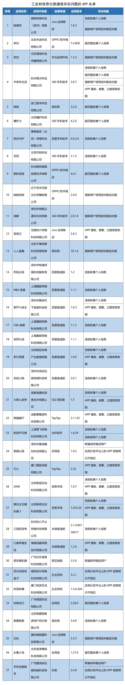

<!--
 - @Author: Kyle Zhang
 - @Date: 2022-04-20 20:04:58
 * @LastEditors: Kyle Zhang
 * @LastEditTime: 2022-05-27 15:30:56
 * @FilePath: \awesome-privacy-chinese\news.md
 - @Description:
-->

# 隐私相关新闻

1. [隐私相关新闻](#隐私相关新闻)
    1. [国内隐私相关](#国内隐私相关)
        1. [202205](#202205)
            1. [通用汽车遭撞库攻击被暴露车主个人信息](#通用汽车遭撞库攻击被暴露车主个人信息)
            2. [上海立法保障因防疫采集的个人信息不得泄露](#上海立法保障因防疫采集的个人信息不得泄露)
            3. [江苏省消保委点名14家新能源车企，涉及个人信息使用不当等问题](#江苏省消保委点名14家新能源车企涉及个人信息使用不当等问题)
            4. [全国首例短视频平台网络“爬虫”案宣判](#全国首例短视频平台网络爬虫案宣判)
            5. [企业监控员工居家办公，每5分钟人脸抓拍是否违法？](#企业监控员工居家办公每5分钟人脸抓拍是否违法)
            6. [工信部《APP收集使用个人信息最小必要评估规范》4项标准报批](#工信部app收集使用个人信息最小必要评估规范4项标准报批)
        2. [202204](#202204)
            1. [工信部通报 37 款存在侵害用户权益行为 APP](#工信部通报-37-款存在侵害用户权益行为-app)
            2. [网站“偷评论”引流被判赔 105 万](#网站偷评论引流被判赔-105-万)
    2. [海外隐私相关](#海外隐私相关)
        1. [202205](#202205-1)
            1. [扎克伯格因“剑桥分析”丑闻被美国DC检察总长起诉](#扎克伯格因剑桥分析丑闻被美国dc检察总长起诉)
            2. [美国谷歌被诉侵犯隐私：开启“隐身模式”依然收集用户浏览记录](#美国谷歌被诉侵犯隐私开启隐身模式依然收集用户浏览记录)
            3. [《康涅狄格州消费者隐私法》通过，照片、视频不属于生物特征数据](#康涅狄格州消费者隐私法通过照片视频不属于生物特征数据)
            4. [欧盟EDPB《执法领域人脸识别技术应用指南》发布](#欧盟edpb执法领域人脸识别技术应用指南发布)
            5. [美国万豪数据泄露集体诉讼案，联邦法院确定赔偿计算方法](#美国万豪数据泄露集体诉讼案联邦法院确定赔偿计算方法)
        2. [202204](#202204-1)
            1. [苹果商店将下架长期不更新的应用程序](#苹果商店将下架长期不更新的应用程序)
            2. [安卓应用程序商店正式增加隐私部分](#安卓应用程序商店正式增加隐私部分)
            3. [欧盟将不允许限制 IOS 上的浏览器引擎](#欧盟将不允许限制-ios-上的浏览器引擎)
            4. [谷歌 Play Store 新政：5 月 11 日起开始扼杀第三方通话录音应用](#谷歌-play-store-新政5-月-11-日起开始扼杀第三方通话录音应用)
            5. [hiQ 诉 LinkedIn 案重审 | 美国上诉法院：爬取公开数据的行为合法，不违反 CFAA](#hiq-诉-linkedin-案重审--美国上诉法院爬取公开数据的行为合法不违反-cfaa)
            6. [LV 因虚拟试穿软件被卷入数据隐私诉讼，涉及生物识别数据](#lv-因虚拟试穿软件被卷入数据隐私诉讼涉及生物识别数据)

## 国内隐私相关

### 202205

#### 通用汽车遭撞库攻击被暴露车主个人信息

> #信息安全

- source: [通用汽车遭撞库攻击被暴露车主个人信息](https://www.freebuf.com/news/334080.html)
- date: 2022-05-25

近期，通用汽车表示他们在今年4月11日至29日期间检测到了恶意登录活动，**经调查后发现黑客在某些情况下将客户奖励积分兑换为礼品卡**，针对此次事件，通用汽车也及时给受影响的客服发邮件并告知客户。为了弥补客户所受损失，通用汽车表示，他们将为所有受此事件影响的客户恢复奖励积分。但根据调查，这些违规行为并不是通用汽车被黑客入侵的结果，而是由针对其平台上的客户的一波撞库攻击引起的。

**撞库是指黑客通过收集网上已泄露的用户和密码信息，生成对应的字典表，并尝试批量登陆其他网站后，得到一系列可以登录的用户**。经后续的调查，通用汽车表示目前没有证据表明登录信息是从通用汽车本身获得的，“未经授权的用户获得了之前在其他非通用汽车网站上被泄露的客户登录凭证的访问权限，然后在客户的通用汽车账户上重复使用这些凭证。”对此通用汽车要求受影响的用户在再次登录他们的帐户之前重置他们的密码。

#### 上海立法保障因防疫采集的个人信息不得泄露

> #隐私安全

- source: [上海立法保障因防疫采集的个人信息不得泄露](http://news.china.com.cn/2022-05/25/content_78236710.htm)

2022年5月24日，上海市十五届人大常委会第四十次会议表决通过了《上海市人民代表大会常务委员会关于进一步促进和保障城市运行“一网统管”建设的决定》

《决定》明确，上海运用治理数字化功能，在疫情防控期间，实行个人疫情防控信息核验措施（即“场所码”或“数字哨兵”等核验措施），核验个人健康信息。

《决定》规定，出入公共场所、居民小区等场所的人员应当按照规定主动接受个人疫情防控信息核验。相关场所管理者、经营者应当按照要求开展个人疫情防控信息核验工作，发现不符合疫情防控要求的，及时向政府有关部门报告，并配合政府有关部门进行联动处置。**信息核验中采集、处理个人疫情防控信息应当遵守个人信息保护相关法律、法规的规定，采集的个人信息仅用于疫情防控需求，任何单位和个人不得泄露**。实行个人疫情防控信息核验措施的具体办法，由上海市人民政府另行制定。

《决定》强化了个人疫情防控信息核验措施相关主体的法定职责和义务，即政府相关部门的法定责任、场所管理者或者经营者的法定义务、公民个人的法定义务。

#### 江苏省消保委点名14家新能源车企，涉及个人信息使用不当等问题

> #隐私安全

- source: [江苏省消保委点名14家新能源车企，涉及个人信息使用不当等问题](https://mp.weixin.qq.com/s?__biz=MzIyNjUxOTQ0MQ==&mid=2247529329&idx=3&sn=08e29571f83998b3910aca6bcb8454a3&chksm=e86d038fdf1a8a995f9062fb4d27456b0f6d454f007905bdf40b83fc502bce1b8144150e9978&mpshare=1&scene=2&srcid=05246t9lDXuadeeUKSBQ3yRg&sharer_sharetime=1653383045155&sharer_shareid=ef7dc9a3b4932e7e94a89420a068e8ea#rd)
- date: 2022-05-24

2022年5月19日，江苏省消保委发布了 **《新能源汽车行业不公平格式条款调查报告》**，报告中称：江苏省消保委近期关注到有消费者反映新能源车企协议的相关问题。为保障消费者合法权益、规范相关企业行为，江苏省消保委选取了市场上具有一定知名度和影响力的新能源汽车品牌作为样本进行调查。调查共收集了14家新能源汽车企业的47份协议，梳理出10个方面共15项不公平格式条款问题，其中比亚迪、长城、上汽通用五菱和特斯拉等10家车企的问题率超过46%，威马汽车的问题率高达60%。

其中个人信息相关的问题：

1. **收集个人信息不规范，消费者被要求必须概括同意**。目前协议中存在大量不规范收集个人信息的情形，一是违反默认不收集原则，特斯拉、小鹏的协议中以“默认收集”为原则；二是收集个人信息明显无必要，比亚迪、广汽埃安、极狐、奇瑞、上汽通用五菱、威马6家企业的协议条款所收集的通讯记录详单、朋友联系列表、日程信息、财产信息、上网记录、常用设备信息等内容均存在超出必要范围收集信息的嫌疑。
2.**个人信息使用不当，消费者的个人信息保护缺位**。部分协议中存在不符合自愿授权、正当必要原则与信息安全的情形。一是个人信息使用涉嫌过度商业化，比亚迪、长安、广汽埃安、极氪、吉利、奇瑞、特斯拉7家企业的协议中规定车企可以通过收集到的用户信息来形成用户画像并向用户展示、推送商品或服务等信息，长安的协议则约定车企可对用户数据库进行商业化利用。二是个人信息出境无单独同意，《个人信息保护法》规定，个人信息原则上不应出境，如果提供给境外接收方，应当告知相关信息，并取得个人单独同意。但是比亚迪、长城、吉利、特斯拉4家企业的协议中直接含有可能分享到境外的条款。

#### 全国首例短视频平台网络“爬虫”案宣判

> #爬虫合规

- source: [全国首例短视频平台领域网络“爬虫”案在无锡宣判](http://www.xhby.net/index/202205/t20220513_7541376.shtml)
- date: 2022-05-13

2021年9月，某信息公司员工吴先生在网上巡查时发现有人在兜售一款叫“汇易获客”的软件，通过对方官网及电话购买了该款软件，吴先生惊讶地发现该软件居然可以“爬取”自己公司后台数据和直播间用户的相关信息，随即报警。经侦查，公安机关发现售卖该软件的某信息咨询公司老板丁某及销售人员有重大作案嫌疑。

经查，该软件利用该软件可以入侵某些短视频平台的服务器，通过关键词搜索可以快速抓取平台信息，主要包括用户名、UID、签名及评论等，再通过软件把UID转换成二维码，来精准定位客户。

「网络爬虫」作为一项技术手段本身并不违法，但由于本案的软件采取了避开或突破计算机信息系统的安全保护措施，未经许可进入被害单位的计算机系统，即属于非法获取计算机信息系统数据罪中的‘侵入’行为。

2022年5月10日，经江苏省无锡市梁溪区人民检察院提起公诉，梁溪区人民法院以提供侵入计算机信息系统程序罪判处被告人丁某有期徒刑一年六个月，缓刑两年，并处罚金三万元。此案系全国首例短视频平台领域网络“爬虫”案件。

#### 企业监控员工居家办公，每5分钟人脸抓拍是否违法？

- source: [居家办公每5分钟抓拍一次员工人脸？ 律师：须征得员工同意](https://www.sohu.com/a/546044588_114988)
- date: 2022-05-11

人脸作为生物识别信息属于个人信息，受法律保护。

近日，据海报新闻消息，有人在平台爆料尚德教育机构要求北京朝阳全区的员工实行居家办公，并要求员工连夜安装电脑监控软件，必须每5分钟自动截屏，每天截屏不够89次的算旷工，而且“该监控系统软件仅支持Windows系统，使用Mac的员工需安装虚拟机以方便公司监控”。

律师分析：“总的来说，在疫情期间，用人单位采取的何种的考勤方式，**必须征得员工的同意**，**同时采取的考核的指标、样本的抓取等等必须提前告知员工，保护员工的知情权**，最后，在员工同意的情况下，单位采取的方式也要合法合理合情，否则容易侵犯劳动者的隐私权以及休息权等，最好导致考核的结果因为违法可能无效。”

#### 工信部《APP收集使用个人信息最小必要评估规范》4项标准报批

- source: [4项通信行业标准报批公示](https://wap.miit.gov.cn/zwgk/wjgs/art/2022/art_91d7ab3312e44bf0bb09ad9b1233bac7.html)
- date: 2022-05-10

工信部4项通信行业标准报批公示：

2022年5月7日，工业和信息化部科技司根据标准制修订计划，相关标准化技术组织已完成通信行业《移动互联网应用程序（APP）收集使用个人信息最小必要评估规范 第1部分：总则》等4项行业标准的制定工作，**涉总则、位置信息、图片信息及短信信息**。在以上标准批准发布之前，为进一步听取社会各界意见，现予以公示，截止日期2022年6月7日。

### 202204

#### 工信部通报 37 款存在侵害用户权益行为 APP

> #隐私保护

- source: [工信部通报 37 款存在侵害用户权益行为 APP](https://www.cnii.com.cn/gxdt/202204/t20220421_374546.html)
- date: 2022-04-20

大部分 APP 存在的问题主要存在于「超范围收集个人信息」和「违规收集个人信息」两方面。

存在问题的 APP 名单：

#### 网站“偷评论”引流被判赔 105 万

> #爬虫合规

- source: [网站“偷评论”引流被判赔 105 万](http://www.ce.cn/culture/gd/202204/06/t20220406_37463685.shtml)
- date: 2022-03-29

近日，北京市朝阳区法院公开审理并宣判了一起新型不正当竞争纠纷案。一汽车质量投诉网站因复制同类平台信息为自身引流，被判赔 105 万。

原告北京某信息技术有限公司诉称，其运营的某网站主要受理汽车消费者投诉，消费者在网站提交针对汽车质量问题的投诉后，网站会与汽车厂商联系并督促解决。自 2014 年成立以来，该网站已累计处理了约 39 万条消费者投诉信息，建立起了包括消费者投诉处理、汽车产品缺陷问题检测等为一体的服务体系。

2021 年 6 月，原告发现，被告北京某公司运营的网站中有 5.2 万余条消费者投诉信息与原告网站展示的信息相同或近似，且投诉日期均晚于或等同于原告网站上的日期，部分投诉信息的附图中甚至还带有原告水印。此外，自 2015 年至今，被告网站中显示的投诉数量为 11 万+，但投诉进展绝大多数为“结果审核”或“企业处理”状态，无处于“完成”状态的投诉信息。原告认为，被告网站的投诉数量及处理进展都是虚构的。

最终，法院判决被告停止涉案不正当竞争行为、消除影响，并赔偿原告 105 万元。

## 海外隐私相关

### 202205

#### 扎克伯格因“剑桥分析”丑闻被美国DC检察总长起诉

> #隐私安全

- source: [扎克伯格被盯上?华盛顿检察官因剑桥丑闻起诉脸书](http://ent.sina.com.cn/s/u/2018-12-21/doc-ihmutuee1201697.shtml)

华盛顿DC的一名检察官卡尔·莱辛（Karl Racine）最近把脸书（Facebook）公司告上了法庭，起因就是今年春天闹得沸沸扬扬的剑桥数据泄露丑闻。**这也是首次美国政府的公检法部门因为数据泄露问题而盯上了互联网巨头**。

今年春天，脸书被曝其超过5000万用户的信息数据被一家名为“剑桥分析”（Cambridge Analytica）的公司泄露，**他们借此在2016年美国总统大选中针对目标受众推送广告，从而影响了大选结果。借用同样的手法，该公司也影响了英国脱欧投票的结果，促成了英国顺利脱欧**。在诉讼中，莱辛称，扎克伯格直接参与了允许剑桥分析公司在美国选民不知情的情况下收集其个人数据的决策，试图影响美国的总统竞选。

正如《卫报》在2018年披露的那样，受雇于特朗普2016年竞选团队的剑桥分析公司，获得了5000万Facebook用户的私人数据。该公司声称，这些信息可用于识别不同类型的选民并影响他们的行为。

#### 美国谷歌被诉侵犯隐私：开启“隐身模式”依然收集用户浏览记录

> #隐私安全

- source: [谷歌被诉侵犯隐私：开启“隐身模式”依然收集用户浏览记录](https://www.sohu.com/a/549218980_161795)
- date: 2022-05-22

继今年1月对谷歌提起侵犯隐私相关诉讼，当地时间5月19日，美国德克萨斯州（以下简称“德州”）总检察长肯·帕克斯顿（Ken Paxton）补充指控称：**即便用户开启了隐身浏览模式，谷歌依然会收集用户的搜索记录、浏览记录等数据。他认为，这种做法侵犯了用户隐私**。

指控内容：

1. 谷歌在用户拒绝的情况下，持续追踪用户的地理位置并利用这些数据来向消费者推送广告，以获得利润。
2. 在谷歌提供隐身浏览模式下，用户可能会查看一些高度个人化的网站，而这些网站也许会展示用户的疾病史、政治倾向、性取向等方面的信息。

对此，谷歌表示，帕克斯顿的指控是基于对于谷歌设置方式的不准确说明和过时断言，“我们一直在产品中内置保护隐私的功能，并向用户提供地理位置信息的控制权。我们强烈反对这些指责，并将全力辩护，以澄清事实。”

“谷歌声称给予用户控制权并尊重他们的选择，但实际上，无论用户选择何种设置，这家大型科技巨头仍在努力收集用户保密的地理位置和其他个人信息并将其货币化，”帕克斯顿称，“我不会让谷歌欺骗德州人。”

#### 《康涅狄格州消费者隐私法》通过，照片、视频不属于生物特征数据

> #信息安全

- source: [美国第五部州隐私法来了！照片、视频不属于生物特征数据](https://mp.weixin.qq.com/s?__biz=MzIyNjUxOTQ0MQ==&mid=2247529207&idx=2&sn=2f8a93a2658e7aed660bf90bbda501a2&chksm=e86d0209df1a8b1f69e0e27b8670b79132d0c1c451915bac859710f7f0346a9ac2d6f611f8c4&mpshare=1&scene=2&srcid=0521vPJq5SVactQ1SafbeaCj&sharer_sharetime=1653100984211&sharer_shareid=ef7dc9a3b4932e7e94a89420a068e8ea#rd)
- date: 2022-05-21

据美国康涅狄格州议会官网消息，近日，在获得康涅狄格州立法机构表决通过十几天后，《康涅狄格州消费者隐私法》（下称《隐私法》）经州长签署后正式通过，将于明年7月1日起生效。

在《隐私法》中，**“生物特征数据”被定义为通过自动测量个人的生物特征而产生的数据，如指纹、声纹、视网膜、虹膜或其他用于识别特定个体的独特生物特征**。然而，数字或实物照片、音频或视频以及由其产生的任何数据不被包括在内——除非这些数据是为识别特定个人而生成。

专家称，该规定较为特殊，其限缩了生物识别数据的范围，对于具有一定公开属性的生物特征进行了排除，是严格遵循个人数据可识别性特征的一种体现。这种定义方法有利于人工智能发展，实现消费者权益和产业发展的平衡。

#### 欧盟EDPB《执法领域人脸识别技术应用指南》发布

> #合规法案

- source: [欧盟EDPB《执法领域人脸识别技术应用指南》发布](https://mp.weixin.qq.com/s/JF5foRm8mtSIcCLcLMzGAg)
- date: 2022-05-18

布鲁塞尔，5月16日——欧盟数据保护委员会EDPB通过了《执法领域人脸识别技术应用指南》。该指南为欧盟和成员国立法者以及执法机构提供了实施和使用人脸识别技术系统的指导。

EDPB主席Andrea Jelinek说：“**虽然现代技术有利于执法，人脸快速识别犯罪嫌疑人，但它们必须满足必要性和相称性的要求。人脸识别技术与处理个人数据（包括生物特征数据）有着内在联系，并对个人权利和自由构成严重威胁。**”

在本指南中，EDPB再次呼吁禁止在某些情况下使用人脸识别技术，正如其在《EDPB-EDPS关于人工智能法案提案的联合意见》中所要求的那样。更具体地说，EDPB认为应禁止：

- 在公共场所对个人进行远程生物识别；
- 人脸识别系统根据个人生物特征，根据种族、性别、政治或性取向或其他歧视理由，将个人分为若干类；
- 人脸识别或类似技术来推断自然人的情绪；
- 执法环境中处理个人数据，这将依赖于一个数据库，该数据库由大规模、不加区分地收集的个人数据组成，例如通过“抓取”在线访问的照片和人脸照片。

#### 美国万豪数据泄露集体诉讼案，联邦法院确定赔偿计算方法

- source: [美国万豪数据泄露集体诉讼案，联邦法院确定赔偿计算方法](https://mp.weixin.qq.com/s/YMEqKr6QcdL2t86q0z0c5g)
- date: 2022-05-03

这起诉讼最早可以追溯到2014年，万豪收购喜达屋（Starwood）之前。在2018年9月8日，万豪发现了喜达屋的网络漏洞，但直到近三个月后，即2018年11月30日，万豪才公开披露此事，承认存在未经授权访问喜达屋客户预订数据库的行为。

经过调查，英国信息专员办公室（ICO, Information Commissioner's Office）最终将全球受影响的客户数量确认为3.39亿。此前，万豪披露，信息中大约有525万个未加密的护照号码和2030万个加密的护照号码，以及其他关于酒店住宿的个人敏感信息。

值得注意的是，2020年，万豪发生了第二次大规模数据泄露事件。据万豪官网介绍，此事涉及多达520万客户的个人信息，包括姓名、公司、生日、住址、电话号码、邮箱地址、会员账号以及积分余额、关联的航空公司等。

根据意见书内容，法院接受了原告计算损害赔偿额的主张，**即消费者可以根据万豪对客户数据的预估价值来计算具体损失，得到个人信息泄露的赔偿。**

### 202204

#### 苹果商店将下架长期不更新的应用程序

> #隐私保护

- source: [PSA | Apple’s Giving Developers 30 Days to Update Aging Apps Before Deletion](https://www.idropnews.com/news/purging-the-app-store-apple-is-cracking-down-on-outdated-apps/185521/)
- date: 2022-04-26

苹果发送给受影响开发者的一封名为“应用商店改进通知”的电子邮件，原文如下：

此应用程序在很长一段时间内没有更新，并计划在 30 天内下架。 对于已经下载了应用的用户来说，不需要任何操作就可以继续使用该应用。 您可以通过在 30 天内提交更新以供审核，让新用户可以从 App Store 发现和下载此应用。如果在 30 天内未提交更新，该应用程序将从商店内被删除。

苹果给出的解释是，此举一方面是保护用户的数据隐私安全性，另一方面也是刺激开发者能更积极地进行软件升级，以适配系统的新特性。

此举对隐私保护的原因主要在于：

> Since they haven’t been updated in such a long time, these apps also lack the new [App Store Privacy Labels](https://developer.apple.com/app-store/app-privacy-details/) . Apple is very firm on its policy about developers adding these labels — except that they’re only required when an app update is submitted. Hence, any apps that haven’t been updated in over a year can get away with skirting these rules.

#### 安卓应用程序商店正式增加隐私部分

> #隐私合规

- source: [Android’s app store privacy section starts rolling out today](https://arstechnica.com/gadgets/2022/04/androids-app-store-privacy-section-starts-rolling-out-today/)
- date: 2022-04-27

在谷歌的安卓应用商店上的应用程序页，除了“关于这个应用程序”和“评级和评论”等部分外，还将有一个名为“数据隐私和安全”的新部分，开发人员可以解释他们收集了哪些数据。谷歌要求开发者提供隐私信息的最后期限是 7 月 20 日，因此目前应用的这个部分可能还是空的。不过，这些信息都是开发者自主申明的，谷歌并不能代表开发者对他们如何处理用户数据做出判断，只是当谷歌发现申明不实时可能会采取各种措施。

#### 欧盟将不允许限制 IOS 上的浏览器引擎

> #竞争合规

- source: [Apple's grip on iOS browser engines disallowed under latest draft EU rules](https://www.theregister.com/2022/04/26/apple_ios_browser/)
- date: 2022-04-26

欧盟即将发布的《数字市场法》（DMA）明确承认“网页浏览器引擎”是一种服务，应受到保护。苹果公司要求通过 iOS 应用商店分发的移动浏览器必须使用苹果的 WebKit 渲染引擎，结果是，iOS 上的 Chrome、Edge 和 Firefox 几乎都是 Safari 换皮。而当 DMA 在 2024 年生效时，苹果可能会被要求在 iOS 设备上允许其它浏览器竞争。

#### 谷歌 Play Store 新政：5 月 11 日起开始扼杀第三方通话录音应用

> #信息安全

- source: [谷歌 Play Store 新政：5 月 11 日起开始扼杀第三方通话录音应用](https://baijiahao.baidu.com/s?id=1730703496271389788&wfr=spider&for=pc)
- date: 2022-04-21

很多品牌的安卓手机都支持通话录音功能，该功能也集成在谷歌 Pixel 手机的电话应用中。但由于部分地区法律的原因，并不是所有手机都支持这个功能，不过即使手机没有这个功能，用户也可以从谷歌 Play Store 等应用商店安装一个第三方应用来实现这个功能。不过，即将到来的 Google Play 政策变化将一劳永逸地杀死所有第三方通话录音应用。

不过不用担心，如果你的手机预装了通话录音功能，该功能将继续正常工作。这一即将到来的变化将只适用于 Play Store 上专门使用 Accessibility API 来启用通话录音的第三方应用，提供内置通话录音的谷歌电话应用不受这一变化影响。

#### hiQ 诉 LinkedIn 案重审 | 美国上诉法院：爬取公开数据的行为合法，不违反 CFAA

> #爬虫安全

- source:
    - [数据爬取之争风波再起：LinkedIn 与 HiQ 案被美国最高法院发回重审](http://www.tylaw.com.cn/cn/news_content.aspx?contentID=00000000000000003025&Lan=CN&MenuID=00000000000000000006)
    - [hiQ 诉 LinkedIn 案重审 | 美国上诉法院：爬取公开数据的行为合法，不违反 CFAA](https://posts.careerengine.us/p/626031b9d553240f9219d185?from=latest-posts-panel&type=title)
- date: 2022-04-20

HiQ 则是一家数据分析公司，HiQ 的商业模式依赖于其从 LinkedIn 爬取的公开数据，HiQ 将其从 LinkedIn 爬取的数据进行整理分析后，将处理结果出售给相关企业。

LinkedIn 所拥有的数据存储于 LinkedIn 系统中，然而，数据本身是由其用户提供给的 LinkedIn。在本案发生时，任何访问 LinkedIn 网站的人都可以访问这些数据。随着越来越多的公司在爬取 LinkedIn 的数据，LinkedIn 采取了措施来禁止违规者的账户，但 HiQ 通过利用代理服务的方式来掩盖他们进行爬取行为的 IP 地址，从而规避了 LinkedIn 对于这些 IP 地址的阻止措施。

在 HiQ 长期对 LinkedIn 的网站数据进行爬取行为后，LinkedIn 向 HiQ 发送了禁止通知函，并在函中援引了《计算机欺诈与滥用法案》（Computer Fraud and Abuse Act, “CFAA”）。LinkedIn 主张，其自身的服务条款已明确禁止使用自动化工具，因而他们有权通过禁止与数据爬取相关的 IP 地址来强制执行其服务条款，HiQ 不仅违反了 LinkedIn 的服务条款，而且也违反了 CFAA 以及其他相关法律。

但是，美国法院认为，CFAA 并不禁止任何人爬取可公开访问的数据。因此 HiQ 也没有违反美国《计算机欺诈和滥用法》（Computer Fraud and Abuse Act，CFAA）。

#### LV 因虚拟试穿软件被卷入数据隐私诉讼，涉及生物识别数据

> #隐私保护

- source: [LVMH Eyewear Virtual ‘Try-on’ Tool Draws Biometric Privacy Suit](https://www.bloomberg.com/news/articles/2022-04-09/lvmh-eyewear-virtual-try-on-tool-draws-biometric-privacy-suit)
- date: 2022-04-09

近日，时尚品牌路易威登（Louis Vuitton，LV）因涉嫌在其网站上的虚拟试穿工具中收集消费者的生物识别数据而受到了诉讼指控，主要指控内容为 LV 会收集用户的 「详细和敏感的生物识别和信息，包括完整的面部扫描」，但没有首先获得他们的同意，或告知他们这些数据正在被收集。LV 的行为涉嫌收集消费者的生物识别数据，违反了伊利诺伊州《生物识别信息隐私法》（BIPA）规定的 "**明确授权**"。
