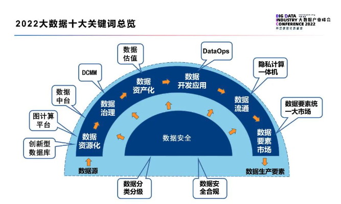

# 隐私相关新闻

1. [隐私相关新闻](#隐私相关新闻)
   1. [国内隐私相关](#国内隐私相关)
      1. [202206](#202206)
         1. [个人信息出境标准合同规定（征求意见稿）](#个人信息出境标准合同规定征求意见稿)
         2. [信通院2022大数据十大关键词](#信通院2022大数据十大关键词)
         3. [网络安全审查办公室对知网启动网络安全审查](#网络安全审查办公室对知网启动网络安全审查)
         4. [学习通曝出大规模被拖库事件，1.7亿条信息遭公开售卖，波及全国大量高校，官方回应称未发现证据](#学习通曝出大规模被拖库事件17亿条信息遭公开售卖波及全国大量高校官方回应称未发现证据)
         5. [国内首个个人信息保护、确权服务平台“人民数保”正式上线](#国内首个个人信息保护确权服务平台人民数保正式上线)
         6. [新国标：长期不用的App或被自动解除敏感权限授权](#新国标长期不用的app或被自动解除敏感权限授权)
         7. [国家网信办修订《移动互联网应用程序信息服务管理规定》发布施行](#国家网信办修订移动互联网应用程序信息服务管理规定发布施行)
         8. [市场监管总局与国家网信办：开展数据安全管理认证工作](#市场监管总局与国家网信办开展数据安全管理认证工作)
         9. [天津一起人脸识别案胜诉，小区以刷脸作为唯一通行方式被判违法](#天津一起人脸识别案胜诉小区以刷脸作为唯一通行方式被判违法)
      2. [202205](#202205)
         1. [工信部网安局：将有序推进2022年电信和互联网行业数据安全检查，目前北京、广东、浙江、湖北等省市已开展工作](#工信部网安局将有序推进2022年电信和互联网行业数据安全检查目前北京广东浙江湖北等省市已开展工作)
         2. [信安标委发布《信息安全技术 互联网平台及产品服务隐私协议要求》（征求意见稿）](#信安标委发布信息安全技术-互联网平台及产品服务隐私协议要求征求意见稿)
         3. [通用汽车遭撞库攻击被暴露车主个人信息](#通用汽车遭撞库攻击被暴露车主个人信息)
         4. [上海立法保障因防疫采集的个人信息不得泄露](#上海立法保障因防疫采集的个人信息不得泄露)
         5. [江苏省消保委点名 14 家新能源车企，涉及个人信息使用不当等问题](#江苏省消保委点名-14-家新能源车企涉及个人信息使用不当等问题)
         6. [全国首例短视频平台网络“爬虫”案宣判](#全国首例短视频平台网络爬虫案宣判)
         7. [企业监控员工居家办公，每 5 分钟人脸抓拍是否违法？](#企业监控员工居家办公每-5-分钟人脸抓拍是否违法)
         8. [工信部《APP 收集使用个人信息最小必要评估规范》4 项标准报批](#工信部app-收集使用个人信息最小必要评估规范4-项标准报批)
      3. [202204](#202204)
         1. [工信部通报 37 款存在侵害用户权益行为 APP](#工信部通报-37-款存在侵害用户权益行为-app)
         2. [网站“偷评论”引流被判赔 105 万](#网站偷评论引流被判赔-105-万)
   2. [海外隐私相关](#海外隐私相关)
      1. [202206](#202206-1)
         1. [Firefox 浏览器推出 Total Cookie Protection 功能](#firefox-浏览器推出-total-cookie-protection-功能)
         2. [TikTok美国用户数据已转移到甲骨文，字节跳动无法访问](#tiktok美国用户数据已转移到甲骨文字节跳动无法访问)
         3. [不再担心App偷窥手机剪贴板！苹果要求访问前获得用户授权](#不再担心app偷窥手机剪贴板苹果要求访问前获得用户授权)
         4. [Facebook 正在开发“隐私安全”广告产品](#facebook-正在开发隐私安全广告产品)
         5. [谷歌因侵犯隐私向居民赔偿 1 亿美元](#谷歌因侵犯隐私向居民赔偿-1-亿美元)
         6. [Tim Hortons 应用程序在收集“大量”位置数据时违反了法律](#tim-hortons-应用程序在收集大量位置数据时违反了法律)
         7. [美国《数据隐私和保护法》（草案）公布](#美国数据隐私和保护法草案公布)
         8. [泰国《个人数据保护法》生效：违规最高可能面临一年的监禁或500万泰铢的罚款](#泰国个人数据保护法生效违规最高可能面临一年的监禁或500万泰铢的罚款)
      2. [202205](#202205-1)
         1. [Meta公司更新隐私政策，让用户更容易了解用户数据如何被使用](#meta公司更新隐私政策让用户更容易了解用户数据如何被使用)
         2. [苹果要求 App 提供删除账号及相关个人数据功能，7 月起实施](#苹果要求-app-提供删除账号及相关个人数据功能7-月起实施)
         3. [扎克伯格因“剑桥分析”丑闻被美国 DC 检察总长起诉](#扎克伯格因剑桥分析丑闻被美国-dc-检察总长起诉)
         4. [美国谷歌被诉侵犯隐私：开启“隐身模式”依然收集用户浏览记录](#美国谷歌被诉侵犯隐私开启隐身模式依然收集用户浏览记录)
         5. [《康涅狄格州消费者隐私法》通过，照片、视频不属于生物特征数据](#康涅狄格州消费者隐私法通过照片视频不属于生物特征数据)
         6. [欧盟 EDPB《执法领域人脸识别技术应用指南》发布](#欧盟-edpb执法领域人脸识别技术应用指南发布)
         7. [美国万豪数据泄露集体诉讼案，联邦法院确定赔偿计算方法](#美国万豪数据泄露集体诉讼案联邦法院确定赔偿计算方法)
      3. [202204](#202204-1)
         1. [苹果商店将下架长期不更新的应用程序](#苹果商店将下架长期不更新的应用程序)
         2. [安卓应用程序商店正式增加隐私部分](#安卓应用程序商店正式增加隐私部分)
         3. [欧盟将不允许限制 IOS 上的浏览器引擎](#欧盟将不允许限制-ios-上的浏览器引擎)
         4. [谷歌 Play Store 新政：5 月 11 日起开始扼杀第三方通话录音应用](#谷歌-play-store-新政5-月-11-日起开始扼杀第三方通话录音应用)
         5. [hiQ 诉 LinkedIn 案重审 | 美国上诉法院：爬取公开数据的行为合法，不违反 CFAA](#hiq-诉-linkedin-案重审--美国上诉法院爬取公开数据的行为合法不违反-cfaa)
         6. [LV 因虚拟试穿软件被卷入数据隐私诉讼，涉及生物识别数据](#lv-因虚拟试穿软件被卷入数据隐私诉讼涉及生物识别数据)

## 国内隐私相关

### 202206

#### 个人信息出境标准合同规定（征求意见稿）

> #数据法规

- source: [个人信息出境标准合同规定（征求意见稿）](http://www.moj.gov.cn/pub/sfbgw/lfyjzj/lflfyjzj/202206/t20220630_458805.html)
- date: 2022-06-29

中国个人信息出境的标准合同条款（SCC），根据第四条看，约束还是比较多的，适合小厂，参考约束条件

1. （一）非关键信息基础设施运营者
2. （二）处理个人信息不满100万人的；
3. （三）自上年1月1日起累计向境外提供未达到10万人个人信息的；
4. （四）自上年1月1日起累计向境外提供未达到1万人敏感个人信息的。　

截止目前总结出境一般三种方式，
1. 网信办安全评估，对于大厂来说必经之路，也是比较好的方式。
2. 专业机构评估和个人信息保护，目前国内此类高置信度机构相对不多。
3. 签署SCC，也就是意见稿的方式，如果规模不大，此类方式相对成本可控。

#### 信通院2022大数据十大关键词

> #技术前沿

- source: [信通院2022大数据十大关键词](https://mp.weixin.qq.com/s/YSfnRirk1O_yXOvSJEOtqA)
- date: 2022-06-28

本年度十大关键词涉及数据从计算机语言到成为生产要素的全生命周期，包括（1）【数据资源化】，即数据从计算机语言到成为可被人类识别的信息（2）【数据治理】，即将散乱的、庞杂的数据进行归类、整理、管理（3）【数据资产化】，即将数据与货币进行对应挂钩，（4）【数据开发应用】，即加工数据使其为业务赋能，（5）【数据流通】，即完成数据在部门与部门间、机构与机构间进行点对点的合规交换共享，（6）【数据要素市场】，即促进全社会按照统一规范的制度、体系完成数据的合规流通利用，（7）【数据安全】，即保障数据流转的全生命周期符合相关法律法规。

#### 网络安全审查办公室对知网启动网络安全审查
> #信息安全

- source: [网络安全审查办公室对知网启动网络安全审查](https://mp.weixin.qq.com/s/6hi4MJ11ljzMjWSBzpm_hw)
- date: 2022-06-24

　网络安全审查办公室有关负责人表示，为防范国家数据安全风险，维护国家安全，保障公共利益，依据《国家安全法》《网络安全法》《数据安全法》，按照《网络安全审查办法》，2022年6月23日，网络安全审查办公室约谈同方知网（北京）技术有限公司负责人，宣布对知网启动网络安全审查。据悉，知网掌握着大量个人信息和涉及国防、工业、电信、交通运输、自然资源、卫生健康、金融等重点行业领域重要数据，以及我重大项目、重要科技成果及关键技术动态等敏感信息。

#### 学习通曝出大规模被拖库事件，1.7亿条信息遭公开售卖，波及全国大量高校，官方回应称未发现证据

> #数据安全

- source: [学习通曝出大规模被拖库事件，1.7亿条信息遭公开售卖，波及全国大量高校，官方回应称未发现证据](https://www.leiphone.com/category/industrynews/8yHwYPIkn8r1e8I9.html)
- date: 2022-06-21

近日，“学习通数据库疑发生信息泄露”登上微博热搜。据网络安全公众号“M78安全团队”6月20日发文（现已删除），高校学习软件“学习通”数据库信息疑似大规模泄露，包含姓名、手机号、性别、学校、学号、邮箱等信息，数量疑达1亿7273万条。

对此，学习通方面21日发微博回应称，不存储用户明文密码，采取单向加密存储，理论上用户密码不会泄露，“公司确认网上传言密码泄露是不实的”。学习通还称收到用户数据疑似泄露的消息后已连续技术排查十余小时，暂未发现明确的用户信息泄露证据，且公安机关已经介入调查。

尽管学习通方面并未确认发现了用户数据泄露，截至目前，已有多位学习通用户在网上晒出登录后的学习通页面，有的显示使用次数高达十几万次。还有网友称，自己近日收到不少骚扰电话，怀疑与学习通数据泄露有关。

---

新加坡之前也有过（小规模的）信息泄露，比如身份证。政府在这方面反应很快，网上填资料只许要身份证最后四位，还有个中央验证系统 Singpass，第三方网站可以请求用户授权，从这里pull个人信息

#### 国内首个个人信息保护、确权服务平台“人民数保”正式上线

> #隐私安全

- source: [人民数保](https://pdc.peopleyun.cn/home)
- date: 2022-06-20

“人民数保”是由人民日报、人民网旗下“党管数据”理论和实践平台人民数据和世纪互联倾力打造的平台，是我国首个个人信息保护与确权服务平台。

据介绍，人民数保平台将通过个人用户二次数据上链，确保身份数据、内容数据、行为数据的安全、可信和不可篡改，提供数据授权、认证、计费，实现个人数字身份和个人数据资产的全环节审核、授权、存证、确权、流转及二次开发的新型信息基础服务。

人民数保基于数据权限管理和资源调度机制，利用区块链技术，既防止数据滥用、盗用、泄露，又提供了数据共享的酬劳分配机制，确保了数据消费者在请求、授权和行权过程中的责权清晰，从而促进数据消费者对所授权数据的利用和价值挖掘，实现了从数据资源到数据资产乃至数据资本的发展。

旨在保护个人数据不被非法乱用的同时，实现数据精准**确权、授权、流转**及二次开发，将个人数据权利还归个人，让数据真正取用于民、造福于民，让广大人民群众共享数字化红利。同时，作为“人民数保”平台在全国落地的抓手，“数据强国工程暨百城千县计划”也于同日启动。

#### 新国标：长期不用的App或被自动解除敏感权限授权

> #数据法规

- source: [关于国家标准《信息安全技术 移动智能终端的移动互联网应用程序（App）个人信息处理活动管理指南》征求意见稿征求意见的通知](https://www.tc260.org.cn/front/bzzqyjDetail.html?id=20220613211733&norm_id=20211108000016&recode_id=47126)
- date: 2022-06-17

6月13日，全国信息安全标准化技术委员会发布国家标准《信息安全技术移动智能终端的移动互联网应用程序（App）个人信息处理活动管理指南》（以下简称《指南》）并公开征求意见。

《指南》拟根据App生命周期，要求移动智能终端为用户提供敏感数据访问提示和控制功能，并拟将应用程序列表和剪切板纳入敏感数据/能力。**《指南》还拟引入权限自动重置机制——对于长期不用的App，用户可以选择自动解除其敏感权限授权**。

#### 国家网信办修订《移动互联网应用程序信息服务管理规定》发布施行

> #数据法规

- source: [国家网信办修订《移动互联网应用程序信息服务管理规定》发布施行](http://politics.people.com.cn/n1/2022/0615/c1001-32446942.html)
- date: 2022-06-14

6月14日，新修订的《移动互联网应用程序信息服务管理规定》发布。新规定要求，应用程序提供者和应用程序分发平台应当履行信息内容管理主体责任，建立健全信息内容安全管理、信息内容生态治理、数据安全和个人信息保护、未成年人保护等管理制度，确保网络安全，维护良好网络生态。

该规定将自2022年8月1日起施行

#### 市场监管总局与国家网信办：开展数据安全管理认证工作

> #数据安全

- source: [国家市场监督管理总局 国家互联网信息办公室关于开展数据安全管理认证工作的公告](https://gkml.samr.gov.cn/nsjg/rzjgs/202206/t20220609_347615.html)
- date: 2022-06-05

国家市场监督管理总局与国家互联网信息办公室发布了《关于开展数据安全管理认证工作的公告》（以下简称《公告》）。《公告》鼓励网络运营者通过认证方式规范网络数据处理活动，加强网络数据安全保护。从事数据安全管理认证活动的认证机构应当依法设立，并按照《数据安全管理认证实施规则》实施认证。数据安全管理认证的认证模式为：技术验证 + 现场审核 + 获证后监督。

这是首次由两家国家权威机构来开展数据安全管理认证工作，体现了国家对数据安全的高度重视。通过认证后获得的“认证标志”，可以按照有关规定在广告等宣传中使用，可以增加外界公众对网络运营者的信任度，助力数据处理相关业务的顺利开展。

#### 天津一起人脸识别案胜诉，小区以刷脸作为唯一通行方式被判违法

> #隐私庭审

- source: [天津一起人脸识别案胜诉，小区以刷脸作为唯一通行方式被判违法](https://www.sohu.com/a/554352407_114988)
- 2022-06-05

因将人脸识别作为进出小区的唯一通行验证方式，天津市一物业公司被居民告上法庭。一审法院认为，相关证据不能证明被告侵犯了其隐私权。近日，该案二审作出改判，法院要求物业公司删除原告人脸信息，并为其提供其他出入小区的通行验证方式。

庭审经过：

此案一审的案由被法院定为隐私权纠纷。依据《民事诉讼法》第六十四条“当事人对自己提供的主张，有责任提供证据”的规定，**一审法院判决认为，原告顾某并未提交被告对其信息存在泄露、篡改、丟失的相关证据，且提供的相关证据不能证明二被告侵犯了其隐私权**。故原告的诉讼请求没有事实和法律依据，不予支持，驳回全部诉讼请求。

顾某不服一审判决，后上诉至天津市第一中级人民法院。上诉人认为，本案的主要法律问题是个人信息保护而非隐私权，一审法院适用法律错误，案由选择错误。其未主张个人信息被泄露、篡改、丢失，无需提供相关证据，一审法院对举证责任的认定有误。

二审法院对一审法院查明的事实予以确认，认为本案系因处理个人信息引发的纠纷，**案由应确定为个人信息保护纠纷**。

二审法院指出，根据2021年8月1日起施行的《最高人民法院关于审理使用人脸识别技术处理个人信息相关民事案件适用法律若干问题的规定》第10条规定，**如果有业主或者物业使用人不同意采取上述验证方式而请求物业公司提供其他合理验证方式的，物业公司不能以智能化管理为由予以拒绝**。

此外，《个人信息保护法》本来就规定了撤回权，基于个人同意处理个人信息的，个人有权撤回同意。个人信息处理者应当提供便捷的撤回同意的方式。对业主来说，根本不需要具备个人信息存在被泄露、篡改、丢失等危险的前提，便可以向物业提出撤回、删除的要求。

### 202205

#### 工信部网安局：将有序推进2022年电信和互联网行业数据安全检查，目前北京、广东、浙江、湖北等省市已开展工作

> #隐私政策

- source: [工信部网安局：将有序推进2022年电信和互联网行业数据安全检查，目前北京、广东、浙江、湖北等省市已开展工作](https://mp.weixin.qq.com/s?__biz=MzIyNjUxOTQ0MQ==&mid=2247529698&idx=2&sn=e1fb6a98dd101d6cadd8de261c843551&chksm=e86d041cdf1a8d0af1d3f3edee6c68932e9e5cacabc93915ea47599c16a3395ce8baed338085&mpshare=1&scene=2&srcid=0531uU9TyuvAWZawhDCxtl3U&sharer_sharetime=1653971634062&sharer_shareid=ef7dc9a3b4932e7e94a89420a068e8ea#rd)
- date: 2022-05-31

5月18日，在2022年世界电信和信息社会日大会“数据安全与治理论坛”上，工业和信息化部网络安全管理局副局长杜广达在致辞中表示，电信和互联网领域数据安全工作取得了良好的开局，但仍处于起步阶段，加强行业数据安全管理需要在已有基础上，有计划、有重点、分步骤推进工作。

重点监察对象：

提供公共互联网网络信息服务的基础电信企业、域名注册服务企业、云平台服务提供商、APP运营企业、车联网平台企业、工业互联网平台和标识解析节点企业等（以下统称“网络运行单位”）。重点检查相关网络运行单位的关键信息基础设施和重要网络单元及承载的信息系统，包括但不限于：通信网络基础设施、公共云服务平台、域名服务系统、工业互联网平台、标识解析系统、车联网应用服务平台、网约车信息服务平台等。

重点检查内容：

1. 网络安全管理制度和保障体系建设落实情况
2. 通信网络安全防护工作落实情况
3. 数据安全保护落实情况
4. 个人信息保护工作情况
5. 工业互联网企业网络安全防护情况

#### 信安标委发布《信息安全技术 互联网平台及产品服务隐私协议要求》（征求意见稿）

> #隐私政策

- source: [信安标委发布《信息安全技术 互联网平台及产品服务隐私协议要求》（征求意见稿）](https://cn-sec.com/archives/1072789.html)
- date: 2022-05-30

近日，全国信息安全标准化技术委员会发布了《信息安全技术 互联网平台及产品服务隐私协议要求》（征求意见稿）（以下简称《征求意见稿》）。
《征求意见稿》规定了互联网平台及产品服务隐私协议编制程序、具体内容、发布形式，增加隐私协议的可读性、透明性，以及处理隐私协议相关的争议纠纷等方面的要求；适用于规范个人信息处理者制定、发布隐私协议的过程，也适用于主管监管部门、第三方评估机构等对隐私协议进行监督、管理和评估。
《征求意见稿》强调，制定、发布隐私协议是个人信息处理者遵循公开透明原则的重要体现，是保证个人信息主体知情权的重要手段，也是约束自身行为和配合监督管理的重要机制。隐私协议应清晰、准确、完整地描述个人信息处理者的个人信息处理行为，并以便于用户阅读、理解的视角，向个人信息主体展现可能会对个人权益产生影响的重点内容。

#### 通用汽车遭撞库攻击被暴露车主个人信息

> #信息安全

- source: [通用汽车遭撞库攻击被暴露车主个人信息](https://www.freebuf.com/news/334080.html)
- date: 2022-05-25

近期，通用汽车表示他们在今年 4 月 11 日至 29 日期间检测到了恶意登录活动，**经调查后发现黑客在某些情况下将客户奖励积分兑换为礼品卡**，针对此次事件，通用汽车也及时给受影响的客服发邮件并告知客户。为了弥补客户所受损失，通用汽车表示，他们将为所有受此事件影响的客户恢复奖励积分。但根据调查，这些违规行为并不是通用汽车被黑客入侵的结果，而是由针对其平台上的客户的一波撞库攻击引起的。

**撞库是指黑客通过收集网上已泄露的用户和密码信息，生成对应的字典表，并尝试批量登陆其他网站后，得到一系列可以登录的用户**。经后续的调查，通用汽车表示目前没有证据表明登录信息是从通用汽车本身获得的，“未经授权的用户获得了之前在其他非通用汽车网站上被泄露的客户登录凭证的访问权限，然后在客户的通用汽车账户上重复使用这些凭证。”对此通用汽车要求受影响的用户在再次登录他们的帐户之前重置他们的密码。

#### 上海立法保障因防疫采集的个人信息不得泄露

> #隐私安全

- source: [上海立法保障因防疫采集的个人信息不得泄露](http://news.china.com.cn/2022-05/25/content_78236710.htm)

2022 年 5 月 24 日，上海市十五届人大常委会第四十次会议表决通过了《上海市人民代表大会常务委员会关于进一步促进和保障城市运行“一网统管”建设的决定》

《决定》明确，上海运用治理数字化功能，在疫情防控期间，实行个人疫情防控信息核验措施（即“场所码”或“数字哨兵”等核验措施），核验个人健康信息。

《决定》规定，出入公共场所、居民小区等场所的人员应当按照规定主动接受个人疫情防控信息核验。相关场所管理者、经营者应当按照要求开展个人疫情防控信息核验工作，发现不符合疫情防控要求的，及时向政府有关部门报告，并配合政府有关部门进行联动处置。**信息核验中采集、处理个人疫情防控信息应当遵守个人信息保护相关法律、法规的规定，采集的个人信息仅用于疫情防控需求，任何单位和个人不得泄露**。实行个人疫情防控信息核验措施的具体办法，由上海市人民政府另行制定。

《决定》强化了个人疫情防控信息核验措施相关主体的法定职责和义务，即政府相关部门的法定责任、场所管理者或者经营者的法定义务、公民个人的法定义务。

#### 江苏省消保委点名 14 家新能源车企，涉及个人信息使用不当等问题

> #隐私安全

- source: [江苏省消保委点名14家新能源车企，涉及个人信息使用不当等问题](https://mp.weixin.qq.com/s?__biz=MzIyNjUxOTQ0MQ==&mid=2247529329&idx=3&sn=08e29571f83998b3910aca6bcb8454a3&chksm=e86d038fdf1a8a995f9062fb4d27456b0f6d454f007905bdf40b83fc502bce1b8144150e9978&mpshare=1&scene=2&srcid=05246t9lDXuadeeUKSBQ3yRg&sharer_sharetime=1653383045155&sharer_shareid=ef7dc9a3b4932e7e94a89420a068e8ea#rd)
- date: 2022-05-24

2022 年 5 月 19 日，江苏省消保委发布了 **《新能源汽车行业不公平格式条款调查报告》**，报告中称：江苏省消保委近期关注到有消费者反映新能源车企协议的相关问题。为保障消费者合法权益、规范相关企业行为，江苏省消保委选取了市场上具有一定知名度和影响力的新能源汽车品牌作为样本进行调查。调查共收集了 14 家新能源汽车企业的 47 份协议，梳理出 10 个方面共 15 项不公平格式条款问题，其中比亚迪、长城、上汽通用五菱和特斯拉等 10 家车企的问题率超过 46%，威马汽车的问题率高达 60%。

其中个人信息相关的问题：

1. **收集个人信息不规范，消费者被要求必须概括同意**。目前协议中存在大量不规范收集个人信息的情形，一是违反默认不收集原则，特斯拉、小鹏的协议中以“默认收集”为原则；二是收集个人信息明显无必要，比亚迪、广汽埃安、极狐、奇瑞、上汽通用五菱、威马 6 家企业的协议条款所收集的通讯记录详单、朋友联系列表、日程信息、财产信息、上网记录、常用设备信息等内容均存在超出必要范围收集信息的嫌疑。
2.**个人信息使用不当，消费者的个人信息保护缺位**。部分协议中存在不符合自愿授权、正当必要原则与信息安全的情形。一是个人信息使用涉嫌过度商业化，比亚迪、长安、广汽埃安、极氪、吉利、奇瑞、特斯拉 7 家企业的协议中规定车企可以通过收集到的用户信息来形成用户画像并向用户展示、推送商品或服务等信息，长安的协议则约定车企可对用户数据库进行商业化利用。二是个人信息出境无单独同意，《个人信息保护法》规定，个人信息原则上不应出境，如果提供给境外接收方，应当告知相关信息，并取得个人单独同意。但是比亚迪、长城、吉利、特斯拉 4 家企业的协议中直接含有可能分享到境外的条款。

#### 全国首例短视频平台网络“爬虫”案宣判

> #爬虫合规

- source: [全国首例短视频平台领域网络“爬虫”案在无锡宣判](http://www.xhby.net/index/202205/t20220513_7541376.shtml)
- date: 2022-05-13

2021 年 9 月，某信息公司员工吴先生在网上巡查时发现有人在兜售一款叫“汇易获客”的软件，通过对方官网及电话购买了该款软件，吴先生惊讶地发现该软件居然可以“爬取”自己公司后台数据和直播间用户的相关信息，随即报警。经侦查，公安机关发现售卖该软件的某信息咨询公司老板丁某及销售人员有重大作案嫌疑。

经查，该软件利用该软件可以入侵某些短视频平台的服务器，通过关键词搜索可以快速抓取平台信息，主要包括用户名、UID、签名及评论等，再通过软件把 UID 转换成二维码，来精准定位客户。

「网络爬虫」作为一项技术手段本身并不违法，但由于本案的软件采取了避开或突破计算机信息系统的安全保护措施，未经许可进入被害单位的计算机系统，即属于非法获取计算机信息系统数据罪中的‘侵入’行为。

2022 年 5 月 10 日，经江苏省无锡市梁溪区人民检察院提起公诉，梁溪区人民法院以提供侵入计算机信息系统程序罪判处被告人丁某有期徒刑一年六个月，缓刑两年，并处罚金三万元。此案系全国首例短视频平台领域网络“爬虫”案件。

#### 企业监控员工居家办公，每 5 分钟人脸抓拍是否违法？

- source: [居家办公每5分钟抓拍一次员工人脸？ 律师：须征得员工同意](https://www.sohu.com/a/546044588_114988)
- date: 2022-05-11

人脸作为生物识别信息属于个人信息，受法律保护。

近日，据海报新闻消息，有人在平台爆料尚德教育机构要求北京朝阳全区的员工实行居家办公，并要求员工连夜安装电脑监控软件，必须每 5 分钟自动截屏，每天截屏不够 89 次的算旷工，而且“该监控系统软件仅支持 Windows 系统，使用 Mac 的员工需安装虚拟机以方便公司监控”。

律师分析：“总的来说，在疫情期间，用人单位采取的何种的考勤方式，**必须征得员工的同意**，**同时采取的考核的指标、样本的抓取等等必须提前告知员工，保护员工的知情权**，最后，在员工同意的情况下，单位采取的方式也要合法合理合情，否则容易侵犯劳动者的隐私权以及休息权等，最好导致考核的结果因为违法可能无效。”

#### 工信部《APP 收集使用个人信息最小必要评估规范》4 项标准报批

- source: [4项通信行业标准报批公示](https://wap.miit.gov.cn/zwgk/wjgs/art/2022/art_91d7ab3312e44bf0bb09ad9b1233bac7.html)
- date: 2022-05-10

工信部 4 项通信行业标准报批公示：

2022 年 5 月 7 日，工业和信息化部科技司根据标准制修订计划，相关标准化技术组织已完成通信行业《移动互联网应用程序（APP）收集使用个人信息最小必要评估规范 第 1 部分：总则》等 4 项行业标准的制定工作，**涉总则、位置信息、图片信息及短信信息**。在以上标准批准发布之前，为进一步听取社会各界意见，现予以公示，截止日期 2022 年 6 月 7 日。

### 202204

#### 工信部通报 37 款存在侵害用户权益行为 APP

> #隐私保护

- source: [工信部通报 37 款存在侵害用户权益行为 APP](https://www.cnii.com.cn/gxdt/202204/t20220421_374546.html)
- date: 2022-04-20

大部分 APP 存在的问题主要存在于「超范围收集个人信息」和「违规收集个人信息」两方面。

存在问题的 APP 名单：

#### 网站“偷评论”引流被判赔 105 万

> #爬虫合规

- source: [网站“偷评论”引流被判赔 105 万](http://www.ce.cn/culture/gd/202204/06/t20220406_37463685.shtml)
- date: 2022-03-29

近日，北京市朝阳区法院公开审理并宣判了一起新型不正当竞争纠纷案。一汽车质量投诉网站因复制同类平台信息为自身引流，被判赔 105 万。

原告北京某信息技术有限公司诉称，其运营的某网站主要受理汽车消费者投诉，消费者在网站提交针对汽车质量问题的投诉后，网站会与汽车厂商联系并督促解决。自 2014 年成立以来，该网站已累计处理了约 39 万条消费者投诉信息，建立起了包括消费者投诉处理、汽车产品缺陷问题检测等为一体的服务体系。

2021 年 6 月，原告发现，被告北京某公司运营的网站中有 5.2 万余条消费者投诉信息与原告网站展示的信息相同或近似，且投诉日期均晚于或等同于原告网站上的日期，部分投诉信息的附图中甚至还带有原告水印。此外，自 2015 年至今，被告网站中显示的投诉数量为 11 万 +，但投诉进展绝大多数为“结果审核”或“企业处理”状态，无处于“完成”状态的投诉信息。原告认为，被告网站的投诉数量及处理进展都是虚构的。

最终，法院判决被告停止涉案不正当竞争行为、消除影响，并赔偿原告 105 万元。

## 海外隐私相关

### 202206

#### Firefox 浏览器推出 Total Cookie Protection 功能

> #隐私保护

- source: [想更好地保护个人隐私，不妨再给Firefox一次机会？](https://posts.careerengine.us/p/62a9d466c6cde2514dc2dd02?from=latest-posts-panel&type=title)
- date: 2022-06-15

为了进一步强化 Firefox 浏览器的隐私与安全，Mozilla 于今天宣布为所有桌面用户推出默认启用的 "Total Cookie Protection" 功能。

作为 Firefox 浏览器最强大的隐私功能之一，"Total Cookie Protection" 是在 Firefox 86 版本中首次引入的（非默认设置），随后在 Firefox 89 版本中被扩展到隐私浏览模式（隐私模式默认启用），并在 Firefox 91 中进一步改进，以防止数据泄露。

此前只有在你打开 Firefox 的隐私浏览模式时，才会默认启用 Total Cookie Protection。但是从今天起，所有桌面平台（Linux、macOS 和 Windows）上的 Firefox 浏览器都会默认启用这项功能，无需切换任何东西，也不会影响正常的网络浏览体验。

"Total Cookie Protection" 可以将 Cookie 限制在创建它们的网站上，这样就可以防止网站读取其他服务创建的 Cookie，增强了在线跟踪的保护。

> 通过让所有用户默认使用 Total Cookie Protection 功能，Firefox 现在在隐私保护方面将 Chrome 和 Edge 甩在身后。Mozilla 认为，虽然广告是互联网经济的核心，但对消费者的隐私保护不应该是可选的。Total Cookie Protection 的工作原理是为你访问的每个网站创建一个单独的 Cookie 存储区域（Cookie Jar）。与其让追踪者将你在多个网站上的行为联系起来，不如让他们只看到在单个网站上的行为。

#### TikTok美国用户数据已转移到甲骨文，字节跳动无法访问

> #数据安全

- source: [TikTok已将美国用户数据转移到甲骨文，由新团队控制监管，字节跳动无法访问](https://www.leiphone.com/category/industrynews/h10kBmoo0AtTu86y.html)
- date: 2022-06-18

据路透社报道，TikTok 已完成将美国用户的数据信息迁移到甲骨文公司 (Oracle）的服务器上，从而解决美国监管机构对该应用数据完整性的担忧。

早在今年 3 月，字节跳动旗下抖音海外版 TikTok 就已被曝接近与甲骨文达成协议，由甲骨文存储TikTok美国用户的信息，而字节跳动则无法访问这些数据。

字节跳动希望以此，来解决美国海外投资委员会(CFIUS)对数据安全的担忧。

报道称，TikTok 此前一直将其美国用户数据存储在位于弗吉尼亚州的数据中心，并在新加坡进行备份。与甲骨文达成交易后，字节将从自己的数据中心删除美国用户的私人数据，并完全依赖和存储在甲骨文的美国服务器。但目前，弗吉尼亚和新加坡中心仍用于备份数据。

TikTok 相关人士表示，TikTok 还成立了一个专门的美国数据安全管理团队，称为“USDS”，作为美国用户信息的看门人，并将其与字节跳动隔离开来。

根据交易协议，这个美国数据管理团队由数百人组成，包括内容审核人员、工程师以及用户、产品运营的成员。

消息人士表示，TikTok公司正在讨论一种结构，在这种结构下，团队将自主运作，不受 TikTok 的控制或监督。

消息人士还补充称，TikTok还在探索与其他技术公司在防火墙和网络安全措施方面进行合作。

据悉，美国商务部正在考虑制定新规则，以应对TikTok和其他外国应用程序的潜在安全风险，甚至可能禁止其中一些应用程序。

这些规则如果被采纳，可能会迫使TikTok接受第三方审计、源代码检查和对用户数据日志的监控。

#### 不再担心App偷窥手机剪贴板！苹果要求访问前获得用户授权

> #隐私安全

- souce: [不再担心App偷窥手机剪贴板！苹果要求访问前获得用户授权](https://www.sohu.com/a/555392436_161795)
- date: 2022-06-08

当地时间6月7日，苹果召开全球开发者大会（WWDC22），会上发布了全新操作系统iOS 16，扩展了隐私功能。继麦克风、摄像头和定位等敏感权限之后，新版本会在App访问剪贴板之前，弹窗征求用户的明确授权。

新的操作系统要求App在访问剪贴板之前，必须征得用户的明示同意。这意味着，除了定位、通讯录、照相机、麦克风、传感器外，剪贴板也被纳入敏感权限的范畴。

#### Facebook 正在开发“隐私安全”广告产品

> #隐私安全

- source: [Facebook is developing a privacy-safe ad product as it tries to save its advertising business](https://www.businessinsider.com/facebook-developing-ads-product-no-user-data-amid-privacy-changes-2022-6)
- date: 2022-06-02

Facebook 正在早期开发一个不依赖任何匿名用户个人信息的产品。Facebook 的工程师们称之为“基本广告”，它针对的是那些试图建立知名度和塑造产品认知的品牌广告商。该产品似乎与广告商使用 Facebook 的目标工具背道而驰。但是，既能提供规模，又能绕过 CCPA 和 GDPR 等数据法规的广告仍然会得到广告商的青睐。

#### 谷歌因侵犯隐私向居民赔偿 1 亿美元

> #隐私安全

- source: [谷歌因侵犯隐私向居民赔偿1 亿美元](https://www.freebuf.com/news/335570.html)
- date: 2022-06-08

据Cybernews网站消息，美国伊利诺伊州居民对谷歌发起了一项集体诉讼，指控这家科技巨头未经其同意的情况下收集和存储个人生物特征，此举违反了伊利诺伊州的生物识别信息隐私法 (BIPA)。最终谷歌以同意支付1亿美元赔偿与诉讼达成和解。

根据原告们的说法，谷歌相册在未经充分的事先通知和同意的情况下，将照片中出现的相似人脸进行分组归类，谷歌认为，该功能主要是为了帮助用户组织归纳同一个人的照片，方便就某个人照片进行查阅。谷歌声称该功能仅用户个人可见，且可以轻松地关闭。

代表集体诉讼的网站声称，任何伊利诺伊州居民，只要在 2015 年 5 月 1 日至 2022 年 4 月 25 日期间内有任何面部影像出现在Google 照片中，都有资格申请获得赔付，申请赔付的截至日期为9月24日，最终的听证会将于9月28日举行。根据预估的申请赔付人数，每人将可获得200-400美元赔偿。

#### Tim Hortons 应用程序在收集“大量”位置数据时违反了法律

> #数据安全

- source: [Tim Hortons app violated privacy laws in collection of ‘vast amounts’ of sensitive location data](https://www.priv.gc.ca/en/opc-news/news-and-announcements/2022/nr-c_220601/)
- date: 2022-06-01

联邦与省级私隐监管机构裁定，Tim Hortons 的应用程序，可以从用户收集大量位置讯息，这违反了加国法例。

私隐专员发表报告，表示下载 Tim Hortons 应用程序的消费者，每隔数分钟，便会被跟踪及纪录 1 次所在位置等资料，即使应用程序没有在手机打开时亦可以做到。

委员表示，Tim Hortons收集了“大量精细”位置数据，目的是要提供具针对性的广告，及可更佳地推广其咖啡与相关产品，但实际上，从未将这些数据用于这目的。

监管机构又发现，该应用程序使用位置数据来推断用户住在哪里，在哪里工作，及是否在旅游。

委员在联合声明中指出，每次用户进入或离开Tim Hortons的竞争对手、体育场馆、家中或工作场所时，都会“产生”1个“事件”。

声明指出：“调查发现Tim Hortons在搁置其用于定向广告计划后，仍继续收集位置数据一年，即使已没有这样做的需要”。

监管机构表示，Tim Hortons在2020年已停止持续跟踪用户的位置。

Therrien表示：“地理位置数据十分敏感，因可显示生活详细情况与画面”；他表示，对市民日常活动的监控，可以显示人们的生活与工作地点，及有关医疗或上礼拜堂等讯息，亦可用来推断偏好、社会政治背景等”。

Tim Hortons已接纳监管当局的建议，包括删除任何剩余位置数据，并指示第三方服务供应商执行相关操作，建立与维修应用程序的私隐管理程序，及公布遵守建议而所采取的措施。

#### 美国《数据隐私和保护法》（草案）公布

> #隐私法规

- source: [Distilling the essence of the American Data Privacy and Protection Act discussion draft](https://iapp.org/news/a/distilling-the-essence-of-the-american-data-privacy-and-protection-act-discussion-draft/)
- date: 2022-06-06

6 月 3 日星期五，美国众议院和参议院发布了一份名为《美国数据隐私和保护法案》（ADPPA）的全面数据隐私法案的两党讨论草案。

从 [Bipartisan U.S. Federal Privacy Bill Circulated](https://www.jdsupra.com/legalnews/bipartisan-u-s-federal-privacy-bill-9169312/) 摘录的一些 High-Level Takeaways：

- **一个新的模式** - 该法案草案不是以加利福尼亚州、康涅狄格州、科罗拉多州、犹他州和弗吉尼亚州的现有法律为模型。它也不是以GDPR为模型。也就是说，该法案中的某些概念和定义与现有法律相似。
- **数据范围** - 该法案适用的数据范围为：“**可识别或与个人相联系或可合理联系的信息，或者可识别或者与一个或多个个人相联系或可合理联系的设备，包括衍生数据和独特的标识符**”。受保护的数据不包括去除识别（de-identified）的数据、雇员数据（广义的）和公开的信息（也是广义的）。
- **约束范围** – 该法案覆盖的实体包括“任何收集、处理或传输覆盖数据的实体或个人”
- **数据最小化**
- **数据处理限制** - 受约束的实体将被禁止从事八项数据处理活动，比如未经肯定同意收集、处理和转让生物识别和基因信息，除非有例外情况。
- ...

更多要点，请访问：[Bipartisan U.S. Federal Privacy Bill Circulated](https://www.jdsupra.com/legalnews/bipartisan-u-s-federal-privacy-bill-9169312/)

#### 泰国《个人数据保护法》生效：违规最高可能面临一年的监禁或500万泰铢的罚款

> #隐私法规

- source: [最新 | 泰国《个人数据保护法》生效：违规最高可能面临一年的监禁或500万泰铢的罚款](https://mp.weixin.qq.com/s?__biz=MzIyNjUxOTQ0MQ==&mid=2247530054&idx=2&sn=79e8cb4b9866f636f0feec758f740e00&chksm=e86d06b8df1a8fae597928d18ec65e6848c608d495cd738ea40e8ed439941c5d3f176d549324&mpshare=1&scene=2&srcid=0607slmghwEqJzhTIJB6RRug&sharer_sharetime=1654573365417&sharer_shareid=ef7dc9a3b4932e7e94a89420a068e8ea#rd)
- date: 2022-06-07

近日，泰国全国新闻委员会发布公告称，泰国《个人数据保护法》（Personal Data Protection Act B.E.2562，简称PDPA）将于2022年6月1日正式生效。

PDPA是泰国制订的第一部用于管理和保护数据的法律，**该法案适用于在泰国境内为泰国提供产品或服务而处理个人数据的实体**。PDPA规定了数据控制者和数据处理者（包括公共和私人实体）在处理、收集或披露个人数据之前，应如何获得数据主体的同意。此外，PDPA规定数据主体有权要求访问其个人数据，并有权删除此类数据。数据主体也有权反对收集、使用或披露他们的个人数据。法律在很多方面体现了欧盟《通用数据保护条例》（GDPR）中的内容。

在处罚措施方面，泰国皇家公报概述了三种类型的责任：**刑事、民事和行政责任**。处罚取决于违规的程度和类型，刑事处罚包括最高100万泰铢（约合19万人民币）的罚款以及最高一年的监禁，而行政处罚则可能导致最高500万泰铢（约合97万人民币）的罚款和最高两倍于实际损失金额的惩罚性赔偿。

此外，泰国个人数据保护委员会（CDPC）近日在社交媒体上表示，该法案在某些特定情况下将对数据使用者给予**豁免**。例如，**未经他人许可拍摄包含他人个人信息的照片或视频，如果拍摄者并无恶意，这种行为将不违法。在上传该类照片或视频时，如果内容不用做商业用途或对当事人造成伤害，这种行为也不会违法。房主在屋内安装监控摄像头，如用于防止犯罪或保证房主安全的情况下，该摄像头无需标有警告标识。在用于公共利益、合同义务、重大利益或遵守法律的情况下，数据使用者无需在每次使用数据前向个人数据主体取得同意等**。

### 202205

#### Meta公司更新隐私政策，让用户更容易了解用户数据如何被使用

> #隐私安全

- source: [Meta公司更新隐私政策 让用户更容易了解用户数据如何被使用](https://www.cnbeta.com/articles/tech/1274499.htm)
- date: 2022-05-28

Meta公司强调，更新后的隐私政策并没有为该公司带来任何收集、使用或分享用户数据的新方式。相反，它只是简化了措辞，并对政策和其他数据做法提供了更详细和更清晰的解释。新的隐私政策以前被称为数据政策，将于7月26日生效。这项政策涵盖Facebook、Messenger、Instagram和其他Meta产品。然而，WhatsApp、Workplace、Free Basics和Messenger Kids并不包括在内。该公司也已经开始向用户发送关于新政策的通知。用户可以点击通知，查看变化并阅读更多细节。

更新的Meta隐私政策是为了让人们更容易理解。Meta已经重写和重新设计了隐私政策，使其更容易理解，更清楚地让用户了解如何使用相关信息。Meta还加入了更多Meta与之共享和接收信息的第三方细节，并解释了用户信息如何以及为什么在Meta产品中共享，以及其他变化。

此外，Meta也在更新其服务条款。在某些国家，用户将可以选择不接受新的隐私政策和服务条款。在印度，用户可以接受或不接受更新的隐私政策和服务条款，对用户访问Meta产品没有任何影响。Meta还推出了一个新的隐私设置，允许用户控制谁可以默认看到他们在Facebook上的帖子。

#### 苹果要求 App 提供删除账号及相关个人数据功能，7 月起实施

> #隐私权利

- source: [苹果要求App提供删除账号及相关个人数据功能，7月起实施](http://www.21jingji.com/article/20220530/herald/dcc9652e81818fd2f145905d12f3f90e.html)
- date: 2022-05-30

日前，苹果在官方网站发布消息，要求提交至 App Store 且支持账户创建的应用程序，必须加入能够让用户在应用程序内删除其创建账户的功能，并需在 6 月 30 日前完成更新。

**此举被视为保护个人信息删除权的具体应用**。近年来，全球范围内均出台法规政策对这一权利予以保护，如欧盟《通用数据保护条例》及我国《网络安全法》《民法典》《个人信息保护法》等。

相关监管也正在进行时。就在 5 月，西班牙数据保护机构发表声明称，谷歌在未经授权的情况下将用户数据提供给第三方并阻碍用户删除其个人数据，决定对谷歌处以 1000 万欧元的罚款。

在此次发布的提醒内容中，苹果对账户删除功能做出以下规定：账户删除选项必须在APP中易于找到；如果APP提供通过苹果账户登陆，开发者须确保用户的身份令牌在账户被删除后完成撤销；**开发者需让用户能彻底删除帐户及与该帐户关联的个人数据，这包括与他人共享的用户生成的内容，例如照片、视频、文字帖子和评论，而不能仅提供暂时禁用或停用帐户的功能**；受严格监管行业的APP可以提供额外的服务流程，辅助帐户删除的过程。同时，开发者应遵守有关存储和保留用户帐户信息以及处理帐户的法律要求，包括遵守不同国家或地区的法律。

#### 扎克伯格因“剑桥分析”丑闻被美国 DC 检察总长起诉

> #隐私安全

- source: [扎克伯格被盯上?华盛顿检察官因剑桥丑闻起诉脸书](http://ent.sina.com.cn/s/u/2018-12-21/doc-ihmutuee1201697.shtml)

华盛顿 DC 的一名检察官卡尔·莱辛（Karl Racine）最近把脸书（Facebook）公司告上了法庭，起因就是今年春天闹得沸沸扬扬的剑桥数据泄露丑闻。**这也是首次美国政府的公检法部门因为数据泄露问题而盯上了互联网巨头**。

今年春天，脸书被曝其超过 5000 万用户的信息数据被一家名为“剑桥分析”（Cambridge Analytica）的公司泄露，**他们借此在 2016 年美国总统大选中针对目标受众推送广告，从而影响了大选结果。借用同样的手法，该公司也影响了英国脱欧投票的结果，促成了英国顺利脱欧**。在诉讼中，莱辛称，扎克伯格直接参与了允许剑桥分析公司在美国选民不知情的情况下收集其个人数据的决策，试图影响美国的总统竞选。

正如《卫报》在 2018 年披露的那样，受雇于特朗普 2016 年竞选团队的剑桥分析公司，获得了 5000 万 Facebook 用户的私人数据。该公司声称，这些信息可用于识别不同类型的选民并影响他们的行为。

#### 美国谷歌被诉侵犯隐私：开启“隐身模式”依然收集用户浏览记录

> #隐私安全

- source: [谷歌被诉侵犯隐私：开启“隐身模式”依然收集用户浏览记录](https://www.sohu.com/a/549218980_161795)
- date: 2022-05-22

继今年 1 月对谷歌提起侵犯隐私相关诉讼，当地时间 5 月 19 日，美国德克萨斯州（以下简称“德州”）总检察长肯·帕克斯顿（Ken Paxton）补充指控称：**即便用户开启了隐身浏览模式，谷歌依然会收集用户的搜索记录、浏览记录等数据。他认为，这种做法侵犯了用户隐私**。

指控内容：

1. 谷歌在用户拒绝的情况下，持续追踪用户的地理位置并利用这些数据来向消费者推送广告，以获得利润。
2. 在谷歌提供隐身浏览模式下，用户可能会查看一些高度个人化的网站，而这些网站也许会展示用户的疾病史、政治倾向、性取向等方面的信息。

对此，谷歌表示，帕克斯顿的指控是基于对于谷歌设置方式的不准确说明和过时断言，“我们一直在产品中内置保护隐私的功能，并向用户提供地理位置信息的控制权。我们强烈反对这些指责，并将全力辩护，以澄清事实。”

“谷歌声称给予用户控制权并尊重他们的选择，但实际上，无论用户选择何种设置，这家大型科技巨头仍在努力收集用户保密的地理位置和其他个人信息并将其货币化，”帕克斯顿称，“我不会让谷歌欺骗德州人。”

#### 《康涅狄格州消费者隐私法》通过，照片、视频不属于生物特征数据

> #信息安全

- source: [美国第五部州隐私法来了！照片、视频不属于生物特征数据](https://mp.weixin.qq.com/s?__biz=MzIyNjUxOTQ0MQ==&mid=2247529207&idx=2&sn=2f8a93a2658e7aed660bf90bbda501a2&chksm=e86d0209df1a8b1f69e0e27b8670b79132d0c1c451915bac859710f7f0346a9ac2d6f611f8c4&mpshare=1&scene=2&srcid=0521vPJq5SVactQ1SafbeaCj&sharer_sharetime=1653100984211&sharer_shareid=ef7dc9a3b4932e7e94a89420a068e8ea#rd)
- date: 2022-05-21

据美国康涅狄格州议会官网消息，近日，在获得康涅狄格州立法机构表决通过十几天后，《康涅狄格州消费者隐私法》（下称《隐私法》）经州长签署后正式通过，将于明年 7 月 1 日起生效。

在《隐私法》中，**“生物特征数据”被定义为通过自动测量个人的生物特征而产生的数据，如指纹、声纹、视网膜、虹膜或其他用于识别特定个体的独特生物特征**。然而，数字或实物照片、音频或视频以及由其产生的任何数据不被包括在内——除非这些数据是为识别特定个人而生成。

专家称，该规定较为特殊，其限缩了生物识别数据的范围，对于具有一定公开属性的生物特征进行了排除，是严格遵循个人数据可识别性特征的一种体现。这种定义方法有利于人工智能发展，实现消费者权益和产业发展的平衡。

#### 欧盟 EDPB《执法领域人脸识别技术应用指南》发布

> #合规法案

- source: [欧盟EDPB《执法领域人脸识别技术应用指南》发布](https://mp.weixin.qq.com/s/JF5foRm8mtSIcCLcLMzGAg)
- date: 2022-05-18

布鲁塞尔，5 月 16 日——欧盟数据保护委员会 EDPB 通过了《执法领域人脸识别技术应用指南》。该指南为欧盟和成员国立法者以及执法机构提供了实施和使用人脸识别技术系统的指导。

EDPB 主席 Andrea Jelinek 说：“**虽然现代技术有利于执法，人脸快速识别犯罪嫌疑人，但它们必须满足必要性和相称性的要求。人脸识别技术与处理个人数据（包括生物特征数据）有着内在联系，并对个人权利和自由构成严重威胁。**”

在本指南中，EDPB 再次呼吁禁止在某些情况下使用人脸识别技术，正如其在《EDPB-EDPS 关于人工智能法案提案的联合意见》中所要求的那样。更具体地说，EDPB 认为应禁止：

- 在公共场所对个人进行远程生物识别；
- 人脸识别系统根据个人生物特征，根据种族、性别、政治或性取向或其他歧视理由，将个人分为若干类；
- 人脸识别或类似技术来推断自然人的情绪；
- 执法环境中处理个人数据，这将依赖于一个数据库，该数据库由大规模、不加区分地收集的个人数据组成，例如通过“抓取”在线访问的照片和人脸照片。

#### 美国万豪数据泄露集体诉讼案，联邦法院确定赔偿计算方法

- source: [美国万豪数据泄露集体诉讼案，联邦法院确定赔偿计算方法](https://mp.weixin.qq.com/s/YMEqKr6QcdL2t86q0z0c5g)
- date: 2022-05-03

这起诉讼最早可以追溯到 2014 年，万豪收购喜达屋（Starwood）之前。在 2018 年 9 月 8 日，万豪发现了喜达屋的网络漏洞，但直到近三个月后，即 2018 年 11 月 30 日，万豪才公开披露此事，承认存在未经授权访问喜达屋客户预订数据库的行为。

经过调查，英国信息专员办公室（ICO, Information Commissioner's Office）最终将全球受影响的客户数量确认为 3.39 亿。此前，万豪披露，信息中大约有 525 万个未加密的护照号码和 2030 万个加密的护照号码，以及其他关于酒店住宿的个人敏感信息。

值得注意的是，2020 年，万豪发生了第二次大规模数据泄露事件。据万豪官网介绍，此事涉及多达 520 万客户的个人信息，包括姓名、公司、生日、住址、电话号码、邮箱地址、会员账号以及积分余额、关联的航空公司等。

根据意见书内容，法院接受了原告计算损害赔偿额的主张，**即消费者可以根据万豪对客户数据的预估价值来计算具体损失，得到个人信息泄露的赔偿。**

### 202204

#### 苹果商店将下架长期不更新的应用程序

> #隐私保护

- source: [PSA | Apple’s Giving Developers 30 Days to Update Aging Apps Before Deletion](https://www.idropnews.com/news/purging-the-app-store-apple-is-cracking-down-on-outdated-apps/185521/)
- date: 2022-04-26

苹果发送给受影响开发者的一封名为“应用商店改进通知”的电子邮件，原文如下：

此应用程序在很长一段时间内没有更新，并计划在 30 天内下架。 对于已经下载了应用的用户来说，不需要任何操作就可以继续使用该应用。 您可以通过在 30 天内提交更新以供审核，让新用户可以从 App Store 发现和下载此应用。如果在 30 天内未提交更新，该应用程序将从商店内被删除。

苹果给出的解释是，此举一方面是保护用户的数据隐私安全性，另一方面也是刺激开发者能更积极地进行软件升级，以适配系统的新特性。

此举对隐私保护的原因主要在于：

> Since they haven’t been updated in such a long time, these apps also lack the new [App Store Privacy Labels](https://developer.apple.com/app-store/app-privacy-details/) . Apple is very firm on its policy about developers adding these labels — except that they’re only required when an app update is submitted. Hence, any apps that haven’t been updated in over a year can get away with skirting these rules.

#### 安卓应用程序商店正式增加隐私部分

> #隐私合规

- source: [Android’s app store privacy section starts rolling out today](https://arstechnica.com/gadgets/2022/04/androids-app-store-privacy-section-starts-rolling-out-today/)
- date: 2022-04-27

在谷歌的安卓应用商店上的应用程序页，除了“关于这个应用程序”和“评级和评论”等部分外，还将有一个名为“数据隐私和安全”的新部分，开发人员可以解释他们收集了哪些数据。谷歌要求开发者提供隐私信息的最后期限是 7 月 20 日，因此目前应用的这个部分可能还是空的。不过，这些信息都是开发者自主申明的，谷歌并不能代表开发者对他们如何处理用户数据做出判断，只是当谷歌发现申明不实时可能会采取各种措施。

#### 欧盟将不允许限制 IOS 上的浏览器引擎

> #竞争合规

- source: [Apple's grip on iOS browser engines disallowed under latest draft EU rules](https://www.theregister.com/2022/04/26/apple_ios_browser/)
- date: 2022-04-26

欧盟即将发布的《数字市场法》（DMA）明确承认“网页浏览器引擎”是一种服务，应受到保护。苹果公司要求通过 iOS 应用商店分发的移动浏览器必须使用苹果的 WebKit 渲染引擎，结果是，iOS 上的 Chrome、Edge 和 Firefox 几乎都是 Safari 换皮。而当 DMA 在 2024 年生效时，苹果可能会被要求在 iOS 设备上允许其它浏览器竞争。

#### 谷歌 Play Store 新政：5 月 11 日起开始扼杀第三方通话录音应用

> #信息安全

- source: [谷歌 Play Store 新政：5 月 11 日起开始扼杀第三方通话录音应用](https://baijiahao.baidu.com/s?id=1730703496271389788&wfr=spider&for=pc)
- date: 2022-04-21

很多品牌的安卓手机都支持通话录音功能，该功能也集成在谷歌 Pixel 手机的电话应用中。但由于部分地区法律的原因，并不是所有手机都支持这个功能，不过即使手机没有这个功能，用户也可以从谷歌 Play Store 等应用商店安装一个第三方应用来实现这个功能。不过，即将到来的 Google Play 政策变化将一劳永逸地杀死所有第三方通话录音应用。

不过不用担心，如果你的手机预装了通话录音功能，该功能将继续正常工作。这一即将到来的变化将只适用于 Play Store 上专门使用 Accessibility API 来启用通话录音的第三方应用，提供内置通话录音的谷歌电话应用不受这一变化影响。

#### hiQ 诉 LinkedIn 案重审 | 美国上诉法院：爬取公开数据的行为合法，不违反 CFAA

> #爬虫安全

- source:
    - [数据爬取之争风波再起：LinkedIn 与 HiQ 案被美国最高法院发回重审](http://www.tylaw.com.cn/cn/news_content.aspx?contentID=00000000000000003025&Lan=CN&MenuID=00000000000000000006)
    - [hiQ 诉 LinkedIn 案重审 | 美国上诉法院：爬取公开数据的行为合法，不违反 CFAA](https://posts.careerengine.us/p/626031b9d553240f9219d185?from=latest-posts-panel&type=title)
- date: 2022-04-20

HiQ 则是一家数据分析公司，HiQ 的商业模式依赖于其从 LinkedIn 爬取的公开数据，HiQ 将其从 LinkedIn 爬取的数据进行整理分析后，将处理结果出售给相关企业。

LinkedIn 所拥有的数据存储于 LinkedIn 系统中，然而，数据本身是由其用户提供给的 LinkedIn。在本案发生时，任何访问 LinkedIn 网站的人都可以访问这些数据。随着越来越多的公司在爬取 LinkedIn 的数据，LinkedIn 采取了措施来禁止违规者的账户，但 HiQ 通过利用代理服务的方式来掩盖他们进行爬取行为的 IP 地址，从而规避了 LinkedIn 对于这些 IP 地址的阻止措施。

在 HiQ 长期对 LinkedIn 的网站数据进行爬取行为后，LinkedIn 向 HiQ 发送了禁止通知函，并在函中援引了《计算机欺诈与滥用法案》（Computer Fraud and Abuse Act, “CFAA”）。LinkedIn 主张，其自身的服务条款已明确禁止使用自动化工具，因而他们有权通过禁止与数据爬取相关的 IP 地址来强制执行其服务条款，HiQ 不仅违反了 LinkedIn 的服务条款，而且也违反了 CFAA 以及其他相关法律。

但是，美国法院认为，CFAA 并不禁止任何人爬取可公开访问的数据。因此 HiQ 也没有违反美国《计算机欺诈和滥用法》（Computer Fraud and Abuse Act，CFAA）。

#### LV 因虚拟试穿软件被卷入数据隐私诉讼，涉及生物识别数据

> #隐私保护

- source: [LVMH Eyewear Virtual ‘Try-on’ Tool Draws Biometric Privacy Suit](https://www.bloomberg.com/news/articles/2022-04-09/lvmh-eyewear-virtual-try-on-tool-draws-biometric-privacy-suit)
- date: 2022-04-09

近日，时尚品牌路易威登（Louis Vuitton，LV）因涉嫌在其网站上的虚拟试穿工具中收集消费者的生物识别数据而受到了诉讼指控，主要指控内容为 LV 会收集用户的 「详细和敏感的生物识别和信息，包括完整的面部扫描」，但没有首先获得他们的同意，或告知他们这些数据正在被收集。LV 的行为涉嫌收集消费者的生物识别数据，违反了伊利诺伊州《生物识别信息隐私法》（BIPA）规定的 "**明确授权**"。
