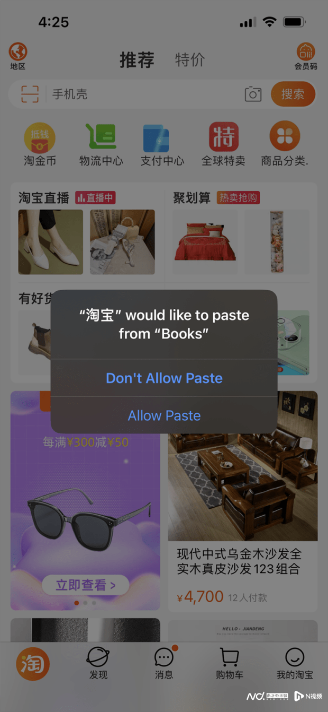

# 202206

1. [202206](#202206)
    1. [国内隐私相关](#国内隐私相关)
        1. [个人信息出境标准合同规定（征求意见稿）](#个人信息出境标准合同规定征求意见稿)
        2. [网络安全审查办公室对知网启动网络安全审查](#网络安全审查办公室对知网启动网络安全审查)
        3. [学习通曝出大规模被拖库事件，1.7 亿条信息遭公开售卖，波及全国大量高校，官方回应称未发现证据](#学习通曝出大规模被拖库事件17-亿条信息遭公开售卖波及全国大量高校官方回应称未发现证据)
        4. [国内首个个人信息保护、确权服务平台“人民数保”正式上线](#国内首个个人信息保护确权服务平台人民数保正式上线)
        5. [新国标：长期不用的 App 或被自动解除敏感权限授权](#新国标长期不用的-app-或被自动解除敏感权限授权)
        6. [国家网信办修订《移动互联网应用程序信息服务管理规定》发布施行](#国家网信办修订移动互联网应用程序信息服务管理规定发布施行)
        7. [市场监管总局与国家网信办：开展数据安全管理认证工作](#市场监管总局与国家网信办开展数据安全管理认证工作)
        8. [天津一起人脸识别案胜诉，小区以刷脸作为唯一通行方式被判违法](#天津一起人脸识别案胜诉小区以刷脸作为唯一通行方式被判违法)
2. [海外隐私相关](#海外隐私相关)
    1. [Firefox 浏览器推出 Total Cookie Protection 功能](#firefox-浏览器推出-total-cookie-protection-功能)
    2. [TikTok 美国用户数据已转移到甲骨文，字节跳动无法访问](#tiktok-美国用户数据已转移到甲骨文字节跳动无法访问)
    3. [不再担心 App 偷窥手机剪贴板！苹果要求访问前获得用户授权](#不再担心-app-偷窥手机剪贴板苹果要求访问前获得用户授权)
    4. [Facebook 正在开发“隐私安全”广告产品](#facebook-正在开发隐私安全广告产品)
    5. [谷歌因侵犯隐私向居民赔偿 1 亿美元](#谷歌因侵犯隐私向居民赔偿-1-亿美元)
    6. [Tim Hortons 应用程序在收集“大量”位置数据时违反了法律](#tim-hortons-应用程序在收集大量位置数据时违反了法律)
    7. [美国《数据隐私和保护法》（草案）公布](#美国数据隐私和保护法草案公布)
    8. [泰国《个人数据保护法》生效：违规最高可能面临一年的监禁或 500 万泰铢的罚款](#泰国个人数据保护法生效违规最高可能面临一年的监禁或-500-万泰铢的罚款)

## 国内隐私相关

### 个人信息出境标准合同规定（征求意见稿）

> #数据法规

- source: [个人信息出境标准合同规定（征求意见稿）](http://www.moj.gov.cn/pub/sfbgw/lfyjzj/lflfyjzj/202206/t20220630_458805.html)
- date: 2022-06-29

中国个人信息出境的标准合同条款（SCC），根据第四条看，约束还是比较多的，适合小厂，参考约束条件

1. （一）非关键信息基础设施运营者
2. （二）处理个人信息不满 100 万人的；
3. （三）自上年 1 月 1 日起累计向境外提供未达到 10 万人个人信息的；
4. （四）自上年 1 月 1 日起累计向境外提供未达到 1 万人敏感个人信息的。

截止目前总结出境一般三种方式，

1. 网信办安全评估，对于大厂来说必经之路，也是比较好的方式。
2. 专业机构评估和个人信息保护，目前国内此类高置信度机构相对不多。
3. 签署 SCC，也就是意见稿的方式，如果规模不大，此类方式相对成本可控

### 网络安全审查办公室对知网启动网络安全审查

> #信息安全

- source: [网络安全审查办公室对知网启动网络安全审查](https://mp.weixin.qq.com/s/6hi4MJ11ljzMjWSBzpm_hw)
- date: 2022-06-24

　网络安全审查办公室有关负责人表示，为防范国家数据安全风险，维护国家安全，保障公共利益，依据《国家安全法》《网络安全法》《数据安全法》，按照《网络安全审查办法》，2022 年 6 月 23 日，网络安全审查办公室约谈同方知网（北京）技术有限公司负责人，宣布对知网启动网络安全审查。据悉，知网掌握着大量个人信息和涉及国防、工业、电信、交通运输、自然资源、卫生健康、金融等重点行业领域重要数据，以及我重大项目、重要科技成果及关键技术动态等敏感信息。

### 学习通曝出大规模被拖库事件，1.7 亿条信息遭公开售卖，波及全国大量高校，官方回应称未发现证据

> #数据安全

- source: [学习通曝出大规模被拖库事件，1.7亿条信息遭公开售卖，波及全国大量高校，官方回应称未发现证据](https://www.leiphone.com/category/industrynews/8yHwYPIkn8r1e8I9.html)
- date: 2022-06-21

近日，“学习通数据库疑发生信息泄露”登上微博热搜。据网络安全公众号“M78 安全团队”6 月 20 日发文（现已删除），高校学习软件“学习通”数据库信息疑似大规模泄露，包含姓名、手机号、性别、学校、学号、邮箱等信息，数量疑达 1 亿 7273 万条。

对此，学习通方面 21 日发微博回应称，不存储用户明文密码，采取单向加密存储，理论上用户密码不会泄露，“公司确认网上传言密码泄露是不实的”。学习通还称收到用户数据疑似泄露的消息后已连续技术排查十余小时，暂未发现明确的用户信息泄露证据，且公安机关已经介入调查。

尽管学习通方面并未确认发现了用户数据泄露，截至目前，已有多位学习通用户在网上晒出登录后的学习通页面，有的显示使用次数高达十几万次。还有网友称，自己近日收到不少骚扰电话，怀疑与学习通数据泄露有关。

---

新加坡之前也有过（小规模的）信息泄露，比如身份证。政府在这方面反应很快，网上填资料只许要身份证最后四位，还有个中央验证系统 Singpass，第三方网站可以请求用户授权，从这里 pull 个人信息

### 国内首个个人信息保护、确权服务平台“人民数保”正式上线

> #隐私安全

- source: [人民数保](https://pdc.peopleyun.cn/home)
- date: 2022-06-20

“人民数保”是由人民日报、人民网旗下“党管数据”理论和实践平台人民数据和世纪互联倾力打造的平台，是我国首个个人信息保护与确权服务平台。

据介绍，人民数保平台将通过个人用户二次数据上链，确保身份数据、内容数据、行为数据的安全、可信和不可篡改，提供数据授权、认证、计费，实现个人数字身份和个人数据资产的全环节审核、授权、存证、确权、流转及二次开发的新型信息基础服务。

人民数保基于数据权限管理和资源调度机制，利用区块链技术，既防止数据滥用、盗用、泄露，又提供了数据共享的酬劳分配机制，确保了数据消费者在请求、授权和行权过程中的责权清晰，从而促进数据消费者对所授权数据的利用和价值挖掘，实现了从数据资源到数据资产乃至数据资本的发展。

旨在保护个人数据不被非法乱用的同时，实现数据精准**确权、授权、流转**及二次开发，将个人数据权利还归个人，让数据真正取用于民、造福于民，让广大人民群众共享数字化红利。同时，作为“人民数保”平台在全国落地的抓手，“数据强国工程暨百城千县计划”也于同日启动。

### 新国标：长期不用的 App 或被自动解除敏感权限授权

> #数据法规

- source: [关于国家标准《信息安全技术 移动智能终端的移动互联网应用程序（App）个人信息处理活动管理指南》征求意见稿征求意见的通知](https://www.tc260.org.cn/front/bzzqyjDetail.html?id=20220613211733&norm_id=20211108000016&recode_id=47126)
- date: 2022-06-17

6 月 13 日，全国信息安全标准化技术委员会发布国家标准《信息安全技术移动智能终端的移动互联网应用程序（App）个人信息处理活动管理指南》（以下简称《指南》）并公开征求意见。

《指南》拟根据 App 生命周期，要求移动智能终端为用户提供敏感数据访问提示和控制功能，并拟将应用程序列表和剪切板纳入敏感数据/能力。**《指南》还拟引入权限自动重置机制——对于长期不用的 App，用户可以选择自动解除其敏感权限授权**。

### 国家网信办修订《移动互联网应用程序信息服务管理规定》发布施行

> #数据法规

- source: [国家网信办修订《移动互联网应用程序信息服务管理规定》发布施行](http://politics.people.com.cn/n1/2022/0615/c1001-32446942.html)
- date: 2022-06-14

6 月 14 日，新修订的《移动互联网应用程序信息服务管理规定》发布。新规定要求，应用程序提供者和应用程序分发平台应当履行信息内容管理主体责任，建立健全信息内容安全管理、信息内容生态治理、数据安全和个人信息保护、未成年人保护等管理制度，确保网络安全，维护良好网络生态。

该规定将自 2022 年 8 月 1 日起施行

### 市场监管总局与国家网信办：开展数据安全管理认证工作

> #数据安全

- source: [国家市场监督管理总局 国家互联网信息办公室关于开展数据安全管理认证工作的公告](https://gkml.samr.gov.cn/nsjg/rzjgs/202206/t20220609_347615.html)
- date: 2022-06-05

国家市场监督管理总局与国家互联网信息办公室发布了《关于开展数据安全管理认证工作的公告》（以下简称《公告》）。《公告》鼓励网络运营者通过认证方式规范网络数据处理活动，加强网络数据安全保护。从事数据安全管理认证活动的认证机构应当依法设立，并按照《数据安全管理认证实施规则》实施认证。数据安全管理认证的认证模式为：技术验证 + 现场审核 + 获证后监督。

这是首次由两家国家权威机构来开展数据安全管理认证工作，体现了国家对数据安全的高度重视。通过认证后获得的“认证标志”，可以按照有关规定在广告等宣传中使用，可以增加外界公众对网络运营者的信任度，助力数据处理相关业务的顺利开展。

### 天津一起人脸识别案胜诉，小区以刷脸作为唯一通行方式被判违法

> #隐私庭审

- source: [天津一起人脸识别案胜诉，小区以刷脸作为唯一通行方式被判违法](https://www.sohu.com/a/554352407_114988)
- 2022-06-05

因将人脸识别作为进出小区的唯一通行验证方式，天津市一物业公司被居民告上法庭。一审法院认为，相关证据不能证明被告侵犯了其隐私权。近日，该案二审作出改判，法院要求物业公司删除原告人脸信息，并为其提供其他出入小区的通行验证方式。

庭审经过：

此案一审的案由被法院定为隐私权纠纷。依据《民事诉讼法》第六十四条“当事人对自己提供的主张，有责任提供证据”的规定，**一审法院判决认为，原告顾某并未提交被告对其信息存在泄露、篡改、丟失的相关证据，且提供的相关证据不能证明二被告侵犯了其隐私权**。故原告的诉讼请求没有事实和法律依据，不予支持，驳回全部诉讼请求。

顾某不服一审判决，后上诉至天津市第一中级人民法院。上诉人认为，本案的主要法律问题是个人信息保护而非隐私权，一审法院适用法律错误，案由选择错误。其未主张个人信息被泄露、篡改、丢失，无需提供相关证据，一审法院对举证责任的认定有误。

二审法院对一审法院查明的事实予以确认，认为本案系因处理个人信息引发的纠纷，**案由应确定为个人信息保护纠纷**。

二审法院指出，根据 2021 年 8 月 1 日起施行的《最高人民法院关于审理使用人脸识别技术处理个人信息相关民事案件适用法律若干问题的规定》第 10 条规定，**如果有业主或者物业使用人不同意采取上述验证方式而请求物业公司提供其他合理验证方式的，物业公司不能以智能化管理为由予以拒绝**。

此外，《个人信息保护法》本来就规定了撤回权，基于个人同意处理个人信息的，个人有权撤回同意。个人信息处理者应当提供便捷的撤回同意的方式。对业主来说，根本不需要具备个人信息存在被泄露、篡改、丢失等危险的前提，便可以向物业提出撤回、删除的要求。

# 海外隐私相关

## Firefox 浏览器推出 Total Cookie Protection 功能

> #隐私保护

- source: [想更好地保护个人隐私，不妨再给Firefox一次机会？](https://posts.careerengine.us/p/62a9d466c6cde2514dc2dd02?from=latest-posts-panel&type=title)
- date: 2022-06-15

为了进一步强化 Firefox 浏览器的隐私与安全，Mozilla 于今天宣布为所有桌面用户推出默认启用的 "Total Cookie Protection" 功能。

作为 Firefox 浏览器最强大的隐私功能之一，"Total Cookie Protection" 是在 Firefox 86 版本中首次引入的（非默认设置），随后在 Firefox 89 版本中被扩展到隐私浏览模式（隐私模式默认启用），并在 Firefox 91 中进一步改进，以防止数据泄露。

此前只有在你打开 Firefox 的隐私浏览模式时，才会默认启用 Total Cookie Protection。但是从今天起，所有桌面平台（Linux、macOS 和 Windows）上的 Firefox 浏览器都会默认启用这项功能，无需切换任何东西，也不会影响正常的网络浏览体验。

"Total Cookie Protection" 可以将 Cookie 限制在创建它们的网站上，这样就可以防止网站读取其他服务创建的 Cookie，增强了在线跟踪的保护。

> 通过让所有用户默认使用 Total Cookie Protection 功能，Firefox 现在在隐私保护方面将 Chrome 和 Edge 甩在身后。Mozilla 认为，虽然广告是互联网经济的核心，但对消费者的隐私保护不应该是可选的。Total Cookie Protection 的工作原理是为你访问的每个网站创建一个单独的 Cookie 存储区域（Cookie Jar）。与其让追踪者将你在多个网站上的行为联系起来，不如让他们只看到在单个网站上的行为。

## TikTok 美国用户数据已转移到甲骨文，字节跳动无法访问

> #数据安全

- source: [TikTok已将美国用户数据转移到甲骨文，由新团队控制监管，字节跳动无法访问](https://www.leiphone.com/category/industrynews/h10kBmoo0AtTu86y.html)
- date: 2022-06-18

据路透社报道，TikTok 已完成将美国用户的数据信息迁移到甲骨文公司 (Oracle）的服务器上，从而解决美国监管机构对该应用数据完整性的担忧。

早在今年 3 月，字节跳动旗下抖音海外版 TikTok 就已被曝接近与甲骨文达成协议，由甲骨文存储 TikTok 美国用户的信息，而字节跳动则无法访问这些数据。

字节跳动希望以此，来解决美国海外投资委员会 (CFIUS) 对数据安全的担忧。

报道称，TikTok 此前一直将其美国用户数据存储在位于弗吉尼亚州的数据中心，并在新加坡进行备份。与甲骨文达成交易后，字节将从自己的数据中心删除美国用户的私人数据，并完全依赖和存储在甲骨文的美国服务器。但目前，弗吉尼亚和新加坡中心仍用于备份数据。

TikTok 相关人士表示，TikTok 还成立了一个专门的美国数据安全管理团队，称为“USDS”，作为美国用户信息的看门人，并将其与字节跳动隔离开来。

根据交易协议，这个美国数据管理团队由数百人组成，包括内容审核人员、工程师以及用户、产品运营的成员。

消息人士表示，TikTok 公司正在讨论一种结构，在这种结构下，团队将自主运作，不受 TikTok 的控制或监督。

消息人士还补充称，TikTok 还在探索与其他技术公司在防火墙和网络安全措施方面进行合作。

据悉，美国商务部正在考虑制定新规则，以应对 TikTok 和其他外国应用程序的潜在安全风险，甚至可能禁止其中一些应用程序。

这些规则如果被采纳，可能会迫使 TikTok 接受第三方审计、源代码检查和对用户数据日志的监控。

## 不再担心 App 偷窥手机剪贴板！苹果要求访问前获得用户授权

> #隐私安全

- souce: [不再担心App偷窥手机剪贴板！苹果要求访问前获得用户授权](https://www.sohu.com/a/555392436_161795)
- date: 2022-06-08

当地时间 6 月 7 日，苹果召开全球开发者大会（WWDC22），会上发布了全新操作系统 iOS 16，扩展了隐私功能。继麦克风、摄像头和定位等敏感权限之后，新版本会在 App 访问剪贴板之前，弹窗征求用户的明确授权。

新的操作系统要求 App 在访问剪贴板之前，必须征得用户的明示同意。这意味着，除了定位、通讯录、照相机、麦克风、传感器外，剪贴板也被纳入敏感权限的范畴。

## Facebook 正在开发“隐私安全”广告产品

> #隐私安全

- source: [Facebook is developing a privacy-safe ad product as it tries to save its advertising business](https://www.businessinsider.com/facebook-developing-ads-product-no-user-data-amid-privacy-changes-2022-6)
- date: 2022-06-02

Facebook 正在早期开发一个不依赖任何匿名用户个人信息的产品。Facebook 的工程师们称之为“基本广告”，它针对的是那些试图建立知名度和塑造产品认知的品牌广告商。该产品似乎与广告商使用 Facebook 的目标工具背道而驰。但是，既能提供规模，又能绕过 CCPA 和 GDPR 等数据法规的广告仍然会得到广告商的青睐。

## 谷歌因侵犯隐私向居民赔偿 1 亿美元

> #隐私安全

- source: [谷歌因侵犯隐私向居民赔偿1 亿美元](https://www.freebuf.com/news/335570.html)
- date: 2022-06-08

据 Cybernews 网站消息，美国伊利诺伊州居民对谷歌发起了一项集体诉讼，指控这家科技巨头未经其同意的情况下收集和存储个人生物特征，此举违反了伊利诺伊州的生物识别信息隐私法 (BIPA)。最终谷歌以同意支付 1 亿美元赔偿与诉讼达成和解。

根据原告们的说法，谷歌相册在未经充分的事先通知和同意的情况下，将照片中出现的相似人脸进行分组归类，谷歌认为，该功能主要是为了帮助用户组织归纳同一个人的照片，方便就某个人照片进行查阅。谷歌声称该功能仅用户个人可见，且可以轻松地关闭。

代表集体诉讼的网站声称，任何伊利诺伊州居民，只要在 2015 年 5 月 1 日至 2022 年 4 月 25 日期间内有任何面部影像出现在 Google 照片中，都有资格申请获得赔付，申请赔付的截至日期为 9 月 24 日，最终的听证会将于 9 月 28 日举行。根据预估的申请赔付人数，每人将可获得 200-400 美元赔偿。

## Tim Hortons 应用程序在收集“大量”位置数据时违反了法律

> #数据安全

- source: [Tim Hortons app violated privacy laws in collection of ‘vast amounts’ of sensitive location data](https://www.priv.gc.ca/en/opc-news/news-and-announcements/2022/nr-c_220601/)
- date: 2022-06-01

联邦与省级私隐监管机构裁定，Tim Hortons 的应用程序，可以从用户收集大量位置讯息，这违反了加国法例。

私隐专员发表报告，表示下载 Tim Hortons 应用程序的消费者，每隔数分钟，便会被跟踪及纪录 1 次所在位置等资料，即使应用程序没有在手机打开时亦可以做到。

委员表示，Tim Hortons 收集了“大量精细”位置数据，目的是要提供具针对性的广告，及可更佳地推广其咖啡与相关产品，但实际上，从未将这些数据用于这目的。

监管机构又发现，该应用程序使用位置数据来推断用户住在哪里，在哪里工作，及是否在旅游。

委员在联合声明中指出，每次用户进入或离开 Tim Hortons 的竞争对手、体育场馆、家中或工作场所时，都会“产生”1 个“事件”。

声明指出：“调查发现 Tim Hortons 在搁置其用于定向广告计划后，仍继续收集位置数据一年，即使已没有这样做的需要”。

监管机构表示，Tim Hortons 在 2020 年已停止持续跟踪用户的位置。

Therrien 表示：“地理位置数据十分敏感，因可显示生活详细情况与画面”；他表示，对市民日常活动的监控，可以显示人们的生活与工作地点，及有关医疗或上礼拜堂等讯息，亦可用来推断偏好、社会政治背景等”。

Tim Hortons 已接纳监管当局的建议，包括删除任何剩余位置数据，并指示第三方服务供应商执行相关操作，建立与维修应用程序的私隐管理程序，及公布遵守建议而所采取的措施。

## 美国《数据隐私和保护法》（草案）公布

> #隐私法规

- source: [Distilling the essence of the American Data Privacy and Protection Act discussion draft](https://iapp.org/news/a/distilling-the-essence-of-the-american-data-privacy-and-protection-act-discussion-draft/)
- date: 2022-06-06

6 月 3 日星期五，美国众议院和参议院发布了一份名为《美国数据隐私和保护法案》（ADPPA）的全面数据隐私法案的两党讨论草案。

从 [Bipartisan U.S. Federal Privacy Bill Circulated](https://www.jdsupra.com/legalnews/bipartisan-u-s-federal-privacy-bill-9169312/) 摘录的一些 High-Level Takeaways：

- **一个新的模式** - 该法案草案不是以加利福尼亚州、康涅狄格州、科罗拉多州、犹他州和弗吉尼亚州的现有法律为模型。它也不是以 GDPR 为模型。也就是说，该法案中的某些概念和定义与现有法律相似。
- **数据范围** - 该法案适用的数据范围为：“**可识别或与个人相联系或可合理联系的信息，或者可识别或者与一个或多个个人相联系或可合理联系的设备，包括衍生数据和独特的标识符**”。受保护的数据不包括去除识别（de-identified）的数据、雇员数据（广义的）和公开的信息（也是广义的）。
- **约束范围** – 该法案覆盖的实体包括“任何收集、处理或传输覆盖数据的实体或个人”
- **数据最小化**
- **数据处理限制** - 受约束的实体将被禁止从事八项数据处理活动，比如未经肯定同意收集、处理和转让生物识别和基因信息，除非有例外情况。
- ...

更多要点，请访问：[Bipartisan U.S. Federal Privacy Bill Circulated](https://www.jdsupra.com/legalnews/bipartisan-u-s-federal-privacy-bill-9169312/)

## 泰国《个人数据保护法》生效：违规最高可能面临一年的监禁或 500 万泰铢的罚款

> #隐私法规

- source: [最新 | 泰国《个人数据保护法》生效：违规最高可能面临一年的监禁或500万泰铢的罚款](https://mp.weixin.qq.com/s?__biz=MzIyNjUxOTQ0MQ==&mid=2247530054&idx=2&sn=79e8cb4b9866f636f0feec758f740e00&chksm=e86d06b8df1a8fae597928d18ec65e6848c608d495cd738ea40e8ed439941c5d3f176d549324&mpshare=1&scene=2&srcid=0607slmghwEqJzhTIJB6RRug&sharer_sharetime=1654573365417&sharer_shareid=ef7dc9a3b4932e7e94a89420a068e8ea#rd)
- date: 2022-06-07

近日，泰国全国新闻委员会发布公告称，泰国《个人数据保护法》（Personal Data Protection Act B.E.2562，简称 PDPA）将于 2022 年 6 月 1 日正式生效。

PDPA 是泰国制订的第一部用于管理和保护数据的法律，**该法案适用于在泰国境内为泰国提供产品或服务而处理个人数据的实体**。PDPA 规定了数据控制者和数据处理者（包括公共和私人实体）在处理、收集或披露个人数据之前，应如何获得数据主体的同意。此外，PDPA 规定数据主体有权要求访问其个人数据，并有权删除此类数据。数据主体也有权反对收集、使用或披露他们的个人数据。法律在很多方面体现了欧盟《通用数据保护条例》（GDPR）中的内容。

在处罚措施方面，泰国皇家公报概述了三种类型的责任：**刑事、民事和行政责任**。处罚取决于违规的程度和类型，刑事处罚包括最高 100 万泰铢（约合 19 万人民币）的罚款以及最高一年的监禁，而行政处罚则可能导致最高 500 万泰铢（约合 97 万人民币）的罚款和最高两倍于实际损失金额的惩罚性赔偿。

此外，泰国个人数据保护委员会（CDPC）近日在社交媒体上表示，该法案在某些特定情况下将对数据使用者给予**豁免**。例如，**未经他人许可拍摄包含他人个人信息的照片或视频，如果拍摄者并无恶意，这种行为将不违法。在上传该类照片或视频时，如果内容不用做商业用途或对当事人造成伤害，这种行为也不会违法。房主在屋内安装监控摄像头，如用于防止犯罪或保证房主安全的情况下，该摄像头无需标有警告标识。在用于公共利益、合同义务、重大利益或遵守法律的情况下，数据使用者无需在每次使用数据前向个人数据主体取得同意等**。
