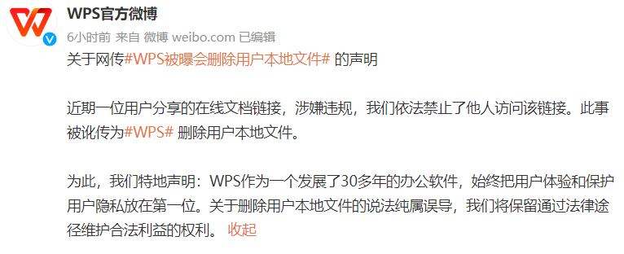

# 202207

### 阿里巴巴与蚂蚁终止《数据共享协议》1. [202207](#202207)
    1. [国内隐私相关](#国内隐私相关)
        1. [阿里巴巴与蚂蚁终止《数据共享协议》](#阿里巴巴与蚂蚁终止数据共享协议)
        2. [央行：数字人民币可满足个人匿名支付需求](#央行数字人民币可满足个人匿名支付需求)
        3. [“国家云”框架浮出水面，中国电信牵头，中国电子等央企注资](#国家云框架浮出水面中国电信牵头中国电子等央企注资)
        4. [WPS 被曝删除用户本地文件？记者实测及官方回应](#wps-被曝删除用户本地文件记者实测及官方回应)
        5. [河南村镇银行案嫌疑人专门设立公司删改数据，该公司疑为空壳](#河南村镇银行案嫌疑人专门设立公司删改数据该公司疑为空壳)
        6. [国家网信办公布《数据出境安全评估办法》](#国家网信办公布数据出境安全评估办法)
        7. [阿里云警方数据库遭入侵 10 亿个资及数十亿警讯 20 大前泄露](#阿里云警方数据库遭入侵-10-亿个资及数十亿警讯-20-大前泄露)
        8. [TikTok 证实中国员工能访问不敏感的美国用户数据](#tiktok-证实中国员工能访问不敏感的美国用户数据)
        9. [2022 西湖论剑，网络安全大会](#2022-西湖论剑网络安全大会)
    2. [海外隐私相关](#海外隐私相关)
        1. [因传送居民 IP 地址等数据到美国，欧委会被诉违反 GDPR](#因传送居民-ip-地址等数据到美国欧委会被诉违反-gdpr)
        2. [提升设备安全和隐私功能 苹果将推出 Lockdown Mode](#提升设备安全和隐私功能-苹果将推出-lockdown-mode)
        3. [万豪国际数据遭泄露，20GB 文件被窃取](#万豪国际数据遭泄露20gb-文件被窃取)

## 国内隐私相关

> #数据共享

- source: [阿里巴巴与蚂蚁终止《数据共享协议》，有何考虑？影响几何？](https://www.sohu.com/a/572603148_161795)
- date: 2022-07-29

三言财经 7 月 26 日消息，今日，阿里发布 2022 财年年报，年报显示，阿里巴巴与蚂蚁集团进一步修订《股权 和资产购买协议》及《支付宝商业协议》，若干修订将于 2022 年 8 月 13 日生效。

据协议，7 月 25 日，阿里与蚂蚁集团同意终止《数据共享协议》，并称其将与蚂蚁集团按双方向各自客户提供服务的必要限度，根据个案并依照适用法律及法规协商数据共享安排的条款。

终止《数据共享协议》意味着什么？背后有何考虑？有专家表示，阿里巴巴、蚂蚁集团等这样的大型集团通过采用终止数据共享这一数据“隔离式”措施来控制风险边界，可能是出于合规考虑。

北京师范大学互联网研究院院长助理、中国互联网协会研究中心副主任吴沈括表示，《数据共享协议》终止后，为了保持企业现有的服务水平和良好的用户体验，两方可能各自会重新收集用户的个人信息.

“**此前通过双方数据共享可以减少对个人信息的收集频率和范围，《数据共享协议》终止后，为了实现个性化服务等，可能会有一个再次收集的过程，也意味着各自业务的调整。**”

在他看来，阿里巴巴和蚂蚁集团两大集团所属数据供应链的组成成分较为复杂，以往数据共享生态的结束也会对例如互联网广告领域等下游数据使用者产生影响，可能需进行业务的重新设计。

一位不愿具名的数据行业人士认为，阿里巴巴与蚂蚁集团的《数据共享协议》类似于框架性协议，终止协议可能会对数据共享的技术操作有所影响，但是对企业的实际业务影响不会太大——阿里系的子公司、分公司可以根据具体的合作事项、数据种类、利用方式等制定单独的数据共享协议。

就在同意终止《数据共享协议》的第二天，7 月 26 日，阿里巴巴发布公告称，董事会已授权集团管理层向香港联合交易所提交申请，拟将香港新增为主要上市地。在香港联交所完成审核程序后，阿里巴巴将在香港联交所主板及纽约证券交易所两地双重主要上市。

“**降低单个公司主体持有或者掌握的数据量，也可以降低上市的合规风险。**”上述数据行业人士分析，共享数据容易被认定为持有或者掌握的自有数据，阿里和蚂蚁的数据切开的话，有可能也是考虑到现在国内外的监管要求，比如数据出境安全评估规定和国外证券交易监管机构的披露要求。

吴沈括认为，从单纯的法律角度来看，个人信息保护法的相关规定对数据共享提出了较为严格的要求。出于风控考虑，阿里巴巴、蚂蚁集团等这样的大型集团通过采用终止数据共享这一数据“隔离式”措施来控制风险边界实属正常的合规选择。

> 个保法第二十三条：
> 个人信息处理者向其他个人信息处理者提供其处理的个人信息的，应当向个人告知接收方的名称或者姓名、联系方式、处理目的、处理方式和个人信息的种类，并取得个人的单独同意。接收方应当在上述处理目的、处理方式和个人信息的种类等范围内处理个人信息。接收方变更原先的处理目的、处理方式的，应当依照本法规定重新取得个人同意。

### 央行：数字人民币可满足个人匿名支付需求

> #数字货币

- source: [央行：数字人民币可满足个人匿名支付需求](https://www.chinanews.com.cn/cj/2022/07-25/9811279.shtml)Q
- date: 2022-07-25

7 月 24 日，人民银行数字货币研究所所长穆长春在第五届数字中国建设峰会数字人民币产业发展分论坛上发言。对于数字人民币是否侵犯用户隐私的担忧，穆长春表示，数字人民币作为人民银行发行的法定数字货币，会充分尊重隐私与个人信息保护，并在此基础上做好风险防范，以防止被不法分子利用。数字人民币的可控匿名将为公众提供体验更好、更加安全的支付服务起到积极作用。

“有人说，数字人民币不能买黄金买外汇。这个说法不正确。”穆长春表示，数字人民币是数字形式的法定货币，与实物人民币 1︰1 兑换，纸钞和硬币能买的东西，数字人民币都能买。纸钞和硬币能买黄金和兑换外汇，数字人民币同样也可以。

还有人认为，数字人民币侵犯用户隐私。穆长春对此回应称，可控匿名作为数字人民币的重要特征，一方面体现了流通中的现金 (M0) 的定位，保障公众合理的匿名交易和个人信息保护的需求；另一方面，也是防控和打击洗钱、恐怖融资、逃税等违法犯罪行为，维护金融安全的客观需要。

穆长春表示，保护消费者隐私应做好三项工作：**一是应符合日常小额现金支付的习惯，确保相关支付交易的保密性；二是应明确匿名对象，确保消费者使用数字人民币进行交易时，其个人信息不被商户和其他未经法律授权的第三方获取；三是应加强个人信息的使用和保护，确保运营机构收集的客户基本信息、产生的交易和消费行为信息不会被泄露。**

**对于数字人民币的下一步计划，穆长春在会上透露，一方面，要加强立法，完善顶层制度设计；另一方面，要强化科技应用，提升风险防控能力。**

他表示，为确保数字人民币可控匿名要求的有效落实，需要在顶层制度设计上作出四项相应安排，分别是**建立信息隔离机制；明确数字钱包查询、冻结、扣划的法律条件；建立相应的处罚机制；完善数字人民币反洗钱、反恐怖融资等法规制度。**

对于信息隔离机制，穆长春表示，将明确运营机构开展数字人民币运营业务的独立性，并通过设立数字人民币客户信息隔离机制和使用限制，规范数字人民币客户信息的使用。

在提升风险防控能力方面，穆长春表示，数字人民币监管将强化监管科技应用实践，积极利用大数据、人工智能、云计算等技术丰富金融监管手段，提升跨行业、跨市场交叉性金融风险的甄别、防范和化解能力。

### “国家云”框架浮出水面，中国电信牵头，中国电子等央企注资

> #本地存储

- source: [“国家云”框架浮出水面，中国电信牵头，中国电子等央企注资](https://www.sohu.com/a/567728938_161795)
- date: 2022-07-15

中国电信全面实施“云改数转”战略，加快以“云网融合”为核心特征的数字信息基础设施建设，全力承接“东数西算”工程；以科技创新赋能云网融合，争当“原创技术策源地”和“现代产业链链长”。

目前的时长规模看，2021 年下半年天翼云（公有云 IaaS+PaaS）市场份额为 8.9%，位居市场第四位。前五名的市场份额分别为 36.7%（阿里云）、11.1%（腾讯云）、10.8%（华为云）、8.9%（中国电信天翼云）、7.4%（AWS）。按单公有云计算，天翼云也排在第四位，前五名的市场份额分别为 37.8%（阿里云）、11.4%（华为云）、10.9%（腾讯云）、10.3%（中国电信天翼云）、6.4%（AWS）。

**合规相关**：如果天翼云作为国家队，重要数据和关键设施数据的上云，很可能会优先选择天翼云，置信度高，政府背书；另外，从市场规模看，20% 左右云市场的长尾需要研究下，到底是被哪些特殊需求瓜分了。

### WPS 被曝删除用户本地文件？记者实测及官方回应

> #隐私安全

- source: [WPS被曝删除用户本地文件？记者实测及官方回应](https://mp.weixin.qq.com/s/98Nvdq7rPdg785ypfordnA)
- date: 2022-07-12

根据新浪科技报道，网友“米兔只想赚钱”称自己利用 WPS 写作编辑的一百多万字小说，被 WPS 以“**文件含有违禁内容，禁止访问**”的理由进行封锁，完全打不开。

WPS 对此发布回应称，“删除用户本地文件”的说法属于讹传。近期一位用户分享的在线文档链接涉嫌违规，WPS 依法禁止了他人访问该链接。

声明发布后，网友“米兔只想赚钱”再次发帖质疑，强调自己的文件完全合法合规，不存在违禁内容，并称被封文件除了配合 WPS 调查分享给 WPS 工作人员外，并未给其他人分享过。

当事人回忆，事发是在 5 月，自己的文稿被 WPS 无端封锁无法打开使用，自己在与 WPS 的沟通过程中，对方承认是审核系统误判敏感词，并承诺将加强系统检测漏洞，而非今日的官方声明所言，是由于文档本身含有违禁内容并且对外分享。

米兔称，其文档目前统共超过一百万字，仅仅只在去年 1 万字左右时单独给编辑分享过，此后在 WPS 内部人员要求其分享链接配合调查时有过分享。那么问题就来了，就算有敏感词，是 WPS 后台偷偷查看的吗？细思极恐！

而且米兔还强调，自己平常创作中有多平台备份的习惯，相同的文档在其他多个云文档平台中皆有存档，并未出现内容违法违规提示。米兔称自己开通了 WPS 会员的自动备份功能，因此，并不能确定 WPS 的审核扫描是否会对本地文件展开。她表示自己从未说过本地文件被删，只是被封锁，无法打开。

据她回忆，当天在与客服初步沟通无果后找到了位于 C 盘的备份文档，在 WPS 无法打开的情况下，右键利用其他文档软件如 Word 可以顺利打开原来的文档。与 WPS 沟通三天后，WPS 方向她道歉，并且该文件被解锁。

贝壳财经记者在实测中发现，当使用 WPS 打开涉违规内容 PDF 文件，并想要采用链接方式分享给别人时，原本可以分享的链接在几十秒到几十分钟不等的时间内显示出了“该文档已被封禁，暂不支持分享”字样，不过该文件的本地文件和云文件并未被删除。

记者实测结果：

1. 链接被封禁本地文件并未封禁
2. 分享时或会触发审核流程

WPS 回应：“现在 WPS 遇到的问题与整治网上不良内容的净网行动有关，发现违规内容会直接冻结，但不能删除，因为那属于用户数据。”

> 对于 WPS 的回应：
>
> 1. WPS 没有说明这位用户违反了什么法规，法规的哪一条。
> 2. WPS 没有停止别人访问私人连接的权力。
> 3. WPS 没有权利干预属于私人领域的文件共同编辑。
>

>在线文件编辑不同于微博，是完全的私人领域。互联网监管无权对在线文件的编辑进行管理。除了恐怖袭击等特例外，几个用户共同编辑一个文件，是不能被政府干预的。而每一起干预必须经过法院授权，而监管也有责任把干预的理由和证据公开。

>

>[泛政治化](https://zh.m.wikipedia.org/zh-hans/%E6%B3%9B%E6%94%BF%E6%B2%BB%E5%8C%96)：指在讨论非政治学领域内容、超出政治学限度，在非必要情况下牵扯到政治相关因素。在政党政治的国家体制内，泛政治化也指政党之间，为互相竞争而不论对国家人民是否有利，抵制对方政党的政策或主张。

### 河南村镇银行案嫌疑人专门设立公司删改数据，该公司疑为空壳

### 国家网信办公布《数据出境安全评估办法》

> #数据跨境

- source: [国家网信办公布《数据出境安全评估办法》](http://tech.ce.cn/news/202207/08/t20220708_37847020.shtml)
- date: 2022-07-08

　7 月 7 日，国家互联网信息办公室公布《数据出境安全评估办法》（以下简称《办法》），自 2022 年 9 月 1 日起施行。

　　国家互联网信息办公室有关负责人表示，出台《办法》旨在落实网络安全法、数据安全法、个人信息保护法的规定，规范数据出境活动，保护个人信息权益，维护国家安全和社会公共利益，促进数据跨境安全、自由流动，切实以安全保发展、以发展促安全。

　　《办法》规定了数据出境安全评估的范围、条件和程序，为数据出境安全评估工作提供了具体指引。

　　《办法》明确，数据处理者向境外提供在中华人民共和国境内运营中收集和产生的重要数据和个人信息的安全评估适用本办法。提出数据出境安全评估坚持事前评估和持续监督相结合、风险自评估与安全评估相结合等原则。

　　《办法》规定了应当申报数据出境安全评估的情形，包括**数据处理者向境外提供重要数据、关键信息基础设施运营者和处理 100 万人以上个人信息的数据处理者向境外提供个人信息、自上年 1 月 1 日起累计向境外提供 10 万人个人信息或者 1 万人敏感个人信息的数据处理者向境外提供个人信息以及国家网信部门规定的其他需要申报数据出境安全评估的情形**。

### 阿里云警方数据库遭入侵 10 亿个资及数十亿警讯 20 大前泄露

> #数据安全

- source: [阿里云警方数据库遭入侵　10亿个资及数十亿警讯20大前泄露](https://www.rfa.org/cantonese/news/data-07042022073024.html)
- date: 2022-07-04

上海公安系统存储的 10 亿个人信息及数十亿条报警记录遭泄露，社交平台电报（Telegram）上一名黑客索价 10 个比特币（约 20 万美元）出售这批资料，部分个资现已提前放送。消息说，上述数据原本存储于阿里云，去年已被盗。

一个 Telegram 频道在周日（3 日）曝出，上海公安系统数据库怀疑遭泄露的消息，泄露的敏感信息高达 23.88TB（容量单位），**涉及 10 亿名居民信息包括姓名、性别、年龄、出生地地址、身份证照片、手机号码等，以及数十亿条警情资讯，有报案时间、报案人姓名、电话、报案人描述的案件具体事件内容等**。

该信息发布者，打算以 10 个比特币（约 20 万美元）出售这些数据。

了解此事件部分内情的网络热点事件关注者常先生周一（4 日）接受本台採访表示，上述信息由上海市公安系统存储在云端，因该系统存在安全隐患，造成重大泄密事故。

常先生说：大概率是去年泄露出去但现在被人拿出来卖，上海调查去年落马的公安局局长龚道安（涉受贿案），可能有关，大概率是从阿里云泄露的，当时上海市公安局的存储信息的供应商是阿里云，没用腾讯。因为当时龚道安觉得阿里云比较好用。现在泄露出去的资料都是真实的。

常先生又说，早在上周四（6 月 30 日），上海警察数据库信息遭泄露的消息已在小范围流传。目前，境外各个领域的专家通过已经泄露的部分数据，分别对中国人口结构、消费群体、生活习惯以及犯罪行为，进行分析。

常先生说：因为数据涉及到 10 亿人，我看到他们都在分析样品。我看到推特上，已经有人在分析人口数据下降的幅度、电信诈骗等很多，在作研究了，很多人已经下载了一部分。

2020 年中国进行人口普查，但被指人口统计中虚报和重複计算现象严重。有网友通过这次网络黑客事件，联想到中国人口危机问题。

推特上有网民质疑中国官方公布的人口数字造假：“10 亿国民，果然没有 14 亿人。”另有推特用户留言说，上海公安数据库泄露 10 亿人口数据。其中 25 万人数据已经公开，他拿到了分年龄、性别的人口数据，进行详细分析。中国人口危机的严重程度超乎大家想象。

一个“黑客技术”网站称，从售卖者文内所说的信息来看，本次遭攻击导致泄漏资料的主机为：oss-cn-shanghai-shga-d01-a.ops.ga.sh。该地址属于公安局域网，与互联网做了物理隔离，由阿里云提供私有云服务。

---

早在 2021 年 4 月 LeakIX 就查到了这个数据库，LeakIX 是一个数据库搜索引擎。查到之后发现无需密码，只要注册就可以下载。这个数据入口直到“10 个比特币”事件发酵后才关闭。

所以在此期间（2021 年 4 月 -2022 年 6 月）其实不知道有多少人已经下载过这个数据。CNN 的报道里至少有两位专家知道这个数据库。并且有人下载过 970m 的数据。这个数据是真实的，因为媒体随机打了几个在数据库中的电话，核实了信息。

2022 年 7 月 1 日要 10 个比特币的售卖消息已经消失，虽然有可能是卖家取消了。但大概率是有人花了 10 个比特币买了“一份之前其实知道就可以下载的数据库”。

外网现在有人出售中国银行 160 万条数据和河南公安 9000 万条数据的帖子，有 screenshots，但还不知道真假。

### TikTok 证实中国员工能访问不敏感的美国用户数据

> #隐私安全

- source: [华尔街日报：TikTok回应美国参议员对用户数据的担忧](https://cn.wsj.com/articles/tiktok%E5%9B%9E%E5%BA%94%E7%BE%8E%E5%9B%BD%E5%8F%82%E8%AE%AE%E5%91%98%E5%AF%B9%E7%94%A8%E6%88%B7%E6%95%B0%E6%8D%AE%E7%9A%84%E6%8B%85%E5%BF%A7-11656723008)
- date: 2022-07-02

TikTok CEO 周受资回应了美国参议员询问，表示 TikTok 与母公司字节跳动的联系有限，不过他承认，为了促进全球平台的发展，非美国员工，包括中国员工，将能够访问一小部分不敏感的 TikTok 美国用户数据，比如世界上任何地方的任何人都可以获得的公开视频和评论，以确保全球相互操作性。他说，这种分享是为了让平台用户受益。周受资称没有与中国政府共享信息，这些信息受到了强有力的网络安全控制的保护。TikTok 还在与美国政府合作加强数据保护。

### 2022 西湖论剑，网络安全大会

> #重要会议

- source: [2022西湖论剑，网络安全大会](https://baijiahao.baidu.com/s?id=1737388397571738537)
- date: 2022-07-02

目前来看，官方认可的业内置信度比较高的网络安全大会，参与方包括浙江省省委常委，网信办网络安全局长等

本届主体：构建安全可信的数字世界

分论坛包括智能亚运安全论坛、威胁情报及应急响应论坛、安全托管运营服务论坛、关键信息基础设施建设及等级保护论坛、工业领域网络和数据安全论坛、**数据安全治理与个人信息保护论坛**、网络安全科普论坛和信创与密码应用论坛。

重点分析数据安全治理和个人信息保护相关主体

1.（一）非关键信息基础设施运营者

2.（二）处理个人信息不满 100 万人的；

3.（三）自上年 1 月 1 日起累计向境外提供未达到 10 万人个人信息的；

4.（四）自上年 1 月 1 日起累计向境外提供未达到 1 万人敏感个人信息的。

截止目前总结出境一般三种方式，

1. 网信办安全评估，对于大厂来说必经之路，也是比较好的方式。
2. 专业机构评估和个人信息保护，目前国内此类高置信度机构相对不多。
3. 签署 SCC，也就是意见稿的方式，如果规模不大，此类方式相对成本可控

## 海外隐私相关

### 因传送居民 IP 地址等数据到美国，欧委会被诉违反 GDPR

> #数据跨境

- source: [因传送居民IP地址等数据到美国，欧委会被诉违反GDPR](https://www.sohu.com/a/569695257_161795)
- date: 2022-07-20

7 月 19 日，据欧洲媒体 EURACTIV 报道，因 IP 地址等个人信息被转移到美国，一位德国公民起诉欧盟委员会违反《通用数据保护条例》（GDPR）。

支持原告方的欧洲数据协会（EuGD）指出，该诉讼涉及欧洲未来会议 (Conference of The Future of Europe) 网站。该网站为欧盟委员会牵头成立，旨在让欧盟公民参与决定欧盟及其成员国的未来。亚马逊网络服务 (Amazon Web Services) 托管此网站，这也意味着，用户在此网站进行注册时，IP 地址等个人数据都将被转移到位于美国的亚马逊服务器。

**根据 GDPR 规定，在欧盟委员会未作出充分性认定的情况下，控制者或处理者只有在提供了适当的保障措施，并为数据主体提供了可执行的权利和有效的法律救济措施的条件下，才可将个人数据转移到第三国。**

就在两年前，欧盟法院在 SchremsII 一案中判决已实施了四年的“隐私盾”（欧盟与美国之间的数据传输协议）无效。法院认为，在该协议下，美国情报机关仍有可能获取用户信息，欧盟公民的个人数据无法得到应有的保护。

上述发起诉讼的德国公民认为，欧盟执行机构不仅涉嫌非法传输数据，而且未能充分披露有关其数据处理的信息。

对此，欧洲数据保护监督机构以及欧盟委员会未予回复。据 EuGD 官网消息，目前该诉讼已被欧盟普通法院（the General Court of the European Union）受理。

### 提升设备安全和隐私功能 苹果将推出 Lockdown Mode

> #数据保护

- source: [提升设备安全和隐私功能 苹果将推出Lockdown Mode](https://www.cincainews.com/news/tech-gadgets/2022/07/08/apples-new-lockdown-mode-makes-it-harder-for-people-to-spy-on-you/16408)
- date: 2022-07-08

一旦 iOS 16、iPadOS 16 和 macOS Ventura 在未来的几个月推出后，iPhone、iPad 和 Mac 设备就会启用 Lockdown Mode 功能。

在设备开启 Lockdown Mode 后，该功能将会为那些因身份或行为而成为复杂数字威胁目标的人（例如来自 NSO 集团和其他国家赞助的雇佣间谍软件）带来极高的安全性。

它会通过严格限制功能，以防止任何间谍软件利用它来增加设备的安全性；也就是说，任何想要提高其数码安全的用户，都可使用该模式。

具体来说，启用 Lockdown Mode 将会阻止除图片以外的大多数消息附件类型，链接预览也被禁用。

就连非联系人打电话给你，你的设备将屏蔽收到的邀请和服务请求，其中包括 FaceTime。当你的 iPhone 启用该功能时，Lockdown Mode 也会阻止与电脑的有线连接。

此外，当 Lockdown Mode 处于激活状态时，用户将无法安装配置文件，也无法将你的设备加入移动设备管理。

在浏览网页时，一些复杂的网络技术，如及时的 JavaScript 编译也将被禁用，除非你将特定的网站从锁定模式中排除。

苹果安全工程和架构负责人伊万（Ivan Krstić）表示：“苹果公司制造了市场上最安全的移动设备。封锁模式是一项突破性的功能，反映了我们对保护用户免受最罕见、最复杂攻击的坚定承诺。”

“虽然绝大多数用户永远不会成为高度针对性的网络攻击的受害者，但我们将不懈努力，保护少数用户的安全。”

作为逐步加强 Lockdown Mode 目标的一部分，苹果在其 Apple Security Bounty 计划中设立了一个新的类别。这个新类别将专门涵盖绕过该模式的问题。

任何发现 Lockdown Mode 有明显问题的人，都可以从苹果公司获得高达 200 万美元（约 885 万 2000 令吉）的赏金，这使其成为业界最高的赏金支付额。

### 万豪国际数据遭泄露，20GB 文件被窃取

> #数据泄露

- source: [酒店巨头万豪证实了又一起数据泄露事件](https://www.163.com/dy/article/HBLKAKRK0511BLFD.html)
- date: 2022-07-07

酒店集团万豪国际集团已经证实了另一起数据泄露事件，黑客们声称窃取了 20GB 的敏感数据 -- 包括客人的信用卡信息。该事件首先由 Databreaches.net 报道，据说发生在 6 月，一个不知名的黑客组织宣称他们利用社会工程欺骗马里兰州一家万豪酒店的员工以让他们进入他们的电脑。

声称对这次攻击负责的组织称，**被盗的数据包括客人的信用卡信息及客人和员工的机密信息**。提供给 Databreaches.net 的数据样本据称显示了从 2022 年 1 月开始的航空公司机组成员的预订记录和客人的姓名和其他细节以及用于预订的信用卡信息。

然而，万豪酒店告诉 TechCrunch，其调查确定，被访问的数据主要包含有关酒店运营的非敏感内部业务文件。
