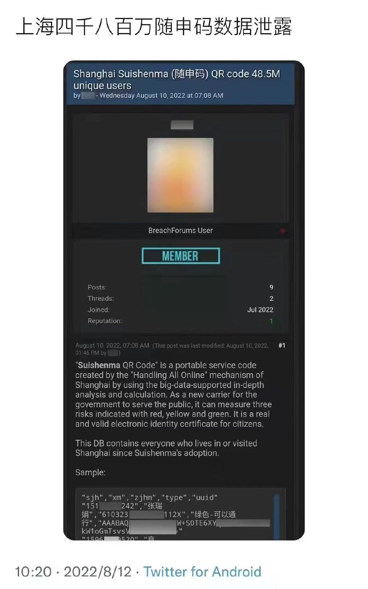
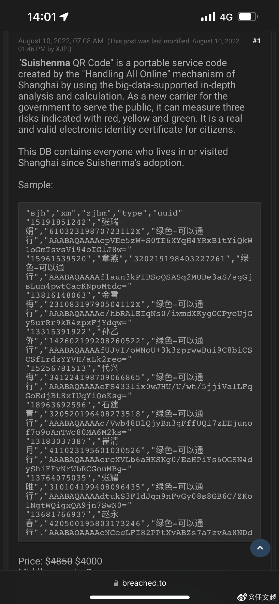
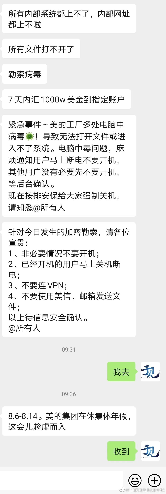
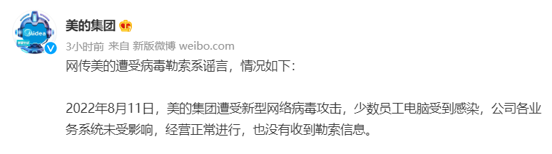
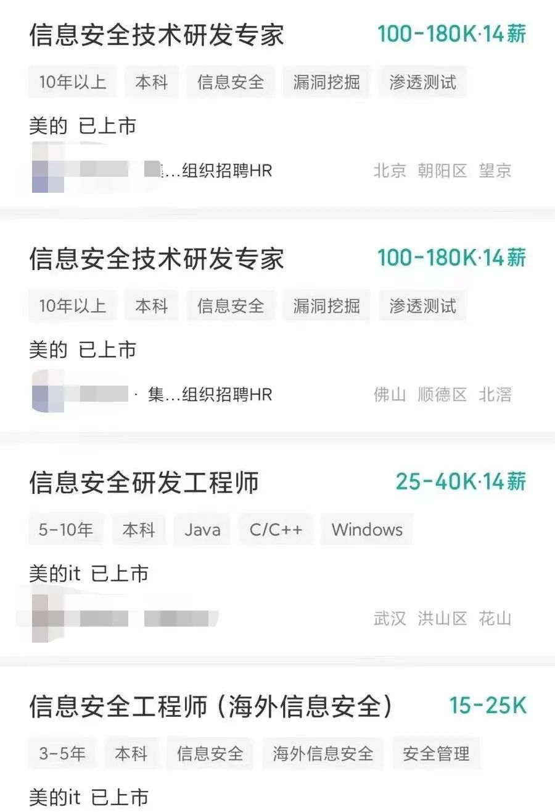
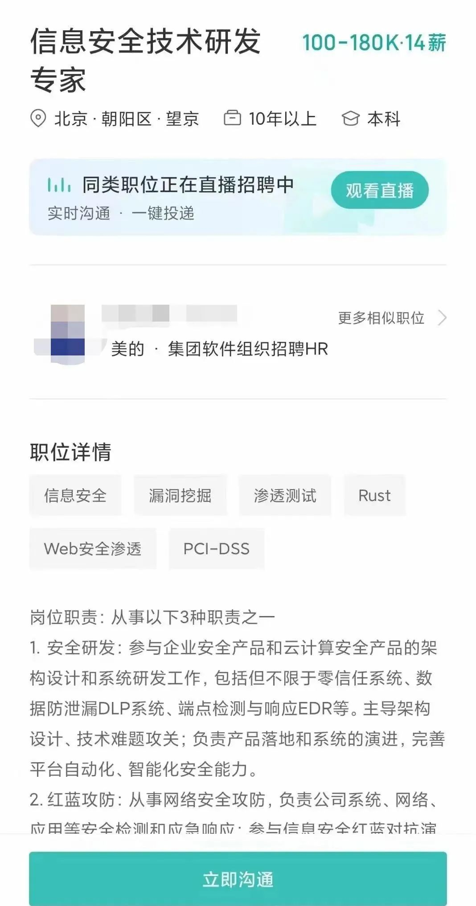

# 202208

1. [202208](#202208)
    1. [国内隐私相关](#国内隐私相关)
        1. [广东发布《广东省企业首席数据官建设指南》](#广东发布广东省企业首席数据官建设指南)
        2. [网信办发布算法备案信息，含腾讯、微信、网易、淘宝、抖音等](#网信办发布算法备案信息含腾讯微信网易淘宝抖音等)
        3. [上海“随申码”数据库遭泄露|健康码用户姓名、手机号、身份证号遭曝光](#上海随申码数据库遭泄露健康码用户姓名手机号身份证号遭曝光)
            1. [2022-08-19 更新](#2022-08-19-更新)
        4. [美的集团被勒索 1 千万，连夜招聘信息安全专家](#美的集团被勒索-1-千万连夜招聘信息安全专家)
        5. [数据出境合规 100 问](#数据出境合规-100-问)
        6. [网信办：2021 数字中国发展报告](#网信办2021-数字中国发展报告)
        7. [工信部：《数据安全传输白皮书》](#工信部数据安全传输白皮书)
        8. [工信部：加快建立数据分类分级保护等基本规则](#工信部加快建立数据分类分级保护等基本规则)
    2. [海外隐私相关](#海外隐私相关)
        1. [越南要求大公司将数据存储和办公室本地化](#越南要求大公司将数据存储和办公室本地化)
        2. [分析称 Instagram 通过 App 内浏览器跟踪用户网络活动](#分析称-instagram-通过-app-内浏览器跟踪用户网络活动)
        3. [员工被钓鱼，云通讯巨头 Twilio 客户数据遭泄露](#员工被钓鱼云通讯巨头-twilio-客户数据遭泄露)
        4. [印度撤回个人数据保护法案，对外国科技公司的斗争失败了？](#印度撤回个人数据保护法案对外国科技公司的斗争失败了)
        5. [思科隐私研究报告](#思科隐私研究报告)

## 国内隐私相关

### 广东发布《广东省企业首席数据官建设指南》

> #职业前沿

- source: [《广东省企业首席数据官建设指南》](http://gdii.gd.gov.cn/szcy/content/post_4001126.html)
- date: 2022-08-29

企业CDO提出了六项岗位职责
1. 数据治理：建立数据治理的组织架构和专门团队，健全业务驱动数据治理的体制机制，推进实施《数据管理能力成熟度评估模型》（DCMM）等标准。
2. 数据增富：打破数据壁垒，推动数据在企业内更好的消费和利用
3. 数字增值：推动上下游、跨行业的数据共享和开发利用
4. 数据安全：数据风险管控，确保企业数据隐私和安全
5. 数据人才：培养企业后备人才
6. 数据文化：推进“大中台+小前台”数据战略

### 网信办发布算法备案信息，含腾讯、微信、网易、淘宝、抖音等

> #算法安全

- source: [国家互联网信息办公室关于发布互联网信息服务算法备案信息的公告](http://www.cac.gov.cn/2022-08/12/c_1661927474338504.htm)
- date: 2022-08-12

根据《互联网信息服务算法推荐管理规定》，国家网信办现公开发布境内互联网信息服务算法名称及备案编号，相关信息可通过互联网信息服务算法备案系统（<https://beian.cac.gov.cn>）进行查询。

此次公告清单中，包括多个大型企业和产品的相关算法，例如网易、360、快手、微博、美团、优酷、百度、抖音、小米、天猫、淘宝、聚好看、苏宁易购、富途牛牛、微信、腾讯等等。

IT 之家曾报道，今年 3 月 1 日，互联网信息服务算法备案系统上线，**具有舆论属性或者社会动员能力的算法推荐服务提供者，应当在提供服务之日起十个工作日，对算法主体信息、算法信息、产品及功能信息三部分进行备案**。

互联网信息服务算法备案仅对备案主体所提供的算法推荐服务及服务中使用的算法推荐技术进行备案，信息由备案主体自行填报，该备案不代表对有关主体、算法、产品、服务等的认可，任何组织和个人不得将备案结果用于宣传和其他商业用途。

第一批备案清单：<http://www.cac.gov.cn/2022-08/12/c_1661927474338504.htm>

### 上海“随申码”数据库遭泄露|健康码用户姓名、手机号、身份证号遭曝光

> #数据泄露

- source: [上海“随申码”数据库遭泄露|健康码用户姓名、手机号、身份证号遭曝光！](https://www.youtube.com/watch?v=8v3Ebn1VA_4)
- date: 2022-08-12

上海随申码数据泄露，黑客声称所有到过和居住在上海的市民数据库都在这里，共 4850 万条，标价 4000 美元。

#### 2022-08-19 更新

根据样本中的数据，记者随机拨打 30 个手机号验证信息真实性，有 8 名居民向南都记者证实了其手机号、姓名、身份证号均属实并且曾注册随申码，部分居民证实其手机号、姓名属实，对于身份证号码是否属实未予回应。亦有居民挂断电话未予回复，还有一个手机号码为空号。在论坛留言区，部分用户表达了购买意愿，并询问数据来源。发帖者称数据来源于上海市大数据中心。

对此，上海市大数据中心的一名工作人员称，建议居民联系上海 12345 反馈，大数据中心只负责研发随申码，“个人信息不是我们泄露的。” 记者以居民身份向上海市民服务热线 12345 咨询此事，其工作人员表示对此并不知情，也无法处理此类事件，建议信息泄露的居民前往公安部门报案。

### 美的集团被勒索 1 千万，连夜招聘信息安全专家

> #数据泄露

- source: [美的回应遭病毒勒索系谣言，但连夜招聘信息安全专家](https://mp.weixin.qq.com/s/Jbc3s98rcc3b8z2Lym_aug)
- date: 2022-08-12

8 月 11 日下午，有网络传言称，“美的集团在休集体年假期间遭遇加密勒索，工厂多处电脑中病毒，导致无法打开文件或进入不了系统。该病毒为勒索病毒，需要 7 天内汇 1000 万美金到指定账户。”

8 月 11 日晚间，美的集团在微博上发文回应“美的遭受病毒勒索”传闻。美的集团称，网传美的遭受病毒勒索系谣言，情况如下：

2022 年 8 月 11 日，美的集团遭受新型网络病毒攻击，少数员工电脑受到感染，公司各业务系统未受影响，经营正常进行，也没有收到勒索信息。

美的多名员工处表示，美的集团确实在集中休假。“不过也并非美的所有人都在同时休假，各单位根据各自经营需要安排休假，好多单位都是分开休假的。”有员工表示。

不过事发当晚，在招聘软件上却发现了美的的相关招聘信息，美的连夜招聘信息安全技术专家。根据招聘信息显示，位于北京、武汉等地的美的公司正在连夜招聘信息安全技术研发专家、信息安全研发工程师。

### 数据出境合规 100 问

> #经典总结

- source: 数据法盟 [地址](https://mp.weixin.qq.com/s/tkrUk0CWpzzosZF-E1Vs9A)
- date: 2022-08-08
经典的问题基本都包括：举几个例子

1. 数据出境的境是指？到香港、台湾是否算出境？那什么算境内运营？
2. 如何判定个人数据?重要数据？关键信息基础设施运营（CIIO）？
3. 数量、范围、类型、敏感程度如何准确定义？
4. 如何评估？如何落地？如何产出报告？等等

### 网信办：2021 数字中国发展报告

> #权威报告

- source: 网信办：数字中国发展报告，[地址](../files/whitepaper/2022-数字中国发展报告-网信办.pdf)
- date: 2022-08-01

包含大量关于数字经济的权威数字，提出了最近五年的八大进展

1. 建成全球规模最大、技术领先的网络基础设施。
2. 数据资源价值加快释放（公共数据开放，培育数据要素市场）
3. 数字技术创新能力快速提升（人工智能、云计算、大数据、区块链、量子信息等新兴技术跻身全球第一梯队）
4. 数字经济发展规模全球领先（数字经济规模从 27.2 万亿增至 45.5 万亿元，总量稳居世界第二，年均复合增长率达 13.6%）
5. 数字政府治理服务效能显著增强（电子政务在线服务指数全球排名提升至第 9 位）
6. 数字社会服务更加普惠便捷
7. 数字化发展治理取得明显成效（各项法规的实施落地）
8. 数字领域国际合作稳步拓展（多方数据治理的协作）

各省数字化综合水平排名：浙江、北京、上海、广东、江苏、山东、天津、福建、湖北、四川

各省数字化基础设施排名：北京、上海、浙江、江苏、天津、广东、重庆、河南、山东、四川

### 工信部：《数据安全传输白皮书》

> #权威报告

- source: 工信部：《数据安全传输白皮书》 [地址](../files/whitepaper/2022-工业部-《数据传输白皮书》.pdf)
- date: 2022-08-05

《白皮书》基于当前形势研判，聚焦数字政府建设、数字金融、互联网等领域中数据传输安全典型应用场景，探讨了主要风险点与解决方案，展望了数据传输安全发展趋势，以期集聚产业优势资源，加强协同合作交流，为政府部门提供决策参考，共绘产业发展新图景。

其中第四章聚焦在合规要点：数据传输加密、数据传输端点安全、数据传输访问控制等合规要点逐步明 确，相关主体积极响应国家政策，主动应对，探索实践。

### 工信部：加快建立数据分类分级保护等基本规则

> #数据分级

- source: 工信部：加快建立数据分类分级保护等基本规则
- date: 2022-08-02

2022 年 7 月 30 日，工信部网络安全管理局局长隋静表示，未来应强化数据安全顶层设计，完善配套政策和标准体系，加快建立数据分类分级保护、重要数据识别和目录备案、跨境数据流动监管、数据安全检测评估等基本规则。

全国政协社会和法制委员会副主任、公安部原副部长陈智敏表示，全球经济社会正加速向网络化、数字化、智能化转型，海量数据成为数字化转型后的重要资产。在全面进入数字时代的当下，维护国家数据安全，保护个人信息、商业机密的任务面临更大挑战。

为保障数据安全，近年来网络安全法、数据安全法、关键信息基础设施安全保护条例、个人信息保护法等法律法规相继出台，明确了重要数据处理者的数据安全保护义务。

隋静表示，未来应完善制度规则，强化行业数据安全治理能力。强化数据安全顶层设计，完善配套政策和标准体系，加快建立数据分类分级保护、重要数据识别和目录备案、跨境数据流动监管、数据安全检测评估等基本规则，压紧压实企业数据安全保护主体责任，充分发挥行业协会、科研机构、安全企业等作用。政府、企业、社会协同联动，合力筑牢作为新型生产要素的数据安全屏障。

邬贺铨称，对于数字安全企业来说，要从以产品为中心向以服务为中心转变，建立专业的服务队伍，为企业提供个性化安全服务。

## 海外隐私相关

### 越南要求大公司将数据存储和办公室本地化

> 隐私法规

- source: [越南要求大公司将数据存储和办公室本地化](https://www.163.com/dy/article/HF9R4DRN0511BLFD.html)
- date: 2022-08-21

**越南信息和通信部本周更新了网络安全法，其要求大科技公司和电信公司在当地存储用户数据并由当地实体控制这些数据**。受影响的数据超出了姓名、电子邮件、信用卡信息、电话号码和IP地址等基本内容并延伸到社会元素--包括用户所加入的团体，或跟他们进行数字互动的朋友。

“**所有互联网用户的数据，从财务记录和生物识别数据到人们的种族和政治观点的信息，或用户在上网时创建的任何数据，都必须在国内存储，**”周三发布的法令写道。

据了解，该法令适用于广泛的业务，包括提供电信服务、在网络空间存储和共享数据、为越南用户提供国家或国际域名、电子商务、在线支付、支付中介、在网络空间运营的运输连接服务、社交媒体、在线视频游戏、消息服务以及语音或视频通话。根据政府第53号法令第26条，新规则将于2022年10月1日生效--从公布之日起约7周。

不过外国公司有12个月的时间来遵守--从他们收到公共安全部长的指示开始。然后这些公司被要求在越南存储数据至少24个月。系统日志将需要存储12个月。

在这个宽限期之后，当局保留权利，通过调查和数据收集要求以及内容删除令以确保受影响的公司遵守法律。

越南是科技制造业的一个重要中心。富士康、三星、微软、英特尔和LG在这个东南亚国家都有业务。据报道，苹果供应商Luxshare Precision Industry和富士康正在谈判从而以首次将Apple Watch和MacBooks的生产从中国转移到越南。

越南总理表示，希望大科技公司能有更大的发展。

**虽然越南是Google和美达的重要用户和收入来源，但两者都没有在该国设立官方办事处。跟该国市场有关的职位通常设在新加坡。据报道，这在历史上是由于越南对在线内容的严格审查。**

根据该法令，当地办事处可以是外国企业的分支机构或代表机构。

### 分析称 Instagram 通过 App 内浏览器跟踪用户网络活动

> #数据安全

- source: [分析称Instagram通过App内浏览器跟踪用户网络活动](https://www.163.com/dy/article/HENMIPJL0511B8LM.html)
- date: 2022-08-14

IT 之家 8 月 14 日消息，对 Meta 旗下 Instagram 应用程序的一项新分析表明，每次用户点击应用程序内的链接时，Instagram 都能够监控他们的所有交互、文本选择，甚至是文本输入，例如内部网站内密码和私人信用卡详细信息应用程序。

Felix Krause 进行分析发现，iOS 版 Instagram 和 Facebook 都使用自己的应用内浏览器，而不是苹果为第三方应用提供的 Safari 浏览器。

使用他们定制的浏览器（仍然基于 WebKit），**Instagram 和 Facebook 将名为“Meta Pixel”的跟踪 JavaScript 代码注入到所有显示链接和网站中**。Krause 发现，使用该代码，Meta 可以完全自由地跟踪用户交互，而无需征得用户的明确同意。

这使得 Instagram 可以在未经用户或网站提供商同意的情况下监控外部网站上发生的一切。

> Instagram 应用程序将跟踪代码注入到显示的每个网站中，包括在点击广告时，使他们能够监控所有用户交互，例如点击每个按钮和链接、文本选择、屏幕截图以及任何表单输入，例如密码、地址和信用卡号码。

正如 Krause 所指出的，像 Meta 这样的公司开发和维护自己的应用内浏览器而不使用苹果内置 Safari ，需要一定的开发付出。在其开发者门户上，Meta 声称“Meta Pixel”旨在通过监控用户在其定制浏览器中所做的所有事件来“跟踪网站上的访问者活动”。

不过还没有证据表明拥有 Instagram 的 Meta 积极收集了哪些用户数据。正如 Krause 所写：

> Facebook 不会真的窃取用户密码、地址和信用卡号码，我现在还没有证据，只是想展示他们在用户不知情情况下可以获得的数据类型。如过去所示，如果公司可以无需征求用户许可而免费访问数据，他们就会选择对其进行跟踪。

但是，这种做法违反了苹果 App Tracking Transparency (ATT) 政策。 ATT 要求所有应用程序在跨其他公司拥有的应用程序和网站跟踪它们之前征求用户同意。

Meta 一再反对苹果允许用户选择是否希望被跟踪的目标。2020 年 12 月，Meta 刊登了整版报纸广告，攻击苹果公司的变革。Krause 说他与 Meta 分享了相关发现，Meta 回应说他们已经确认该“问题”，但此后没有回应。Krause 说，在决定公开他的发现之前，已经提前两周通知了 Meta 。

### 员工被钓鱼，云通讯巨头 Twilio 客户数据遭泄露

> #数据泄露

- source: [员工被钓鱼，云通讯巨头Twilio客户数据遭泄露](https://www.wangan.com/p/7fy78y45c115115c)
- date: 2022-08-09

据 Bleeping Computer 网站 8 月 8 日消息，云通讯巨头 Twilio 表示，有攻击者利用短信网络钓鱼攻击窃取了员工凭证，并潜入内部系统泄露了部分客户数据。

根据 Twilio 在上周末的公开披露，8 月 4 日，Twilio 首次注意到了这些旨在窃取员工凭证的复杂社会工程学攻击。**这些攻击者冒充公司内部的 IT 部门人员，向公司员工发送短信，警告他们的系统密码已经过期，需要通过点击短信附带的 URL 进行修改。该 URL 带有 “Twilio”、“Okta” 和 “SSO” 等具有高仿真性的字段，受害员工一旦点击便会跳转到一个克隆的 Twilio 登录页面。**

当被问及有多少员工的帐户在网络钓鱼攻击中 “失陷”，以及有多少客户数据受到泄露影响时，Twilio 的 EMEA 通讯总监 Katherine James 拒绝透露相关信息。Twilio 对外表示，已经与美国的短信供应商取得联系，封闭了发送钓鱼短信的账户。

Twilio 尚未确定攻击者的身份，但已联系执法部门对攻击者展开调查。为此，Twilio 已经封禁了在攻击期间遭到破坏的员工账户，以阻止攻击者访问其系统，并已开始通知受此事件影响的客户。

Twillio 在 17 个国家和地区拥有 26 个办事处，共计 5000 多名员工，提供可编程语音、文本、聊天、视频和电子邮件 API，被超过 1000 万开发人员和 150000 家企业用于构建客户参与平台。

Twilio 还在 2015 年 2 月收购了 Authy，这是一家面向终端用户、开发者和企业的流行双因素认证（2FA）供应商，在全球拥有数百万用户。

### 印度撤回个人数据保护法案，对外国科技公司的斗争失败了？

> #隐私法案

- source: [印度撤回个人数据保护法案，对外国科技公司的斗争失败了？](https://www.163.com/dy/article/HDV9LOHC0534A4SC.html)
- date: 2022-08-04

新德里：经过近三年的审议，印度政府已经撤回了有争议的《2019 年个人数据保护法（草案）》，该法案旨在规范企业和政府如何使用公民的数字数据。

印度联邦电子和信息技术部长在上周三在议会撤回了该法案。他在一份声明中指出，该法案已经由印度议会联合委员会（JPC）进行了 " 详细审议 "，该委员会提出了 81 项修正案以及 12 项建议，以建立数字生态系统的综合法律框架。

" 考虑到联合议会委员会的报告，要求努力建立一个全面的法律框架。因此，在这种情况下，建议撤回《2019 年个人数据保护法（草案）》，并提出一个建构综合法律框架的新法案，" 声明中说。

该法案背后的主要想法是通过正确定义个人数据、建立数据保护局（DPA）和制定数据使用的政策框架来保障公民的隐私，以规制包括像 Meta 和谷歌这样的大型科技公司。

**然而，该法案遭到了反对党和一些民间社会团体的抨击，他们声称，虽然该法案试图为民营公司的数据使用引入更多控制措施，但它为政府及其机构提供了太多豁免。**

随着该法案的撤回，印度政府认为，纳入各种修正案和建议将不利于印度的创业生态系统，因此需要制定另一个全新框架。

**《2019 年个人数据保护法法（草案）》的内容是什么？**

在印度最高法院将 " 隐私权 " 视为宪法规定的一项基本权利之后，《个人数据保护法（草案）》于 2019 年 12 月 11 日首次在议会提出。

印度议会随后要求政府提出一个政策框架，让所有相关的利益攸关方，包括大型科技公司都能遵守。

该法案的目的是确保在机构和大型科技公司处理个人数据时有一个框架或规则可以遵守。在该法案中，个人数据被分为三类：敏感的个人数据（如健康、性取向、财务），关键的个人数据（由政府定义），以及一般的个人数据。

公司应该告知消费者他们是如何利用数据的，并征得他们的同意。该法案赋予消费者随时撤回同意的权利，公司必须履行义务并提供一个机制来实现这一目标。

**此外，该法对数据出境提出了严格的规定，包括赋予政府向公司索取用户信息的权力。**

还有关于某些 " 关键 " 数据如何不能被主体不在印度的跨国公司所利用的规定。这遭到了大型科技公司的反对，因为这会要求他们改变存储和处理印度用户数据的方式。

该法案被提交给一个印度议会联合委员会，以进一步审议其条款，其中之一是成立一个名为数据保护局的中央机构，以监督这些规则的实施。联合委员会于 2021 年 12 月向议会提交了其报告。

经过近 3 年的审议，印度政府撤回了引发争议的个人数据保护法案。

### 思科隐私研究报告

> #权威报告

- source: 思科 [地址](../files/whitepaper/2022-思科-2021年数据隐私基准研究报告.pdf)
- date: 2022-01

全球企业在隐私保护方面的支出为 240 万美元,亚太地区企业此项支出平均达到 230 万美元。中国企业在隐私保护方面投资最高,平均支出为 300 万美元。超过三分之一的企业获得的收益是其投资的两倍。报告显示,平均而言,亚太地区企业可获得的收益是其投资的 1.9 倍,中国企业获得的收益是其投投资的 1.7 倍。通过隐私保护投资,亚太地区企业预计获得 290 万美元的收益,而中国企业将可能获得 370 万美元的收益。

报告里面非常详细了分析了全球安全的主要问题（privacy-32%），等等数据还是非常不错，隐私的主要问题

1. audits 34%
2. data breaches 33%
3. impact assessments 32%
4. data subject requests 31%
5. incident response 27%
