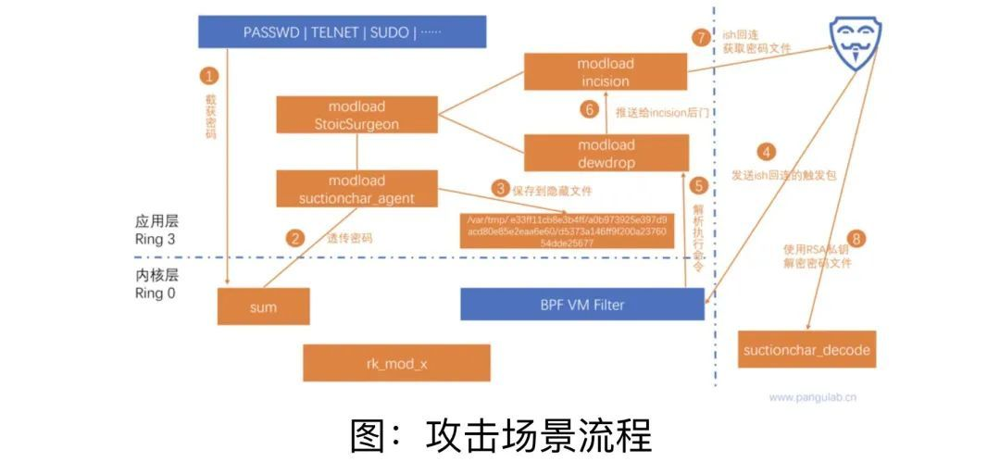

# 202209

1. [202209](#202209)
    1. [国内隐私相关](#国内隐私相关)
        1. [西北工大遭美网袭事件又一细节曝光 专家提“零信任”应对方案](#西北工大遭美网袭事件又一细节曝光-专家提零信任应对方案)
        2. [国标《网络数据分类分级要求》征求意见](#国标网络数据分类分级要求征求意见)
        3. [《关于修改〈网络安全法〉的决定》：未经安全审查罚款上限达五千万或年营收 5%](#关于修改网络安全法的决定未经安全审查罚款上限达五千万或年营收-5)
    2. [海外隐私相关](#海外隐私相关)
        1. [没隐私钱赚了，报告称苹果 App 追踪透明度导致 iPhone 应用内购价格涨了 40%](#没隐私钱赚了报告称苹果-app-追踪透明度导致-iphone-应用内购价格涨了-40)
        2. [9 月 14 日，全球信息技术巨头谷歌和 Meta 因涉嫌在韩国未经用户同意收集个人信息，被韩国处以罚款。两家企业被指责利用非法搜集的用户个人数据在线投放个性化广告](#9-月-14-日全球信息技术巨头谷歌和-meta-因涉嫌在韩国未经用户同意收集个人信息被韩国处以罚款两家企业被指责利用非法搜集的用户个人数据在线投放个性化广告)
        3. [恶意黑客“操纵”网约车订单，在俄罗斯首都制造交通拥塞](#恶意黑客操纵网约车订单在俄罗斯首都制造交通拥塞)
        4. [苹果不配备充电器，被罚 1655 万元](#苹果不配备充电器被罚-1655-万元)
        5. [Meta 被罚 4 亿美金，原因是青少年隐私处理不当](#meta-被罚-4-亿美金原因是青少年隐私处理不当)

## 国内隐私相关

### 西北工大遭美网袭事件又一细节曝光 专家提“零信任”应对方案

> 网络安全

- source: [西北工大遭美网袭事件又一细节曝光 专家提“零信任”应对方案](https://weibo.com/1686546714/M5wS4hERE)
- date : 2022-09-13

《环球时报》记者 13 日从相关部门获悉，在西北工业大学遭受美国国家安全局（NSA）网络攻击事件中，名为“饮茶”的嗅探窃密类网络武器是导致大量敏感数据遭窃的最直接“罪魁祸首”之一。对此，网络安全专家建议，在信息化建设过程中，建议选用国产化产品和“零信任”安全解决方案。

9 月 5 日，中国相关部门对外界宣布，此前西北工业大学声明遭受境外网络攻击，攻击方是美国国家安全局（NSA）特定入侵行动办公室（TAO）。此后国家计算机病毒应急处理中心与北京奇安盘古实验室对此次入侵事件进一步深入分析，在最新的调查报告中，美国实施攻击的技术细节被公开：即在 41 种网络武器中名为“饮茶”的嗅探窃密类网络武器就是导致大量敏感数据遭窃的最直接“罪魁祸首”之一。

相关网络安全专家介绍，TAO 使用“饮茶”作为嗅探窃密工具，将其植入西北工业大学内部网络服务器，窃取了 SSH 等远程管理和远程文件传输服务的登录密码，从而获得内网中其他服务器的访问权限，实现内网横向移动，并向其他高价值服务器投送其他嗅探窃密类、持久化控制类和隐蔽消痕类网络武器，造成大规模、持续性敏感数据失窃。

经技术分析与研判，“饮茶”不仅能够窃取所在服务器上的多种远程管理和远程文件传输服务的账号密码，并且具有很强的隐蔽性和环境适应性。上文中的网络安全专家称，**“饮茶”被植入目标服务器和网络设备后，会将自身伪装成正常的后台服务进程，并且采用模块化方式，分阶段投送恶意负载，具有很强的隐蔽性，发现难度很大。“饮茶”可以在服务器上隐蔽运行，实时监视用户在操作系统控制台终端程序上的输入，并从中截取各类用户名密码，如同站在用户背后的“偷窥者”。网络安全专家介绍：“一旦这些用户名密码被 TAO 获取，就可以被用于进行下一阶段的攻击，即使用这些用户名密码访问其他服务器和网络设备，进而窃取服务器上的文件或投送其他网络武器。”**

技术分析表明，“饮茶”可以与 NSA 其他网络武器有效进行集成和联动，实现“无缝对接”。 今年 2 月份，北京奇安盘古实验室公开披露了隶属于美国国家安全局（NSA）黑客组织——“方程式”专属的顶级武器“电幕行动”（Bvp47）的技术分析，其被用于奇安盘古命名为“电幕行动”的攻击活动中。在 TAO 此次对西北工业大学实施网络攻击的事件中，“饮茶”嗅探窃密工具与 Bvp47 木马程序其他组件配合实施联合攻击。根据介绍， Bvp47 木马具有极高的技术复杂度、架构灵活性以及超高强度的分析取证对抗特性，与“饮茶”组件配合用于窥视并控制受害组织信息网络，秘密窃取重要数据。其中，“饮茶”嗅探木马秘密潜伏在受害机构的信息系统中，专门负责侦听、记录、回送“战果”——受害者使用的账号和密码，不论其是在内网还是外网中。

报告还指出，随着调查的逐步深入，技术团队还在西北工业大学之外的其他机构网络中发现了“饮茶”的攻击痕迹，很可能是 TAO 利用“饮茶”对中国发动大规模的网络攻击活动。

值得注意的是，在美国对他国实施的多次网络攻击活动中，反复出现美国 IT 产业巨头的身影。例如在“棱镜”计划中，美国情治部门掌握高级管理员权限，能够随时进入微软、雅虎、谷歌、苹果等公司的服务器中，长期秘密进行数据挖掘。在“影子经纪人”公布的“方程式”组织所使用的黑客工具中，也多次出现了微软、思科甚至中国部分互联网服务商旗下产品的“零日漏洞”（0Day）或者后门。 “美国正在利用其在网络信息系统软硬件领域的技术主导地位，在美国 IT 产业巨头的全面配合下，利用多种尖端网络武器，在全球范围发动无差别的网络攻击，持续窃取世界各地互联网设备的账号密码，以备后续随时‘合法’登录受害者信息系统，实施更大规模的窃密甚至破坏活动，其网络霸权行径显露无疑。” 因此，网络安全专家建议用户对关键服务器尤其是网络运维服务器进行加固，定期更改服务器和网络设备的管理员口令，并加强对内网网络流量的审计，及时发现异常的远程访问请求。同时，在信息化建设过程中，建议选用国产化产品和“零信任”安全解决方案。（“零信任”是新一代的网络安全防护理念，默认不信任企业网络内外的任何人、设备和系统。）

这位专家进一步指出，无论是数据窃取还是系统毁灭瘫痪，网络攻击行为都会给网络空间甚至现实世界造成巨大破坏，尤其是针对重要关键信息基础设施的攻击行为，“网络空间很大程度是物理空间的映射，网络活动轻易跨越国境的特性使之成为持续性斗争的先导。没有网络安全就没有国家安全，只有要发展我们在科技领域的非对称竞争优势，才能建立起属于中国的、独立自主的网络防护和对抗能力。”

### 国标《网络数据分类分级要求》征求意见

> 隐私法规

- source: [国标《网络数据分类分级要求》征求意见](https://www.tc260.org.cn/front/bzzqyjDetail.html?id=20220914180530&norm_id=20211108000024&recode_id=48416)
- date: 2022-09-16

本标准在编制过程中遵循了问题导向原则、协调性原则。

本标准旨在支撑《中华人民共和国数据安全法》第二十一条提出的数据分类分级保护制度的贯彻落实，解决由于缺乏国家统一的数据分类分级规则，导致相关国家数据安全制度、数据分类分级保护要求不易落地的问题。

本标准给出了数据分类分级基本原则、数据分类方法、数据分级框架和数据定级方法等，包括：

1) 数据分类分级的基本原则；

2) 数据分类框架和方法，包括数据分类框架、行业领域数据分类方法、处理者数据分类流程等；

3) 数据分级框架；

4) 数据分级确定方法，包括概述、数据分级要素、数据影响分析、分级参考规则、数据分级流程等；

5) 数据分类分级实施流程；

6) 基于数据描述对象的行业领域数据分类参考示例；

7) 分级要素识别常见考虑因素；

8) 影响对象考虑因素；

9) 影响程度参考示例；

10) 衍生数据定级参考；

11) 动态更新情形参考；

12) 一般数据分级参考；

13) 个人信息分类示例。

### 《关于修改〈网络安全法〉的决定》：未经安全审查罚款上限达五千万或年营收 5%

> 隐私法规

- source: [关于公开征求《关于修改〈中华人民共和国网络安全法〉的决定（征求意见稿）》意见的通知](http://www.gov.cn/xinwen/2022-09/14/content_5709805.htm)
- date: 2022-09-14

9 月 14 日，国家网信办发布了关于公开征求《关于修改〈中华人民共和国网络安全法〉的决定（征求意见稿）》意见的通知，拟对实施五年（2017 年 6 月 1 日起施行）的《网络安全法》作出修改。

**《征求意见稿》修改变化：加大处罚力度与上限 多部法律无缝衔接**

根据国家网信办“关于修改《中华人民共和国网络安全法》的决定（征求意见稿）的说明”，此番修改是为了适应在《网络安全法》实施之后的修订及制定的《行政处罚法》《数据安全法》《个人信息保护法》，要做好法律之间衔接协调，主要包括四个方面：完善违反网络运行安全一般规定的法律责任制度；修改关键信息基础设施安全保护的法律责任制度；调整网络信息安全法律责任制度；修改个人信息保护法律责任制度。

 1、整合提升同一大类违法行为的处罚幅度和上限

此次《征求意见稿》将原来多条针对违反不同条款的行为的处罚种类和幅度合并为同一表述，从“处一万元以上十万元以下罚款”、“处五万元以上五十万元以下罚款”、“处十万元以上一百万元以下罚款”不同处罚额度 **统一合并提升到“处一百万元以下罚款”**，总体提升了处罚力度和上限，就高不就低。

2、罚款幅度大幅提高 营业额 5% 对齐个保法

违反现有《网络安全法》的企业主体被罚款额度 100 万元封顶，个人 10 万元封顶，力度难以震慑较大规模的机构组织及其高管。**此次《征求意见稿》对于企业而言，罚款从最高 100 万提高到 5000 万或上一年度营业额的 5%；对于个人而言，罚款从最高 10 万元提高到 100 万。**这与 2021 年实施的《个人信息保护法》相关处罚力度对齐，将对大型集团、行业巨头等产生有效威慑，提升法律权威性。

3、行政处罚新增禁业处罚措施 违法成本上升

违法判定在“一般违法行为”和“情节严重”的基础上，增加了“情节特别严重”。此次《征求意见稿》对于企业而言，新增“通报批评”的行政处罚形式；对于个人而言，增加了“禁止其在一定期限内担任相关企业的董事、监事、高级管理人员或者从事网络安全管理和网络运营关键岗位的工作”，有力提升对高级管理层人员的违法惩戒效果。

4、剥离法律责任 多部法律处罚措施保持一致

在只有《网络安全法》的年代，其承担着数据安全保护、个人信息保护、关键信息基础设施保护等多重功能，随着一系列新法颁布，此次修改将对应的法律责任进行剥离。**关键信息基础设施数据出境的相关处罚主要参照《数据安全法》和《关键信息基础设施安全保护条例》规定执行；侵犯个人信息主体权利的法律责任，相关处罚主要参照《个人信息保护法》规定执行。**

5、加强违法信息内容监管 兜底条款捕捉漏网之鱼

现行《网络安全法》针对“发布或者传输本法第十二条第二款和其他法律、行政法规禁止发布或者传输的信息的”情况，法律责任表述为其他法律法规有规定的，从其规定。此次《征求意见稿》增加了兜底性罚则，新增其他法律法规没有规定的情况下，依据《网络安全法》三档违法程度进行处罚。

网络运营主体应对：梳理多部法律义务清单 提前做好评估和自查

可以看到，本次修改工作的核心在于加重《网络安全法》项下的违法责任，将罚款上限与个人责任与其他法律拉齐一致，体现了国家对于维护网络安全的强势态度。此次修订尚处于征求意见阶段，距离正式生效仍有一段时间，从事网络运营的相关主体应积极履行网络运行安全、网络信息安全、个人信息保护义务，并对立法动态予以持续关注。

首先建议所有的网络运营者做好《网络安全法》的义务清单重新梳理，并注意与《数据安全法》《个人信息保护法》的义务清单进行衔接，梳理好彼此的关系。对于《征求意见稿》修订条款中所涉及的相关法定义务开展前期风险评估工作，避免适用最高处罚机制。

对于关键信息基础设施单位，需要注意做好网络安全审查的自查，避免因未及时更换网络产品，导致面临最高处罚机制风险，并严格落实《关键信息技术设施安全保护条例》的义务责任。

对于跨境或出海企业，涉及数据出境的，需要注意《数据出境安全评估办法》以及其他法律法规的义务和处罚机制的设置，对于数据出境安全评估应该引起最高度的重视，避免触发多条红线。

对于企业或个人的信息传播行为，需要事前建立好审核机制，完善当前的内容发布审核流程以及做好自身网络产品的合法性评估，避免传播虚假信息，避免侵害用户的名誉、隐私、知识产权等合法权益，否则面临最高处罚机制适用风险。

对于企业的 CSO 以及其他直接负责的高管，考虑开展安全意识和技能培训，提高“履职意识”和“风险意识”，避免适用《征求意见稿》的顶格处罚，甚至可能面临禁业和刑事责任的风险。

具体而言，本次修改内容仅涉及《网络安全法》第六章“法律责任”章节，其他关于安全保障责任与义务方面的规定均没有变化。

## 海外隐私相关

### 没隐私钱赚了，报告称苹果 App 追踪透明度导致 iPhone 应用内购价格涨了 40%

> 隐私合规

- source: [没隐私钱赚了，报告称苹果App追踪透明度导致iPhone应用内购价格涨了40%](https://finance.sina.com.cn/tech/tele/2022-09-14/doc-imqqsmrn9010843.shtml)
- date: 2022-09-14

自去年以来，苹果 iOS 上的应用内购买的平均价格上涨了 40%，其中一个主要原因是苹果的 App 追踪透明度（AppTrackingTransparency，ATT）隐私功能，该限制使得应用的获客成本变高了。

根据 Apptopia 报告，iOS 上的应用内购买价格上涨远高于 GooglePlay。报告称，这种增长可能是“由于苹果的 App 追踪透明度政策使得获取用户的成本更高，发行商对每次安装有效成本（eCPI）的增加做出了反应”。

根据 ATT，应用在追踪用户前需要获得用户批准。该功能推出后，对不少开发者和公司都产生了影响。

在 4 月份的另一份报告称，苹果 App 追踪透明度导致大型科技平台的收入可能会下降近 160 亿美元。

因此，无法从追踪用户处获得收入，那么开发者只能从其他途径获取更多收入，而应用内购就是其中一个受影响的点。

### 9 月 14 日，全球信息技术巨头谷歌和 Meta 因涉嫌在韩国未经用户同意收集个人信息，被韩国处以罚款。两家企业被指责利用非法搜集的用户个人数据在线投放个性化广告

> 隐私合规

- source: [谷歌和Meta在韩国获巨额罚款，涉非法收集用户个人信息](https://www.163.com/dy/article/HH8JFIJT0514R9P4.html)
- date: 2022-09-14

据韩联社 9 月 14 日报道，韩国国务总理下属的个人信息保护委员会当日开会作出决定，分别向谷歌和 Meta 处以 629 亿韩元（约合人民币 3.47 亿元）和 308 亿韩元（约合人民币 1.54 亿元）罚款。此外，个人信息保护委员会还勒令两家公司，若要利用用户数据，必须提前通知用户，让用户明确了解收集和使用数据的情况，并让用户自由行使决定权。

这是韩国就在线广告平台收集和利用用户信息的行为首次作出处罚决定，罚款金额为违反韩国《关于保护个人信息的法律》规定的案件之最。

韩国个人信息保护委员会从去年 2 月起针对国内外主要在线广告平台收集和利用个人信息的情况进行了督查。经查发现，谷歌和 Meta 对用户利用其他平台的行为信息进行分析，由此推测用户可能感兴趣的信息，并利用该信息投放个性化广告，但未事先告知，也未提前征得用户同意。

韩联社报道称，在韩国，谷歌至少在 2016 年至今约 6 年的时间内擅自收集和利用用户在其他平台上的信息，将隐私政策中的相关选项设置为默认同意。但谷歌在欧洲的服务中，用户自身可选择设置，决定是否同意信息的收集和利用。Meta 在韩国则从 2018 年 7 月 14 日至今约 4 年的时间未获用户同意擅自收集和利用用户信息。Meta 近期试图将隐私政策改为用户不同意收集信息就无法使用部分服务，但在遭到用户强烈反对后取消了该计划。

### 恶意黑客“操纵”网约车订单，在俄罗斯首都制造交通拥塞

> 网络安全

- source: [恶意黑客“操纵”网约车订单，在俄罗斯首都制造交通拥塞](https://www.secrss.com/articles/46590)
- date: 2022-09-05

安全内参消息，9 月 1 日下午，恶意黑客在网约车应用 Yandex Taxi 上一口气预约几十辆出租车，直接导致莫斯科发生交通堵塞。这是目前已知首批利用网约车应用造成交通混乱的案例之一。

菲利区位于莫斯科市中心以外的库图兹夫普罗斯派克特沿线，这是一条自西南方向通往莫斯科市中心的主干道。目前尚不清楚黑客为什么选择这片区域，Yandex 公司的发言人也拒绝公布关于此次攻击的更多细节。

莫斯科向来以交通拥堵而闻名，经常跻身于全球交通拥堵最严重的城市之列。**Yandex 公司发言人提到，该问题“在不到一小时内”得到解决。**“Yandex Taxi 的安全服务及时制止了此次人为造堵企图，并改进了检测和预防此类攻击的算法，以防止未来再次发生类似事件。”

面对迅速恶化且后果严重的汽车入侵事件，全球知名黑客大会 DEF CON 开始定期举办汽车黑客村活动。在这一与主会场同步组织的研讨活动中，黑客和安全研究人员可以了解汽车如何接入互联网，以及如何入侵和操纵车载系统。

目前还不清楚此次莫斯科交通拥堵事件是谁所为，但攻击本身已经让我们再次感受到全面互联时代下可怕的风险破坏力。

### 苹果不配备充电器，被罚 1655 万元

- source: [苹果不配备充电器，被罚1655万元](https://finance.sina.com.cn/tech/it/2022-09-07/doc-imqmmtha6381466.shtml)
- date: 2022-09-07

当地时间 6 日，巴西政府要求苹果公司停止在该国销售未配备电池充电器的手机，政府表示苹果公司向消费者提供了不完整产品，并且没有证据表明销售不配备充电器的智能手机可以保护环境。

巴西司法部由此对苹果公司处以 1227.5 万雷亚尔（约合人民币 1655 万元）的罚款。

### Meta 被罚 4 亿美金，原因是青少年隐私处理不当

- source: [又见天价罚单，Meta违反GDPR被罚4亿美元](https://www.freebuf.com/articles/neopoints/343874.html)
- date: 2022-09-06
爱爱蓝数据监管机构处以 4.05 亿欧元罚款，原因是该公司允许青少年开设账号，并公开显示器电话号码和电子邮件地址。

欧盟一直非常重视儿童数据保护，并致力于更好地保护儿童在社交媒体、在线视频游戏和其他互联网服务上生成的数据。这也是 Instagram 踩雷 GDPR 之后，被监管机构开出了 4 亿美元的天价罚单。

Meta 很快做出了回应。公司一位发言人公开表示，在整个调查过程中，meta 一直都非常配合爱尔兰数据保护委员，但不能接受这笔罚款的计算方式，后续会提出上诉。

发言人还强调此次调查主要是集中在一年多前更新的旧设置上，自那以后已经更新了许多新功能，以帮助保护青少年的安全及其信息隐私。任何 18 岁以下的人在加入 Instagram 时，他们的账户都会自动设置为私人账号，所以只有他们认识的人才能看到其发布的内容，成年人不能给没有关注他们的青少年发消息。
