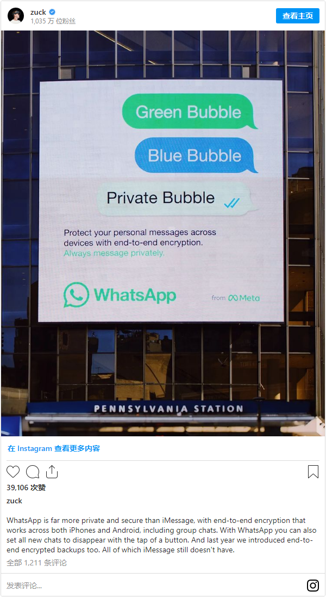
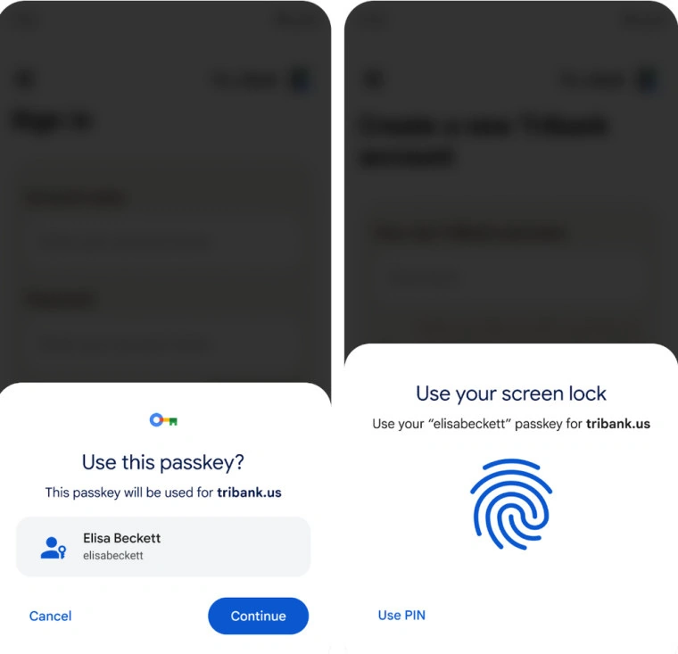
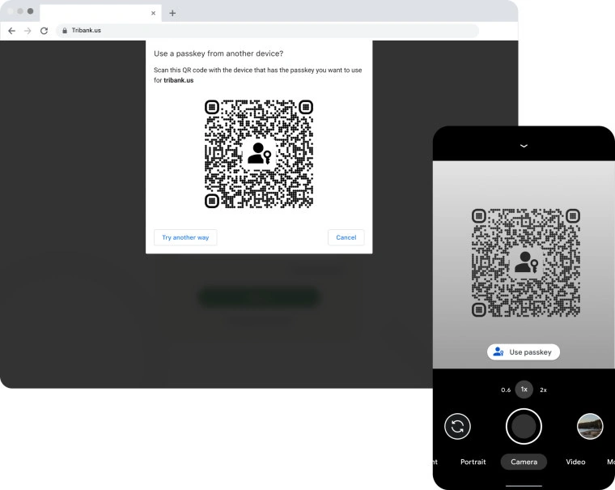

# 202210

1. [202210](#202210)
    1. [国内隐私相关](#国内隐私相关)
        1. [二十大报告中数字、网络及安全相关的金句](#二十大报告中数字网络及安全相关的金句)
    2. [海外隐私相关](#海外隐私相关)
        1. [韩国网络服务大中断，科技巨头 Kakao CEO 宣布辞职](#韩国网络服务大中断科技巨头-kakao-ceo-宣布辞职)
        2. [扎克伯格嘲讽苹果聊天工具不安全](#扎克伯格嘲讽苹果聊天工具不安全)
        3. [进军无密码未来，谷歌安卓系统和 Chrome 浏览器开始测试“通行密钥”](#进军无密码未来谷歌安卓系统和-chrome-浏览器开始测试通行密钥)
        4. [优步前高管或因隐瞒数据泄露入狱](#优步前高管或因隐瞒数据泄露入狱)
        5. [泰国政府宣布该国“健康码”停止运行，销毁所有数据](#泰国政府宣布该国健康码停止运行销毁所有数据)
        6. [谷歌将于 2023 年开设首个日本数据中心](#谷歌将于-2023-年开设首个日本数据中心)
        7. [法国对clearView AI人脸识别2000万欧元罚款](#法国对clearview-ai人脸识别2000万欧元罚款)
        8. [《思科2022年消费者隐私调查报告》](#思科2022年消费者隐私调查报告)

## 国内隐私相关

### 二十大报告中数字、网络及安全相关的金句

> 政策研究

- source: [二十大报告（实录全文）](https://news.ifeng.com/c/8K9l4qcZtaw)
- date: 2022-10-16

1. 总章强调网络强国和数字中国，网络生态要持续向好，推动形成良好的网络生态。
2. 提高公共安全治理水平，提到**加强个人信息保护**
3. 强化国家安全工作协调机制，完善国家安全法治体系
4. 国家安全观里面再次提到：国家安全是民族复兴的根基，社会稳定是国家强盛的前提。必须坚定不移贯彻总体国家安全观
5. 最后提到了参与**全球安全治理**

## 海外隐私相关

### 韩国网络服务大中断，科技巨头 Kakao CEO 宣布辞职

> 稳定性

- source: [韩国网络服务大中断，科技巨头 Kakao CEO 宣布辞职](https://www.ithome.com/0/647/459.htm)
- date: 2022-10-19

凤凰网科技讯 北京时间 10 月 19 日消息，由于互联网巨头 Kakao 的大范围服务中断给严重依赖该公司服务的韩国造成了混乱，Kakao 联席 CEO Whon Namkoong 今天宣布辞职。

在周三举行的新闻发布会上，Whon Namkoong 就公司的服务中断道歉，并表示他将辞职。“我对这起事件负有重大责任，我将辞去 CEO 的职务，并领导紧急灾难特别工作组，监督事件的善后工作，”Whon Namkoong 表示，“我们将尽最大努力恢复用户对 Kakao 的信心，确保此类事件不再发生。”

公司文件显示，Kakao 另一名联席 CEO Hong Eun-taek 将留任。“我们真诚地向所有在服务中断期间受到影响的人道歉。”Hong Eun-taek 鞠躬致歉时称。

上周六，首尔南部的 SK C&C 数据中心发生火灾，导致 Kakao 的服务大范围中断，引发公众对于 Kakao 及其附属公司的批评。这家互联网巨头花了数小时来努力恢复其广受欢迎的即时通讯服务 KakaoTalk 的运营，该服务在全国范围内被政府官员和企业使用。在此期间，包括支付、银行和游戏在内的 Kakao 服务暂停。截至周三，包括 KakaoTalk 在内的大部分服务都已恢复。

### 扎克伯格嘲讽苹果聊天工具不安全

> 数据安全

- source: [扎克伯格嘲讽苹果聊天工具不安全](https://www.cnbeta.com/articles/tech/1328191.htm)
- date: 2022-10-18

近日，Meta发布了一则广告，直接针对苹果旗下的移动聊天工具iMessage，这给两家公司的竞争关系再带来一丝“火药味”。当地时间周一，Meta公司在美国纽约市地铁的宾夕法尼亚车站发布了一则图片广告。在广告中，Meta首席执行官扎克伯格暗示，和苹果的移动聊天工具和传统的手机短信服务相比，Meta旗下的移动聊天工具WhatsApp更安全，更有私密性。

目前，苹果方面并未对此发表评论。

扎克伯格表示，和苹果的iMessage工具相比，WhatsApp更加安全，更加能保护隐私，它具备了端到端的加密功能，覆盖Android设备和苹果手机，另外加密功能也覆盖了群聊。

所谓的端到端加密功能，指的是聊天工具对聊天信息进行了加密，这样，聊天工具运营商并不能够看到用户实际聊天的文字，即使是其他机构根据法律要求索取文字，也根本无法提供。

据报道，Meta的WhatApp和苹果的iMessage都提供了聊天内容加密服务，另外两家公司也对聊天内容进行备份，后续可以获取备份的内容。而在传统的手机短信服务中，短信内容备份在移动运营商的设备中。

扎克伯格介绍道，去年，WhatsApp提供了备份聊天信息的加密功能，他还介绍另外一个重要的创新功能，即用户发送信息时，可以设置在一段时间之后自我删除。

### 进军无密码未来，谷歌安卓系统和 Chrome 浏览器开始测试“通行密钥”

> 数据安全

- source: [进军无密码未来，谷歌安卓系统和 Chrome 浏览器开始测试“通行密钥”](https://www.ithome.com/0/646/311.htm)
- date: 2022-10-13

IT 之家 10 月 13 日消息，谷歌今天宣布安卓和 Chrome 浏览器带来初步的 Passkey 通行密钥支持。第一阶段让开发者通过使用 Google Play 服务 Beta 测试版和 Chrome Canary 来获得该技术，并让他们在其网站和应用程序中增加对该功能的支持。

谷歌希望在今年晚些时候向稳定频道推出对该功能的支持，届时一些开发者将把该技术纳入其产品。

IT 之家获悉，**通行密钥是密码的一种替代形式，旨在为各种网站和 App 提供一种更安全快捷的免密登录体验**。与密码不同，通行密钥是一种基于标准的技术。它可以抵御网络钓鱼，始终具有出色的安全性，并且从设计上避免了机密的共享。

Passkey 界面类似于 Chrome 手机用户已经熟悉的自动填充界面。使用 Passkey 就像选择要登录的账户一样简单，然后使用用户指纹、人脸或屏幕锁来获得访问权。如果用户愿意，还可以使用手机上的密码在附近的设备上登录。如果想在电脑上登录网站，可以提供二维码，并使用手机扫描来批准访问。

谷歌的下一个里程碑是将 API 支持引入原生安卓应用。在他们的应用程序中建立支持的开发者将允许用户选择使用 Passkey 或密码来登录。随着 Passkey 的普及，创建和记住密码的需求将减少，这可能导致黑客入侵账户的情况减少。

Passkey 是一个行业标准，作为 FIDO 联盟和 W3C 的一部分，苹果、微软和谷歌都对其进行了投入，致力于构建无密码未来。

### 优步前高管或因隐瞒数据泄露入狱

> 数据泄露

- source: [优步前高管或因隐瞒数据泄露入狱，企业该如何应对黑客勒索？](https://www.sohu.com/a/591698318_161795)
- date: 2022-10-11

10 月 5 日，对 Uber 前首席安全官 Joseph Sullivan 一案作出裁定——Sullivan 曾试图向美国联邦贸易委员会（FTC）隐瞒 Uber 在 2016 年的数据泄露事件。据悉，Sullivan 被裁定为妨碍司法公正罪和隐瞒罪行罪，可能面临最高 5 年和最高 3 年的监禁。

这是美国首例企业高管因黑客攻击而面临刑事起诉的案件。但多位安全专家认为，Uber 可能并不是唯一一家隐瞒数据泄露事件的企业，事实上向黑客支付赎金的行为并不鲜见。不过，这起判决可能会改变企业安全专业人士处理数据泄露的方式。

作为首席安全官，Sullivan 在任上的工作涉及了 Uber 在 2014 和 2016 年遇到的两次数据泄露事件。

Sullivan 于 2015 年 4 月被聘为 Uber 首席安全官。在他上任一个月后，FTC 就 2014 年数据泄露事件向 Uber 提出了民事调查要求。此次事件涉及约 5 万名消费者的个人信息未经授权访问，包括姓名和驾照号码。Sullivan 负责陈述 Uber 为保护客户数据安全所采取的措施，并在 2016 年 11 月 4 日向 FTC 进行了宣誓作证。

在作证后十天，2016 年 11 月 14 日，Sullivan 得知 Uber 再次遭到了黑客攻击。黑客们通过电子邮件直接联系 Sullivan，称发现了 Uber 的安全漏洞并获取了数字密钥，从亚马逊云服务器盗取了大规模用户数据，包括约 5700 万 Uber 用户的记录和 60 万驾照号码，以此勒索大笔赎金。

尽管明知应立即向 FTC 报告，Sullivan 仍然隐瞒下了此事，也没有将其透露给 Uber 用户或任何其他机构。在谈判后，2016 年 12 月，Sullivan 通过比特币向黑客支付了 10 万美元，并将这笔款项掩饰为漏洞赏金计划的一部分。

作为交换，双方签署了保密协议。据调查，黑客在协议中承诺不会向任何人透露此次数据泄露事件，还做出了“没有获取或存储任何数据”的虚假陈述。2017 年 1 月，Uber 安全小组查出了这两名黑客的真实身份，要求他们以真实姓名签署新的保密协议副本。

证据表明，Sullivan 知道黑客在攻击和勒索 Uber 的同时也攻击了其他企业，并至少从其中一些企业获得了数据。后来黑客提交的认罪书表明，在 Sullivan 协助掩盖了对 Uber 的攻击之后，黑客还对另一家企业 lynda.com 进行了攻击和勒索。

### 泰国政府宣布该国“健康码”停止运行，销毁所有数据

> 数据销毁

- source: [泰国政府宣布该国“健康码”停止运行，销毁所有数据](https://www.secrss.com/articles/47595)
- date: 2022-10-01

> 泰国公共卫生部疾控厅关闭疫情追踪软件“医生胜利”，于此同时销毁系统中的所有数据。

泰国头条新闻社讯 10 月 1 日，泰国总理府副发言人拉差妲透露，为顺应自今日起将新冠视为监测性传染病的政策，泰国公共卫生部疾控厅关闭疫情追踪软件“医生胜利”，于此同时销毁系统中的所有数据。此外，外交部领事事务局也取消了针对外籍游客入境的新冠相关文件审查，如疫苗接种证明、登机前 72 小时核酸检测结果。

拉差妲表示，虽然政府降低了新冠疫情的严重性，但仍继续密切监控疫情，包括加强疫苗接种工作，尤其是老年人。此外，仍支持民众保持距离、在拥挤的地方戴口罩，轻症患者积极使用 ATK 检测。目前，政府已经为 6 个月至 4 岁的儿童提供了 300 万剂辉瑞疫苗，预计将于 10 月下旬抵达，并为全国儿童接种。

### 谷歌将于 2023 年开设首个日本数据中心

> 数据本地化

- source: [谷歌日本首个数据中心将于明年投入使用](http://www.cww.net.cn/article?id=569142)
- date: 2022-10-07

近日，赴日本访问的美国谷歌首席执行官（CEO）桑达尔·皮查伊（Sundar Pichai）在接受采访时透露了该公司在日本和亚洲的业务方针。他表示，从去年到 2024 年的 4 年里，谷歌在日本将投资 1000 亿日元（约 7 亿美元），其中一部分用于在千叶县建设数据中心。这是谷歌在日本建设的首个数据中心，预计 2023 年投入使用。

受疫情及通货膨胀等宏观经济因素影响，谷歌业绩发展中的不确定性增加，利润减少，对此，谷歌采取了一系列的举措。

其中，在投资领域的推进方面，谷歌将继续对所有定位于业务基础的人工智能（AI）进行投资，将继续致力于主力业务——互联网检索服务及视频共享服务“YouTube”的发展，还将优先投资将这些服务提供给用户所需要的基础软件（OS）“Android”及云服务等。

以地区而论，亚洲是投资重点，皮查伊明确表示“未来 10 年的增长大多来自亚洲市场”，“我们长期看好亚洲，对该地区投资的优先度很高”。

8 月，谷歌宣布将在马来西亚、泰国和新西兰设立新的云区域。就日本来看，谷歌此前已经在东京和大阪设有云区域，为当地企业提供存储和基础设施服务。此次数据中心的建设，除提高消费者使用的互联网服务的方便性之外，皮查伊还表示“希望通过我们公司的云计算业务，为日本企业的数字化变革提供支援”。

### 法国对clearView AI人脸识别2000万欧元罚款

> 数据安全

- source: [2000万欧元罚单！美国面部识别公司Clearview AI因违规收集人脸信息在欧盟又被指控](https://finance.sina.com.cn/tech/internet/2022-10-23/doc-imqmmthc1800550.shtml)
- date: 2022-10-23

法国数据监管机构国家信息与自由委员会（CNIL）以违反《欧盟通用数据保护条例》（GDPR）为由，向美国人脸识别公司Clearview AI开出了2000万欧元的罚单。南方财经全媒体记者梳理发现，这并非Clearview AI第一次面临控诉。此前，英国、美国、澳大利亚、意大利等国的监管机构都曾对其违反收集人脸信息的违规行为提出指控。

具体违反行为：CNIL揭示了Clearview AI违反GDPR的具体行为，例如非法处理生物识别信息数据，且在收集这些数据时未征求同意等。

CNIL向Clearview AI发出正式通知，要求其停止违规收集和使用法国境内人员的数据；保护个人的数据权利，并遵守其删除请求，但未回应。

2022年5月，英国ICO在此前联合调查的基础上发布通知，对其处以755万英镑的罚款，并命令其停止获取并删除在互联网上公开的英国居民的个人数据。同月，由美国伊利诺伊州法院发起、整整历时两年的纠纷案件在5月10日落下帷幕，Clearview AI接受伊利诺伊州法院提供的解决方案，同意不再对大多数私企或者个人提供免费或者付费的数据库服务，并在五年内停止对伊利诺伊州的政府机构提供数据库，**仅对美国联邦政府以及除伊利诺伊州以外的政府提供服务**

### 《思科2022年消费者隐私调查报告》

> 隐私报告

- source:[《consumer privacy survey 2022》](../files/whitepaper/2022-cisco%20consumer-privacy-survey-2022.pdf)
- date: 2022-10-20

简述一些关键信息
page 5：关于用户隐私最关心的问题
1. 39%认为”数据透明度“是个人和企业建立信任的首要任务。
2. 21%认为"不出售个人数据"
3. 20%认为”遵守隐私法规“
4. 10%选择”可以配置我的隐私设置“
5. 9%选择”保证数据安全“
简而言之，用户依然最关心，自己的数据是如何被处理的。

page 6：超过一半的用户不相信公司能够充分保护他们的数据，79%原因是搞不清楚公司用他们的数据在干嘛

page 11：对与AI的态度，45%觉的可以改善生活，54%甚至愿意匿名分享自己的个人数据，但是，65%对于企业人工智能的做法失去了信任。

page 15-18：用户对于数据本地化的态度，78%的用户是infavor，10% against 
page 19 ：最后给组织的建议
1. 尽可能投资于透明度和感知能力（Invest in transparency.）
2. 确保客户和用户尽可能的了解法规和权利（Increase awareness of privacy laws and rights among individuals. ）
3. 采取措施保护数据（ Adopt measures to ensure responsible use of data.）
4. 成本可控情况下，尽可能数据本地化（Consider the costs and legal alternatives, if any, to data localization requirements.）
