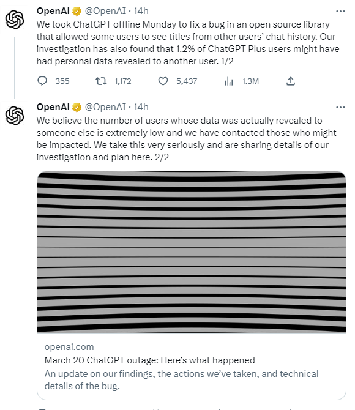

# 202303

1. [202303](#202303)
    1. [国内隐私相关](#国内隐私相关)
        1. [工信部立即查处“3·15”晚会曝光的破解版 APP 违法违规收集用户个人信息行为](#工信部立即查处315晚会曝光的破解版-app-违法违规收集用户个人信息行为)
        2. [微软将中国用户数据传输至境外，为什么？](#微软将中国用户数据传输至境外为什么)
        3. [无锡首批 10 亿条涉疫个人数据全部销毁，门铃码等应用陆续下线](#无锡首批-10-亿条涉疫个人数据全部销毁门铃码等应用陆续下线)
        4. [组件国家数据局](#组件国家数据局)
        5. [两会和数据安全、数字经济相关的提案](#两会和数据安全数字经济相关的提案)
    2. [国际隐私相关](#国际隐私相关)
        1. [TikTok 在美国会听证会：数据隐私、儿童在线保护与美国的中国威胁论](#tiktok-在美国会听证会数据隐私儿童在线保护与美国的中国威胁论)
        2. [ChatGPT 服务中断，还泄露对话记录？OpenAI 披露详细故障信息](#chatgpt-服务中断还泄露对话记录openai-披露详细故障信息)
        3. [9 亿条执法记录！印度公检法系统被黑，600G 数据在暗网出售](#9-亿条执法记录印度公检法系统被黑600g-数据在暗网出售)
        4. [英国禁止在政府设备上使用 TikTok](#英国禁止在政府设备上使用-tiktok)
        5. [欧盟委员会：WhatsApp 已同意对隐私政策变更作出更清晰的解释](#欧盟委员会whatsapp-已同意对隐私政策变更作出更清晰的解释)
        6. [担心安全问题，韩国政府拒绝苹果将高精度地图数据输出境外](#担心安全问题韩国政府拒绝苹果将高精度地图数据输出境外)

## 国内隐私相关

### 工信部立即查处“3·15”晚会曝光的破解版 APP 违法违规收集用户个人信息行为

> 数据收集

- source: [工信部立即查处“3·15”晚会曝光的破解版APP违法违规收集用户个人信息行为](https://finance.sina.com.cn/tech/roll/2023-03-20/doc-imymnnse3410906.shtml)
- date: 2023-03-20

本报讯 工业和信息化部高度重视用户权益保护工作，持续开展移动互联网应用程序（APP）侵害用户权益专项整治行动，不断改善 APP 应用服务环境。针对“3·15”晚会报道的部分破解版 APP 违法违规收集用户个人信息问题，立即组织核查，并依据《个人信息保护法》《电信和互联网用户个人信息保护规定》等有关法律法规要求进行严厉查处。

广告

　　一是组织应用分发平台、电商平台、搜索平台第一时间对曝光的“b 站破解版 2021”“百度网盘破解版”“酷狗破解版”等 APP 及其他破解版 APP 迅速进行排查，截至目前，共处置 436 条非正规渠道的非法下载链接。二是组织相关通信管理局对有关线索进行调查，依法处理违法违规主体。三是举一反三，组织专业检测机构对 APP 及软件开发工具包（SDK）开展专项检测，发现的问题将坚决查处，及时向社会通告。

　　下一步，工业和信息化部将继续采取有效措施，进一步筑牢安全防线，切实强化电信和互联网用户个人信息保护。一是督导相关互联网平台企业落实主体责任，加大巡检和排查力度，及时发现、清理违法违规 APP。二是加强 APP 和 SDK 技术检测和监督检查，加大问题处置和曝光力度，对违法违规行为持续保持高压震慑。三是深化 APP、SDK 等应用服务上下游全链条治理，加大管理和规范力度，营造良好服务环境。四是配合有关部门加大对破解版 APP 侵权盗版等违法违规行为的打击力度，引导从正规渠道下载 APP，维护用户合法权益。

### 微软将中国用户数据传输至境外，为什么？

> 数据跨境

- source: [微软将中国用户数据传输至境外，为什么？](https://www.36kr.com/p/2165599991771396)
- date: 2023-03-10

近日，中国用户在注册、登录微软 Office、Windows、Azure 等产品账户时，会出现提醒“你的数据将在你所在国家或地区之外进行处理。”如果用户拒绝授权，就无法使用。有人据此认为，微软将退出中国。

3 月 9 日，微软中国发布声明称，微软始终严格遵守个人隐私保护与数据安全等方面的各项法律法规。微软提供的所有产品与服务以及跨境数据管理，都严格遵从法律法规。为何此时要提醒将中国用户的数据转移至其他国家或地区处理？对此，微软相关负责人未回应。

> 1、微软表示，数据传输至其他国家或地区是为了“使产品能够按预期工作”。
> 2、微软 Azure 是全球排名第二的公有云平台，市场份额仅次于亚马逊 AWS。
> 3、近一年来，微软在中国的投资持续加码。

### 无锡首批 10 亿条涉疫个人数据全部销毁，门铃码等应用陆续下线

> 数据销毁

- source: [无锡：首批10亿条涉疫个人数据全部销毁 门铃码等应用陆续下线](https://m.yicai.com/news/101690704.html)
- date: 2023-03-02

如今疫情防控已平稳进入“乙类乙管”常态化防控阶段。3 月 2 日，无锡市举行涉疫个人数据销毁仪式，首批销毁数据 10 亿条。为确保数据彻底销毁、无法还原，邀请了第三方审计和公证处参与工作。

至此，无锡市第一批涉疫个人数据实现成功销毁，全力保障了公民个人数据安全。

同时，门铃码、疫查通、货运通行证等“数字防疫”40 多项应用今天功成身退陆续下线。

无锡市“数字防疫”服务上线以来，始终坚持以人民为中心，发挥数据在科学决策、精准施策中的重要作用。共搜集了 10 亿条个人数据，主要用于核酸筛查、流调溯源、外防输入性疫情、重点人群核酸检测等用途，通过不断创新数字防疫战法，推动疫情数据共享、开放利用，为确保疫情防控顺利进行提供坚实的数据支撑。

同时，采取有效的技术和管理措施，依法依规保障了个人信息安全，未发生任何数据泄露事件，获评省委网信办“2022 年个人信息保护优秀实践案例”。

此次无锡在全国地级市中率先销毁涉疫公民个人数据，体现了“以人民为中心”的治数理念。

此次销毁涉疫个人数据，一是体现了依法执政理念，依法依规删除目的已经实现的数据；二是保护了公民隐私，防止数字时代公民个人信息被盗用或滥用；三是防止了数据泄露，通过数据彻底销毁减少数据泄露的可能性；四是节约了存储空间，进一步提高存储效率。

下一步，城市大数据中心将进一步加强数据分类分级管理，数据安全风险评估、监测预警、数据安全审查等制度建设，确保数据无法被恢复。同时持续加强对技术运维人员的安全教育，加强数据安全合规理念，提升全员数据安全意识，严格禁止私下留存、转移涉疫数据等行为，全力保障公民个人隐私。

数据要素是数字经济深化发展的核心引擎，保护个人数据安全是维护社会稳定和人民幸福的必然要求。无锡市将继续坚持数据安全和隐私保护原则，加强数据资源整合、安全保护、开发利用，利用数据快速应对处置，有效提升社会治理能力现代化水平，守护城市安宁、保障人民幸福。

### 组件国家数据局

> 重大政策

- source: [组建国家数据局](http://www.news.cn/2023-03/07/c_1129419141.htm)
- date: 2023-03-07

负责协调推进数据基础制度建设，统筹数据资源整合共享和开发利用，统筹推进数字中国、数字经济、数字社会规划和建设等，**由国家发展和改革委员会管理**

将 **中央网络安全和信息化委员会办公室** 承担的研究拟订数字中国建设方案、协调推动公共服务和社会治理信息化、协调促进智慧城市建设、协调国家重要信息资源开发利用与共享、推动信息资源跨行业跨部门互联互通等职责，**国家发展和改革委员** 会承担的统筹推进数字经济发展、组织实施国家大数据战略、推进数据要素基础制度建设、推进数字基础设施布局建设等职责划入国家数据局。

整体来看：数据管理存在“九龙治水”情况，组建国家数据局，或将有利破解目前数据流通利用中的难点，为数据要素市场建设提速

一些券商的解读

- 中信证券：以便于集中各方资源全面推进数字中国建设，彰显数字中国有望步入发展快车道
- 华安证券：数据要素乃至数字经济的发展真正进入落地阶段
- 天风证券：数据要素、国家云是两大基础设施，云数一体，云底座是数据汇聚与流通的基础，数据要素价值的发挥依赖安全可控的国家云平台，国家云有望率先受益。

一些专家解读

- 姚建明（人大）：一定会更有利于数据的确权、交易等一系列数字经济发展中的重要问题
- 盘和林（浙大）：通过高权限部门的方式，打通数据链路，实现数据整合
- 王鹏（北京社科院）：组建国家数据局后，可以调动各方资源全面推进数字中国，有利于各项工作的展开
- 吴琦（无锡数字研究院）：数字经济的外在表现之一是平台经济，其二是算力经济。
- 屈庆超（龙信数据）：运用数据为经济社会发展赋能，最重要的就是基础制度的设计
- 马颜昕（华南师范）：国家要大力建设数据要素市场，此前分散的管理机制存在一定痛点，无法适应这种需求。组建国家数据局是想由其主导推进未来的制度构建和相关投资建设
- 谢波峰（中国政法）：成立国家数据局将有利于解决目前数据要素、数字经济领域发展的制度性难题

相关新闻：2 月 28 号，国务院提出《数字中国建设整体布局规划》，即所谓的 [”2522框架“](http://www.cac.gov.cn/2023-02/28/c_1679227156006490.htm)，数字技术创新和数字安全屏障是个两个非常关键的点。

### 两会和数据安全、数字经济相关的提案

> 重大政策

- source: [两会数据安全](https://www.goupsec.com/meeting/11210.html)
- date: 2023-03-07
- 雷军（小米）：构建完善汽车数据安全管理体系，目前汽车数据安全标准、认证评价、应用管理等机制仍不完善，制约了向行业发展。
- 齐向东（360）：
    - 网络安全要遵循“零事故”目标
    - 数据安全任重道远，需要有决心、恒心和信心
- 周鸿祎（360）：
    - 关注人工智能大模型技术发展
    - 城市数字安全
    - 聚焦中小微企业数字化发展
- 张敏（电信）：加强基层安全建设，构建分布式安全网络
- 刘庆峰（科大讯飞）：
    - 加快推进我国认知智能大模型建设
    - 用人工智能降低基层错诊漏诊和不合理用药风险，守护百姓健康
    - 人工智能关爱老龄社会，保障幸福晚年
    - 用人工智能关怀青少年心理健康，呵护孩子们的幸福童年
- 何小鹏（小鹏）：加快自动驾驶应用落地体系化保障
- 王坚（阿里）：建议鼓励中小企业全面数字化转型
- 肖新光（安天科技）：聚焦国家网络安全
- 曹鹏（京东）：加快数智化社会供应链建设，降低社会物流成本
- 胡成中（德力西）：妥善处置健康码数据，删除健康码搜集的相关数据，不存储用户个人行程数据

## 国际隐私相关

### 意大利个人数据保护局：从即日起禁止使用ChatGPT并限制OpenAI处理意大利用户信息

> 数据隐私

- source: [意大利个人数据保护局：从即日起禁止使用ChatGPT](https://mp.weixin.qq.com/s/JAAk3XV5KlooqxEaZdxl8w)
- date: 2023-03-31

意大利个人数据保护局宣布，即日起禁止使用聊天机器人ChatGPT，并限制开发这一平台的美国人工智能公司OpenAI处理意大利用户信息。同时个人数据保护局开始立案调查。

个人数据保护局认为，3月20日ChatGPT平台出现了用户对话数据和付款服务支付信息丢失情况。此外平台没有就收集处理用户信息进行告知，缺乏大量收集和存储个人信息的法律依据。

OpenAI公司必须在20天内通过其在欧洲的代表，向意大利个人数据保护局通报公司执行保护局要求而采取的措施，否则将被处以最高2000万欧元或公司全球年营业额4%的罚款。

OpenAI 表示，应要求已禁止意大利用户接入 ChatGPT。目前在意大利地区无法访问该网站。ChatGPT 网页上的一则通知称，该网站的所有者可能设置了限制，阻止用户访问该网站。

OpenAI 补充说：「我们在训练我们的人工智能系统（如 ChatGPT）时积极努力减少对个人数据的需求，因为我们希望我们的人工智能了解世界，而不是了解个人。」

暂时限制 ChatGPT 使用国内用户个人数据的意大利，现在已经成为了第一个对人工智能驱动的聊天机器人采取行动的西方国家。

该技术的快速发展引起了多个国家立法者的关注。许多专家表示，由于人工智能对国家安全、就业和教育的潜在影响，需要赶快制定新的法规来管理人工智能。
「我们希望在欧盟活跃的所有公司都尊重欧盟的数据保护规则。通用数据保护条例（GDPR）的执行是欧盟数据保护当局的责任，」欧盟委员会发言人表示。

欧盟委员会执行副主席玛格丽特・维斯塔格（Margrethe Vestager）在推特上表示，正在讨论欧盟人工智能法案的委员会可能不倾向于禁止人工智能技术，但需要对其进行规制。
「无论我们使用哪种技术，我们都必须继续推进我们的自由并保护我们的权利。因此我们不规范 AI 技术，我们规范 AI 的使用，」维斯塔格表示。「我们不应在几年内抛弃数十年来建立的成果。」

本周三，伊隆・马斯克和很多人工智能领域的专家联名在一封公开信中呼吁，暂停开发比 OpenAI 最近推出的 GPT-4 更强大的 AI 系统至少六个月，理由是其对社会存在潜在风险。
OpenAI 尚未提供有关如何训练其 AI 模型的详细信息。

「缺乏透明度才是真正的问题，」瑞典于默奥大学人工智能研究员兼副教授 Johanna Björklund 对此表示。「如果你从事人工智能研究，你的研究应该公开透明。」

根据瑞银上个月发布的一项研究，ChatGPT 在推出仅两个月后，在 1 月份的月活跃用户数量就已达到一亿，使其成为历史上增长最快的消费级应用程序。

### 澳大利亚再发严重数据泄露事件，涉及800万用户个人数据

> 数据泄漏

- source: [澳大利亚再发严重数据泄露事件，涉及800万用户个人信息](https://www.freebuf.com/news/361779.html)
- date: 2023-03-28

三月初，澳大利亚非银行贷款机构 Latitude Financial 遭遇了一次网络攻击，最新情况表明，其后果可能比先前预估的更加严重。

该公司于 3 月 16 日首次透露了这起攻击事件，称有33万客户的数据遭到泄露，而最近，该公司承认受影响的客户数量可能达到了800万之多。

美国广播公司新闻报道称，黑客已经获取了客户的姓名、地址、出生日期、电话号码、护照号码，甚至还获取了月度财务报表。此外，有大约570万条数据来源于2013年之前的历史数据，最早可以追溯到2005年。该公司仍在评估可能涉及重复统计的数据，并确定受影响客户的真实数量。

有Latitude 客户表示，由于个人可供识别身份的照片在攻击中被盗，让他们感到“受到了侵犯”。 Latitude 表示，它将补偿客户更换任何被盗身份证件的费用。外交和贸易部还证实，受影响的护照仍然可以安全使用。

由于Latitude 保留了可追溯至 2005 年的历史客户数据，这一做法遭到了网络安全专家的批评。新南威尔士大学的网络安全专家理查德·巴克兰 (Richard Buckland) 称保留此类数据“非常令人难以置信”，即使这是法律所要求的。 他认为，长期保留此类数据会使客户容易遭受假冒和欺诈的风险，他还质疑联邦政府保留数据与公司共享以降低欺诈风险的做法，称这是“误导”。

Latitude 首席执行官艾哈迈德·法胡尔（Ahmed Fahour ）为此次攻击导致的数据泄露事件作了“毫无保留”的致歉，并承诺与受影响的客户合作，将风险降到最低。

目前，澳大利亚由网络攻击引发的个人信息泄露危机较为严峻，仅在2022年9月至10月，短短一个月的时间就发生了电信巨头Optus泄露1000万用户敏感信息、健康保险公司Medibank泄露390万用户数据两起颇为严重的安全事件，受影响用户人数超过了澳大利亚总人口的三分之一。

### TikTok 在美国会听证会：数据隐私、儿童在线保护与美国的中国威胁论

> 数据隐私

- source: [TikTok在美国会听证会：数据隐私、儿童在线保护与美国的中国威胁论](https://mp.weixin.qq.com/s/yZQ6C85ZseFCqAS--Xh-ZQ)
- date: 2023-03-25

在周四（3 月 23 日）的美国国会听证会上，TikTok 的首席执行官周受资面历经超过四个半小时长的问讯。

很多科技公司高管都曾在国会面前作供，而他们经历的过程往往都不会轻松。

但是，周受资在这一场不寻常的听证中，接受美国众议院能源和商业委员会（US House Committee on Energy and Commerce）连番提问，当中不乏尖刻和穷追猛打的攻击。

无论是民主党人还是共和党人，都咬住不放。

TikTok 一名发言人在事后表示，这些政客是在“哗众取宠”。这种说法无疑有几分真确。

周受资本人与 TikTok 及其母公司字节跳动（ByteDance）之间的利益关联，是这场听证会上首当其冲的攻击目标，尽管周受资极力淡化自己与字节跳动乃至中国共产党之间有关联的指控。

质询涉及的另一个问题是用户数据安全，周受资反复强调 TikTok 将会把数据全部保存于美国的服务器，并由美国公司和工程师审核。

除此之外，自我伤害、假消息以及对儿童有害的信息等内容的监管问题，都在听证会上两党提出质疑的范围。

总体上，民主、共和党议员在这一场听证会上，对 TikTok 和周受资的负面态度是高度一致，但是有 BBC 记者报道指，好几名议员都表示，马拉松式的质问之后，他们仍然觉得问题比答案多。

以下是 BBC 北美科技事务记者詹姆斯·克雷顿（James Clayton）总结的这场听证会上的五个关键时刻。

**周受资的孩子不使用 TikTok**

在听证会上的某个时刻，周受资被民主党国会议员纳内特·巴拉甘（Nanette Barragán，贝芮耿）问到，他自己的孩子有没有使用 TikTok。

他说，他们不使用，因为他们居住在新加坡。在那个国家，并没有该应用程式的 13 岁以下儿童版本。

他说，该应用程式的儿童版在美国有提供，而如果他的孩子们是在美国的话，他会让他们使用。

**字节跳动的中国境内工程师可访问部分美国数据**

周受资一直在谈论一个叫“得克萨斯计划”（Project Texas）的政策，在美国保存的所有数据都会在美国公司甲骨文的监督之下。

但是，得州计划尚未全面运作。周受资确认，中国境内的字节跳动工程师目前可访问这些数据。

“我们依赖全球的协同操作性，中国工程师可以访问数据，”他说。

这番确认是政客们后来反复提及的一点。他们的论点是，如果数据能够被中国境内的工程师获取，就很难相信中国政府不能获取它。

**周受资在字节跳动持有股份**

或许，周受资最无力的辩解是他试图将 TikTok 和字节跳动分开。

从任何定义上说，这家中国公司都是 TikTok 的所有者。周受资自己就曾是字节跳动的首席财务官。

最开始被问到的时候，周受资并不想说他是否持有字节跳动的股份。

在议员的逼问下，他最终说他有，但还是尝试淡化这种利益关系。

**借剑桥分析公司案进行反击**

大体上，周受资比较有所克制，没有对国会议员进行咄咄逼人的回击，但是有少数几个时刻，他的确有采取反击——而且行之有效。

被查问 TikTok 对用户数据的使用时，他说：“恕我直言，美国公司在数据上的往绩也没有非常好，只要看看脸书（Facebook）和剑桥分析公司（Cambridge Analytica）就知道。”

这是一句语带讥讽的评语，但是却是有理据的论点。

英国政治咨询机构合格分析公司和其他一些第三方应用收割脸书用户个人信息的消息，在 2018 年被披露时曾引发哗然。

**议员们团结一致对付 TikTok**

两党从一开始就对 TikTok 有批评，但是各方怀疑和不信任的程度却极尽一致。

“欢迎来到国会当中两党最一致的委员会，”共和党人布迪·卡特（Buddy Carter）说。

“谢谢你，周先生，把共和党人和民主党人团结起来了，”共和党人丹·克伦肖（Dan Crenshaw）说。

这确实是一件挺了不起的事情，如此多的政客，他们基本上都不会在任何事情上有一致的看法，但却一致同意 TikTok 是一个安全威胁。

TikTok 在事后投诉称，并没有足够时间集中谈论该平台用于保障数据安全的措施。

“今天同样没有被委员会成员提及的是：TikTok 上 500 万商家的生计，还有一个受 1.5 亿美国人欢迎的平台被禁对（美国宪法）第一修正案意味着什么，”一名 TikTok 的发言人说。

TikTok 似乎是花费了数以百万美元计的费用，用于在华盛顿进行积极游说。如果今天的状况有任何参考价值的话，他们还需要花费更多。

### ChatGPT 服务中断，还泄露对话记录？OpenAI 披露详细故障信息

> 数据泄露

- source: [ChatGPT服务中断，还泄露对话记录？OpenAI披露详细故障信息](https://finance.sina.cn/hkstock/ggyw/2023-03-25/detail-imynapfa2652034.d.html)
- date: 2023-03-25

3 月 25 日，OpenAI 发文证实，部分 ChatGPT Plus 服务订阅用户可能泄露了部分个人隐私和支付信息。

OpenAI 表示，由于开源库中的一个错误，本周早些时候，部分用户可以看到另一个用户的聊天记录标题。发现该问题后，公司将 ChatGPT 短暂下线并紧急修补了这个 bug。

经过更深入的调查，OpenAI 还发现，在特定的 9 小时窗口内，同样的漏洞可能导致活跃的 ChatGPT Plus 用户（占比约 1.2%）与支付相关的信息对外可见：

“我们在本周一关闭 ChatGPT 几个小时前，部分用户可能会到另一位活跃成员的姓名、电子邮件地址、支付地址、信用卡的后四位和信用卡到期时间。我们承诺在任何情况下，都不会暴露完整的信用卡号码”。

OpenAI 还表示，已联系到所有可能受到影响的用户，同时向用户和整个 ChatGPT 社区致歉。

值得一提的是，该公司在公告中还提及，实际看到他人个人和支付信息的 ChatGPT Plus 用户数量“极低”，主要可能是因为以下两种情况：

用户打开了时间 3 月 20 日星期一凌晨 1 点到 10 点之间发送的订阅确认电子邮件 —— 该窗口期间生成的一些订阅确认电子邮件被发送给了错误的用户。这些电子邮件包含另一个用户信用卡号的最后四位数字，但没有显示完整的信用卡号。在 3 月 20 日之前，可能有少量订阅确认电子邮件被错误地处理了，尽管 OpenAI 尚未确认任何此类情况。

在太平洋时间 3 月 20 日星期一凌晨 1 点到 10 点之间，在 ChatGPT 中单击“我的帐户”，然后单击“管理我的订阅”，在此窗口中，另一个活跃的 ChatGPT Plus 用户的名字、姓氏、电子邮件地址、付款地址、信用卡号码的最后四位和信用卡到期日期可能是可见的。这种情况也是可能发生在 3 月 20 日之前，尽管 OpenAI 尚未确认任何此类情况。

### 9 亿条执法记录！印度公检法系统被黑，600G 数据在暗网出售

> 数据泄漏

- source: [9亿条执法记录！印度公检法系统被黑，600G数据在暗网出售](https://m.freebuf.com/news/360799.html)
- date: 2023-03-17
在某论坛上，一名用户声称拥有一个包含超过 9 亿份印度法律文件的数据库，其中包括印度警方记录、报告、法庭案件以及被告和被捕人员等详细信息。

据了解，该用户正在论坛上出售这些数据，文件总大小约为 600GB，数据格式为 JSON，并给出了原始 PDF 文件的链接。目前这些数据的真实性尚未确定，亦不清楚黑客究竟是如何获取到这些数据的。需要注意的是，这种敏感信息被公开兜售可能会带来严重的后续影响，例如滥用个人信息、诈骗以及敲诈勒索。

发布该帖子的黑客是泄漏网站上的“God”级用户，使用 Tailmon 作为其个人资料图片。2023 年 3 月 13 日，Tailmon 在数据泄漏网站上发布的帖子中写道：“我正在出售超过 9 亿（600GB）份印度法律文件、被捕/被告人员和警察/法院报告……文件为 JSON 格式，并包含指向原始 PDF 文件的链接。”

近年来，几起数据泄露和网络攻击事件突出了数据安全和隐私的重要性。这些数据的出售进一步强调了需要采取严格的措施来保护敏感信息。

印度政府回应

印度政府表态，必须立即采取行动调查此事，并采取必要的措施，防止出售这种敏感信息。 当局还必须执行更严格的法规，确保处理个人信息的公司和个人遵守数据保护法。

此外，这一事件提醒个人和企业应采取适当的措施来保护他们的数据。这包括对网络安全更多的资金分配，对员工进行数据安全最佳实践的培训，并定期更新其安全协议，以保持对潜在威胁的领先。

出售包含印度公民敏感法律文件的数据库是一个值得关注的问题，这一事件为印度政府、公司和个人敲响了警钟，要求他们优先考虑数据安全和隐私，并采取必要的措施来防止数据泄露和网络攻击。

### 英国禁止在政府设备上使用 TikTok

> 数据跨境

- source: [英国禁止在政府设备上使用TikTok](https://cn.nytimes.com/world/20230317/uk-ban-tiktok/)
- date: 2023-03-17

周四，英国成为最新一个禁止在“政府设备”上使用 TikTok 的西方国家，理由是担心这款视频分享应用由一家中国公司所有而导致的安全问题。

内阁高级大臣奥利弗·道登在议会发言时宣布这项禁令立即生效，并称其为“预防措施”，尽管美国、欧盟的执行机构、加拿大和印度已经采取了类似的措施。

道登说，社交媒体应用程序收集和存储“大量用户数据，包括政府设备上的联系人、用户内容和地理位置数据，这些数据可能是敏感的”，但 TikTok 引起的怀疑比大多数同类产品要多，因为其所有者是中国公司字节跳动。

英国的行动反映了西方各国政府的担忧，他们担心 TikTok 可能会将政治人物和高级官员使用的设备中的敏感数据分享给中国政府。

### 欧盟委员会：WhatsApp 已同意对隐私政策变更作出更清晰的解释

> 隐私声明

- source: [欧盟委员会：WhatsApp已同意对隐私政策变更作出更清晰的解释](https://m.jiemian.com/article/9021043.html)
- date: 2023-03-06

据路透社，欧盟委员会 3 月 6 日表示，在收到欧洲各地消费者的投诉后，Meta 旗下 WhatsApp 已同意对其 2021 年推出的隐私政策变更作出更加透明的解释。

欧洲消费者组织（BEUC）和欧洲网络消费者监管机构（European Network of consumer authorities）去年表示，WhatsApp 没有用通俗易懂的语言解释其隐私政策变更，这违反了欧盟的法律。

WhatsApp 现已同意解释其政策变更以及变更将如何影响用户的权力，并同意在显著位置允许用户选择接受或拒绝变更，同时确保用户可以轻松关闭更新的弹出通知。

此外，WhatsApp 还确认，不会出于广告目的与第三方或其他 Meta 公司（包括 Facebook）共享用户的个人数据。

### 担心安全问题，韩国政府拒绝苹果将高精度地图数据输出境外

> 数据跨境

- source: [担心安全问题，韩国政府拒绝苹果将高精度地图数据输出境外](https://www.ithome.com/0/677/787.htm)
- date:2023-03-06

IT 之家 3 月 6 日消息，据韩联社报道，一名韩国政府官员周一表示，韩国政府以安全问题为由，拒绝了美国科技巨头苹果提出的向海外传输韩国高精度地图数据的要求。

据韩国国土交通部的官员透露，苹果公司向隶属于韩国国土交通部的韩国国家地理信息院申请获取 1:5000 比例尺的韩国地图数据，但其请求在 2 月 16 日被拒绝。

“主要是因为安全问题”，该部门官员说，目前，韩国只允许向海外传输 1:25000 比例尺的地图数据，而更高精度的地图数据则不允许。

此前，谷歌也曾多次向韩国政府要求将地图数据带到海外，但都遭到了拒绝。

高精度地图数据被认为是自动驾驶、增强现实和虚拟现实等下一代无线服务的关键，截至 IT 之家发稿，苹果公司对于韩国这一决定没有发表任何评论。
